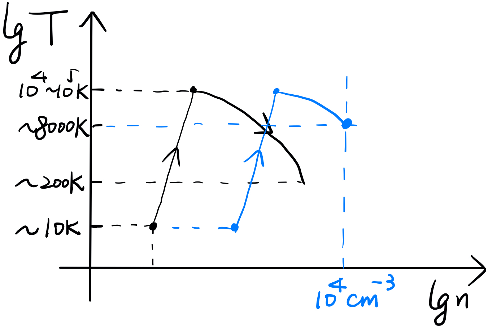

# Chapter 3. Compressible Fluid

## Sound Wave

Compressible fluid satisfies
$$
\frac{D\rho}{D t}\neq0\iff\nabla\cdot\vec v\neq0
$$
Consider small perturbation in the uniform, static background with constant $\rho_0,\ P_0$ and bulk velocity $\vec v_0$.
$$
\left\{
\begin{array}{c}
\rho=\rho_0+\rho_1\left(\vec r,t\right)\\
P=P_0+P_1\left(\vec r,t\right)\\
\vec v=\vec v_0+\vec v_1\left(\vec r,t\right)
\end{array}
\right.
$$
Thus the leading orders of the EoC and EoM are
$$
\partial_t\rho_1+\rho_0\nabla\cdot\vec v_1=0
$$
and
$$
\partial_t\vec v_1+\frac1{\rho_0}\nabla P_1=0
$$
Let's consider adiabatic perturbation
$$
\nabla P_1=\left(\frac{\partial P}{\partial \rho}\right)_s\nabla\rho_1\equiv c_s^2\nabla\rho_1
$$
Then
$$
\partial^2_{tt}\vec v_1-c_s^2\nabla^2\vec v_1=0\\
\partial^2_{tt}\rho_1-c_s^2\nabla^2\rho_1=0
$$
which are both in the form of **wave equations**.

- The propogation speed is the adiabatic sound speed $c_s$.

- The velocity of the perturbation $\vec v_1$ is parallel to its density gradient $\nabla\rho_1$ - **longitudinal wave**.

- For ideal gas
  $$
  c_s=\sqrt{\gamma\frac P\rho}=\sqrt{\gamma\frac {k_BT}{\mu m_p}}
  $$

  - In HI gas ($\sim 10^2$ K), $c_s\sim2$ km/s.
  - In HII gas ($\sim 10^4$ K), $c_s\sim20$ km/s.
  - For a galaxy, if the typical rotation velocity $v_\text{rot}<c_s$, the gas will be too hot to be contained anymore!

The general solution is
$$
\left\{
\begin{array}{l}
\rho_1=f\left(\vec k\cdot\vec r-\omega t\right),\quad \text{where } \omega=c_s\left|\vec k\right|\\
\vec v_1=\frac{\rho_1}{\rho_0}c_s\hat{\vec k},\quad \text{where }\hat{\vec k}=\vec k/\left|\vec k\right|
\end{array}
\right.
$$
$\vec k$ is the wave vector. Since $f$ is a fixed function, the wave shape is conserved for small perturbation.

## Waves with Finite Amplitude

In a linear region, we note that the amplitude of $\vec v_1$ is proportional to the density $\rho_1$, so for waves with finite amplitudes, the density peaks tend to move faster. Is it true?

Now we consider a 1-D, finite-perturbation system. The EoC and EoM now give
$$
\partial_t\rho+\rho\partial_x u+v\partial_x\rho=0
$$

$$
\partial_t u+v\partial_x u=-\frac{c_s^2}{\rho}\partial_x\rho
$$

To explore some possible solutions, we assume **simple wave**, so that
$$
\rho=\rho(u)
$$
In this way,
$$
\rho'\partial_tu+(\rho+v\rho')\partial_xu=0
$$

$$
\rho'\partial_t u+\left(v\rho'+\frac{c_s^2}{\rho}\rho'^2\right)\partial_xu=0
$$

$$
\Rightarrow\left[\rho-\frac{c_s^2}{\rho}\left(\frac{\text d\rho}{\text dv}\right)^2\right]\partial_xu=0
$$

So there are two solutions,
$$
\frac{\text dv}{\text d\rho}=\pm\frac{c_s}{\rho}\Rightarrow u=\pm\int\frac{c_s}{\rho}\text d\rho
$$
With $\rho'=\pm \rho/c_s$, we can rewrite the initial EoC,
$$
\partial_tu+(v\pm c_s)\partial_xu=0
$$
and in the mean time
$$
\partial_t\rho+(v\pm c_s)\partial_x\rho=0
$$
They yield general solutions of the form
$$
u=F_1[x-(v\pm c_s)t],\quad \rho=F_2[x-(v\pm c_s)t]
$$
where $F_1$ and $F_2$ are arbitrary functions. They are known as **simple waves**.

So when
$$
\frac{\text dx}{\text dt}=v\pm c_s
$$
the time derivative
$$
\frac{\text d}{\text dt}\left(\begin{array}{c}\rho\\v\end{array}\right)=\left[\partial_t+(v\pm c_s)\partial_x\right]\left(\begin{array}{c}\rho\\v\end{array}\right)=0
$$
As a result, $\rho$ and $u$ are constant along the curves ${\text dx}/{\text dt}=v\pm c_s$ in the $x-t$ plane. In other word, a perticular value of $\rho$ or $u$ propogates through the ambient medium with phase speed $v_\text p=v\pm c_s$.

- For polytropic EoS,
  $$
  c_s=\sqrt{\frac{P/P_0}{\rho/\rho_0}}c_0=\left(\frac{\rho}{\rho_0}\right)^{\frac{\gamma-1}2}c_0
  $$

  $$
  \Rightarrow u=\pm\frac{2c_0}{\gamma-1}\left[\left(\frac{\rho}{\rho_0}\right)^{\frac{\gamma-1}2}-1\right]=\pm\frac{2(c_s-c_0)}{\gamma-1}
  $$

  where $\gamma\neq1$. Here $\rho_0$ (density) and  $c_0$ (adiabatic sound speed) are unperturbed values.

  In the meantime, we have
  $$
  \frac{\rho}{\rho_0}=\left[1\pm\frac{1}{2}(\gamma-1)\frac u{c_0}\right]^{\frac2{\gamma-1}}
  $$
  This equation plainly shows that more compressed parts in a pulse have a larger fluid velocity $u$.

>When $u=v_1\ll c_0$, we have
>$$
>\frac{\rho}{\rho_0}\sim1\pm\frac{v_1}{c_0}\iff \frac{\rho_1}{\rho_0}=\pm\frac{v_1}{c_0}
>$$
>
>We recover the small perturbation solution.  

Consider a finite pulse having an initial sinusoidal shape, as in the figure below, moving to the right. The most compressed regions move faster than any other part and, as shown in the figure, the crest of the pulse continuously gains on the front and the wave front steepens.

Eventually, the wave crest overtakes the wave front. This is definitely unphysical, *indicating a break-down of the theory*. In reality, the front steepens into a **shock**, in which are variables change abruptly through a very thin **shock layer**. The gradients are so steep that viscosity is no longer negligible, as well as thermal conductivity. The perturbation is no longer adiabatic!

## Shocks & Rankine - Hugoniot Equations

To understand the discontinuity crossing a shock, we consider a 1-D shock frame, in which the shock front is at rest. Materials, initially in the **pre-shock region** ($\rho_1,\ P_1,\ v_1$), cross the shock front and enter the **post-shock region** ($\rho_2,\ P_2,\ v_2$). Consider a steady state without any external force, viscosity or conduction, the conservations laws give
$$
\nabla\cdot\left(\rho\vec v\right)=0\Rightarrow\frac{\text d}{\text dx}\left(\rho v\right)=0\Rightarrow \rho_1v_2=\rho_2v_2
$$

$$
\left(\vec v\cdot \nabla\right)\vec v=-\frac1\rho\nabla P\Rightarrow\rho v\frac{\text dv}{\text dx}+\frac{\text dP}{\text dx}=0\Rightarrow \rho_1v_1^2+P_1=\rho_2v_2^2+P_2
$$

$$
\nabla\cdot\left[\rho\vec v\left( e+\frac12 v^2+\frac{P}{\rho}\right)\right]=0\Rightarrow\frac{\text d}{\text dx}\left[\rho v\left( e+\frac12 v^2+\frac{P}{\rho}\right)\right]=0\Rightarrow \frac12 v_1^2+e_1+\frac{P_1}{\rho_1}= \frac12 v_2^2+e_2+\frac{P_2}{\rho_2}
$$

For ideal gas, the specific enthalpy
$$
h=e+\frac P\rho=\frac{\gamma}{\gamma-1}\frac P\rho
$$
Let us introduce
$$
x\equiv\frac{\rho_2}{\rho_1}=\frac{v_1}{v_2},\quad y\equiv \frac{P_2}{P_1}
$$
and define the **Mach number**
$$
\mathcal M=\frac u{c_s}=\frac{v}{\sqrt{\gamma P/\rho}}\Rightarrow \rho v^2=\gamma \mathcal M^2P
$$
In this way, the equations can be written as
$$
\gamma \mathcal{M}_1^2+1=\frac\gamma x \mathcal{M}_1^2+y
$$

$$
\left(\frac12\gamma \mathcal{M}_1^2+\frac{\gamma}{\gamma-1}\right)x=\frac\gamma{2x} \mathcal{M}_1^2+\frac{\gamma y}{\gamma-1}
$$

From the first equation we have
$$
y = 1+\gamma \mathcal{M}_1^2\left(1-\frac1x\right)
$$
So we substitute $y$ with $x$ in the second equation to find
$$
\left[\frac12\mathcal{M}_1^2\left(1+x\right)+\frac{x-\gamma \mathcal{M}_1^2}{\gamma-1}\right]\left(1-\frac1x\right)=0
$$
A trivial solution will be $x=1,\ y=1$, when there is not any discontinuity. When there is a shock and $x\neq1$, we have
$$
x=\frac{(\gamma+1)\mathcal{M}_1^2}{(\gamma-1)\mathcal{M}_1^2+2},\quad y=\frac{2\gamma \mathcal{M}_1^2-(\gamma-1)}{\gamma+1}
$$
which are known as the **Rankine-Hugonoit equations**.

We can also derive the Mach number in the post-shock region,
$$
\frac{\mathcal{M}_2^2}{\mathcal{M}_1^2}=\frac{v_2}{v_1}\frac{P_1}{P_2}=\frac1{xy}\Rightarrow \mathcal{M}_2^2=\frac{(\gamma-1)\mathcal{M}_1^2+2}{2\gamma \mathcal{M}_1^2-(\gamma-1)}=\frac{(\gamma-1)(\mathcal{M}_1^2-1)+(\gamma+1)}{2\gamma (\mathcal{M}_1^2-1)+(\gamma+1)}
$$

- When $\mathcal{M}_1^2>1$ (**supersonic**), we have $\mathcal{M}_2<1$ (**subsonic**).

**Strong Shock ($\mathcal{M}_1\gg1$)**
$$
x\sim\frac{\gamma+1}{\gamma-1},\quad y\sim\frac{2\gamma}{\gamma+1}\mathcal{M}_1^2\propto \mathcal{M}_1^2
$$

For $\gamma=5/3$, $x=4,\ y=5\mathcal{M}_1^2/4$. Furthermore, for ideal gas, let us consider the temperature in the post-shock region.
$$
\frac{T_2}{T_1}=\frac{P_2/\rho_2}{P_1/\rho_1}=\frac yx\sim\frac{2\gamma(\gamma-1)}{(\gamma+1)^2}\mathcal{M}_1^2
$$

$$
\iff T_2\sim\frac{2(\gamma-1)}{(\gamma+1)^2}\frac{v_1^2T_1}{P_1/\rho_1}=\frac{2(\gamma-1)}{(\gamma+1)^2}\frac{\mu m_p}{k_B}v_1^2
$$

Again, for $\gamma=5/3$, the post-shock temperature is simply
$$
T_2\sim\frac3{16}\frac{\mu m_p}{k_B}v_1^2
$$
This temperature is important for virialization in galaxy formation, since it gives the cooling timescale
$$
t_\text{cool}\sim\frac{T_2}{\rho\Gamma(T_2)}
$$
where $\Gamma(T)$ is the cooling efficiency at $T$. If this timescale is within the Hubble timescale of redshift $z$, galaxy formation is possible.

**Weak Shock $(\mathcal{M}_1^2=1+m_1,\ m_1\ll1)$**
$$
x=\left(1-\frac2{\gamma-1}\frac{m_1}{1+m_1}\right)^{-1},\quad y=1+\frac{2\gamma}{\gamma+1}(1+m_1)
$$

### Shock Layer

In the shock layer ($\rho,\ P,\ u$), there must be viscosity, thus
$$
\rho u=\rho_1 v_1
$$

$$
\rho v^2+P-\eta\frac{\text dv}{\text dx}=\rho_1v_1^2+P_1
$$

$$
\rho v\left(\frac12v^2+\frac{\gamma}{\gamma-1}\frac P\rho\right)-\eta v\frac{\text dv}{\text dx}=\rho_1 v_1\left(\frac12v_1^2+\frac{\gamma}{\gamma-1}\frac {P_1}{\rho_1}\right)
$$

When we combine these equations,

$$
\Rightarrow \frac{\gamma+1}{\gamma-1}\rho_1v_1 v^2-\frac{2}{\gamma-1}\eta v\frac{\text dv}{\text dx}=\rho_1v_1^2\left(\frac{2\gamma}{\gamma-1}u-v_1\right)+\frac{2\gamma}{\gamma-1}\left(u-v_1\right)P_1
$$

$$
\begin{align*}
\Rightarrow -\frac\eta{\rho_1} v\frac{\text dv}{\text dx}&=(u-v_1)c_{s1}^2+v_1^2\left(\gamma u-\frac{\gamma-1}{2}v_1\right)-\frac{\gamma+1}{2}v_1v^2\\
&=(u-v_1)\left[v_1\left(\frac{\gamma-1}2v_1-\frac{\gamma+1}2v\right)+c_{s1}^2\right]
\end{align*}
$$

The RHS has two zero-points,
$$
u=v_1
$$
and
$$
u=\frac{(\gamma-1)v_1^2+2c_{s1}^2}{(\gamma+1)v_1}=\frac{(\gamma-1)\mathcal{M}_1^2+2}{(\gamma+1)\mathcal{M}_1^2}v_1=v_2
$$
which are simply the velocities on the boundary.

At the center of the shock layer, $x_0$, due to the symmetry, $v_0=(v_1+v_2)/2$. Thus
$$
\frac{\text dv}{\text dx}\Bigg|_{x_0}=-\frac{(v_1-v_2)^2}{4v_0\nv}\frac{\gamma+1}2v_1=-\frac{(\gamma+1)(v_1-v_2)^2v_1}{4(v_1+v_2)\nv}
$$
where $\nv\equiv \eta/\rho_1$.

The width of the shock layer can be estimated as
$$
\delta\simeq\left|\frac{v_1-v_2}{({\text dv}/{\text dx})|_{x_0}}\right|=\frac{4\nv}{v_1(\gamma+1)}\frac{v_1+v_2}{v_1-v_2}=\frac{4\nv}{c_s}\frac{\gamma \mathcal{M}_1^2+1}{(\gamma+1)\mathcal{M}_1(\mathcal{M}_1^2-1)}
$$
Since $\nv\sim c_sl_\text{mfp}$,
$$
\delta\sim l_\text{mfp}\cdot \frac{\gamma \mathcal{M}_1^2+1}{(\gamma+1)\mathcal{M}_1(\mathcal{M}_1^2-1)}
$$

- Weak shock:
  $$
  \delta \sim \frac{l_\text{mfp}}{m_1}
  $$

- Strong shock:
  $$
  \delta \sim \frac\gamma{\gamma+1}\frac{l_\text{mfp}}{\mathcal{M}_1}
  $$

This scale is in fact beyond the picture of our assumption before, where
$$
l\gg l_\text{mfp}
$$
At this scale, Navier-Stokes equation is no longer valid. We have to apply **Boltzmann equation**, which degenerates into Naiver-Stokes equation through Chapmann-Enskog expasion, instead. Fortunately, the results obtained before are in general correct.

## Radiative Cooling

Generally speaking, shock process is not adiabatic. The hot, dense post-shock region cools down via radiation. We note that such radiative cooling is important when the cooling timescale $t_\text{cool}$ is much shorter than the dynamical timescale of the system. Here, the dynamical timescale is defined as
$$
t_\text{dyn}=\frac Lu
$$
where $L$ is the typical size of the system, and $u$ is the velocity of the shock front. So the dynamical timescale is simply the shock-crossing timescale.

### Isothermal Shock

The simpliest situation is that after cooling, the post-shock region recovers its original temperature $T_1$. The mass and momentum conservation laws are always held, thus
$$
\rho_1v_2=\rho_2v_2
$$

$$
\rho_1v_1^2+P_1=\rho_2v_2^2+P_2
$$

$$
\frac{P_1}{\rho_1}=\frac{P_2}{\rho_2}\iff x=y
$$

Then it is easy to derive
$$
x=y=\frac{2\gamma\mathcal{M}^2_1-(\gamma-1)}{\gamma+1}
$$

and in the strong shock case
$$
x=y\simeq\frac{2\gamma}{\gamma+1}\mathcal M_1^2\sim\mathcal M_1^2
$$
Comparing to the adiabatic strong shock, the density enhancement is proportional too the Mach number square, instead of only a factor of 4.

### General Case

For non-isothermal case, still, mass and momentum conserve. For simplicity we only study strong shocks. In other word, $\mathcal M_1\gg1$. As a result,
$$
\frac{\rho_1 v_1^2}{P_1}=\gamma \mathcal M_1^2\gg1
$$
So $P_1$ is negligible comparing to $\rho_1v_2^2$.

First let us consider the region between the pre-shock & the region just behind the shock front. More specifically, we define $x_\text{cool}\equiv ut_\text{cool}$. Within $x_\text{cool}$ from the shock front, the post-shock materials have not undergone cooling yet, so the physical properties should simply be characterized by the Rankine-Hogoniot equations
$$
\frac{\rho_2}{\rho_1}\simeq\frac{\gamma+1}{\gamma-1}=4
$$
and pressure is given by the conservation of momentum
$$
P_2=\rho_1v_1^2\left(1-\frac{v_2}{v_1}\right)+P_1\simeq\frac2{\gamma+1}\rho_1v_1^2+P_1\simeq\frac34\rho_1v_1^2+P_1
$$
And during the radiative cooling, the pressure and density are still related by the conservations laws
$$
P=\rho_1v_1^2\left(1-\frac{\rho_1}{\rho}\right)+P_1=P(\rho)
$$
As long as $t_\text{cool}<t_\text{dyn}$, the cooling process goes on and the temperature decreases, so that
$$
\frac{\text dT}{\text dt}<0\iff\frac{\text d}{\text dt}\left(\frac P\rho\right)<0
$$
Neglecting $P_1$, this is only true when $\rho>2\rho_1,\ \dot\rho>0$, or $\rho<2\rho_1,\ \dot\rho<0$. At $x=x_\text{cool}$, $\rho=4\rho_1>2\rho_1$, so as $x$ increases and $T$ falls down, $\rho$ continues to go up. When $\rho\gg\rho_1$, $P\lesssim\rho_1v_1^2+P_1$, when the total pressure is balanced with the incoming flow.

In a $P-x$ diagram, directly after the shock at $x=0$, the pressure jumps from $P_1$ to $P_1+\frac34\rho_1v_1^2$. From $x=0$ to $x=x_\text{cool}$, the pressure stays essentially the same, while after $x_\text{cool}$, the pressure continuously rises to approching its asymptote $P=P_1+\rho_1v_1^2$.

In a $T-\rho$ diagram, in the shock $(\rho_1,T_1)$ suddenly jumps to $(\rho_2,T_2)$. Then during the radiation cooling, again the evolution in the phase space gradually approches th asymptote $P=P_1+\rho_1v_1^2$. For isothermal shock, the evolution is halted at $T=T_1$, when the density is promoted roughly by a factor of $\mathcal M_1^2$. The termination of cooling varies case by case. Here we discuss $\ce{H2}$ cooling, which is essential for star formation in high redshift.

In giant molecular cloud, $\ce{H2}$ cooling is one of the most important cooling mechanisms. [Inayoshi & Omukai (2012)](https://academic.oup.com/mnras/article/422/3/2539/1047976) proposed a scenario for supermassive star formation by cold accretion shocks in the first galaxies. Initially in the pre-shock region, the typical temperature for cold, dense molecular cloud is $\sim10$ K. In the local universe where the density is relatively low, the post-shock region undergoes radiative cooling until $T\sim200$ K, when the $\ce{H2}$ cooling is no longer efficient. The evolution follows the black track. For the first galaxies, however, shocks due to some supersonic flows could develop a hot and dense ($\sim10^4$ K and $\sim10^3$ cm$^{-3}$) region. Initially the $\ce{H2}$ cooling still works, but as the density goes up to $\sim10^4$ cm$^{-3}$, which is the critical density of $\ce{H2}$ cooling, the cooling process terminates, and the gas cannot cool below several thousand Kelvin.

- Critical density $n_\text{cr}$

  Consider two energy states ($E_1$ and  $E_2$) with number density of particles of $n_1$ and $n_2$, respectively. Particles on the higher energy level $E_2$ tend to jump to the lower one $E_1$ and eject a photon of energy $h\nu=E_2-E_1$, at a probability of $A_{21}$. $A_{21}$ is known as the **Einstein coefficient for spontaneous emission**. On the other hand, energy level transitions are also caused by collisional excitation ($C_{12}$) and de-excitation ($C_{21}$). These collisional coefficients are proportional to the ambient number density $n$. In a steady state, excitation and de-excitation are balanced, so that
  $$
  n_2(A_{21}+C_{21})=n_1C_{12}
  $$
  When $n$ is high enough so that $C_{21}>A_{21}$, the collisional de-excitation dominates the spontaneous emission so the radiative cooling gets inefficient. The critical density $n_\text{cr}$ is the density at which $C_{21}=A_{21}$.

In other words, nothing can further contract or fragment the cloud, except gravity. When the total mass is over Jeans mass
$$
M_J=\frac43\rho\left(\frac{c_s}{\sqrt{G\rho}}\right)^3\sim10^5M_\odot
$$
the molecular cloud starts to collapse without fragmentation. Finally a supermassive star is formed.