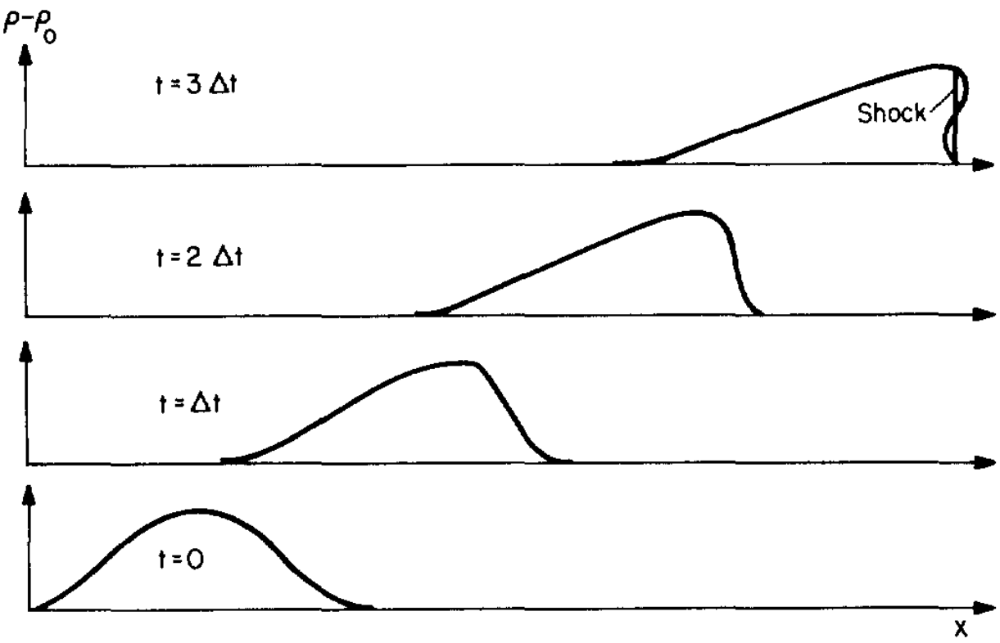

# Chapter 3. Compressible Fluid

## Sound Wave

Compressible fluid satisfies
$$
\frac{D\rho}{D t}\neq0\iff\nabla\cdot\vec u\neq0
$$
Consider small perturbation in the uniform, static background with constant $\rho_0,\ P_0$ and bulk velocity $\vec u_0$.
$$
\left\{
\begin{array}{c}
\rho=\rho_0+\rho_1\left(\vec r,t\right)\\
P=P_0+P_1\left(\vec r,t\right)\\
\vec u=\vec u_0+\vec u_1\left(\vec r,t\right)
\end{array}
\right.
$$
Thus the leading orders of the EoC and EoM are
$$
\partial_t\rho_1+\rho_0\nabla\cdot\vec u_1=0
$$
and
$$
\partial_t\vec u_1+\frac1{\rho_0}\nabla P_1=0
$$
Let's consider adiabatic perturbation
$$
\nabla P_1=\left(\frac{\partial P}{\partial \rho}\right)_s\nabla\rho_1\equiv c_s^2\nabla\rho_1
$$
Then
$$
\partial^2_{tt}\vec u_1-c_s^2\nabla^2\vec u_1=0\\
\partial^2_{tt}\rho_1-c_s^2\nabla^2\rho_1=0
$$
which are both in the form of **wave equations**.

- The propogation speed is the adiabatic sound speed $c_s$.

- The velocity of the perturbation $\vec u_1$ is parallel to its density gradient $\nabla\rho_1$ - **longitudinal wave**.

- For ideal gas
  $$
  c_s=\sqrt{\gamma\frac P\rho}=\sqrt{\gamma\frac {k_BT}{\mu m_p}}
  $$

  - In HI gas ($\sim 10^2$ K), $c_s\sim2$ km/s.
  - In HII gas ($\sim 10^4$ K), $c_s\sim20$ km/s.
  - For a galaxy, if the typical rotation velocity $v_\text{rot}<c_s$, the gas will be too hot to be contained anymore!

The general solution is
$$
\left\{
\begin{array}{l}
\rho_1=f\left(\vec k\cdot\vec r-\omega t\right),\quad \text{where } \omega=c_s\left|\vec k\right|\\
\vec u_1=\frac{\rho_1}{\rho_0}c_s\hat{\vec k},\quad \text{where }\hat{\vec k}=\vec k/\left|\vec k\right|
\end{array}
\right.
$$
$\vec k$ is the wave vector. Since $f$ is a fixed function, the wave shape is conserved for small perturbation.

## Waves with Finite Amplitude

In a linear region, we note that the amplitude of $\vec u_1$ is proportional to the density $\rho_1$, so for waves with finite amplitudes, the density peaks tend to move faster. Is it true?

Now we consider a 1-D, finite-perturbation system. The EoC and EoM now give
$$
\partial_t\rho+\rho\partial_x u+u\partial_x\rho=0
$$

$$
\partial_t u+u\partial_x u=-\frac{c_s^2}{\rho}\partial_x\rho
$$

To explore some possible solutions, we assume **simple wave**, so that
$$
\rho=\rho(u)
$$
In this way,
$$
\rho'\partial_tu+(\rho+u\rho')\partial_xu=0
$$

$$
\rho'\partial_t u+\left(u\rho'+\frac{c_s^2}{\rho}\rho'^2\right)\partial_xu=0
$$

$$
\Rightarrow\left[\rho-\frac{c_s^2}{\rho}\left(\frac{\text d\rho}{\text du}\right)^2\right]\partial_xu=0
$$

So there are two solutions,
$$
\frac{\text du}{\text d\rho}=\pm\frac{c_s}{\rho}\Rightarrow u=\pm\int\frac{c_s}{\rho}\text d\rho
$$
With $\rho'=\pm \rho/c_s$, we can rewrite the initial EoC,
$$
\partial_tu+(u\pm c_s)\partial_xu=0
$$
and in the mean time
$$
\partial_t\rho+(u\pm c_s)\partial_x\rho=0
$$
They yield general solutions of the form
$$
u=F_1[x-(u\pm c_s)t],\quad \rho=F_2[x-(u\pm c_s)t]
$$
where $F_1$ and $F_2$ are arbitrary functions. They are known as **simple waves**.

So when
$$
\frac{\text dx}{\text dt}=u\pm c_s
$$
the time derivative
$$
\frac{\text d}{\text dt}\left(\begin{array}{c}\rho\\u\end{array}\right)=\left[\partial_t+(u\pm c_s)\partial_x\right]\left(\begin{array}{c}\rho\\u\end{array}\right)=0
$$
As a result, $\rho$ and $u$ are constant along the curves ${\text dx}/{\text dt}=u\pm c_s$ in the $x-t$ plane. In other word, a perticular value of $\rho$ or $u$ propogates through the ambient medium with phase speed $v_\text p=u\pm c_s$.

- For polytropic EoS,
  $$
  c_s=\sqrt{\frac{P/P_0}{\rho/\rho_0}}c_0=\left(\frac{\rho}{\rho_0}\right)^{\frac{\gamma-1}2}c_0
  $$

  $$
  \Rightarrow u=\pm\frac{2c_0}{\gamma-1}\left[\left(\frac{\rho}{\rho_0}\right)^{\frac{\gamma-1}2}-1\right]=\pm\frac{2(c_s-c_0)}{\gamma-1}
  $$

  where $\gamma\neq1$. Here $\rho_0$ (density) and  $c_0$ (adiabatic sound speed) are unperturbed values.

  In the meantime, we have
  $$
  \frac{\rho}{\rho_0}=\left[1\pm\frac{1}{2}(\gamma-1)\frac u{c_0}\right]^{\frac2{\gamma-1}}
  $$
  This equation plainly shows that more compressed parts in a pulse have a larger fluid velocity $u$.

>When $u=u_1\ll c_0$, we have
  >$$
>\frac{\rho}{\rho_0}\sim1\pm\frac{u_1}{c_0}\iff \frac{\rho_1}{\rho_0}=\pm\frac{u_1}{c_0}
  >$$
  >
  >We recover the small perturbation solution.  

Consider a finite pulse having an initial sinusoidal shape, as in the figure below, moving to the right. The most compressed regions move faster than any other part and, as shown in the figure, the crest of the pulse continuously gains on the front and the wave front steepens.

Eventually, the wave crest overtakes the wave front. This is definitely unphysical, *indicating a break-down of the theory*. In reality, the front steepens into a **shock**, in which are variables change abruptly through a very thin **shock layer**. The gradients are so steep that viscosity is no longer negligible, as well as thermal conductivity. The perturbation is no longer adiabatic!

## Shocks & Rankine - Hugoniot Equations

To understand the discontinuity crossing a shock, we consider a 1-D shock frame, in which the shock front is at rest. Materials, initially in the **pre-shock region** ($\rho_1,\ P_1,\ u_1$), cross the shock front and enter the **post-shock region** ($\rho_2,\ P_2,\ u_2$). Consider a steady state without any external force, viscosity or conduction, the conservations laws give
$$
\nabla\cdot\left(\rho\vec u\right)=0\Rightarrow\frac{\text d}{\text dx}\left(\rho u\right)=0\Rightarrow \rho_1u_2=\rho_2u_2
$$

$$
\left(\vec u\cdot \nabla\right)\vec u=-\frac1\rho\nabla P\Rightarrow\rho u\frac{\text du}{\text dx}+\frac{\text dP}{\text dx}=0\Rightarrow \rho_1u_1^2+P_1=\rho_2u_2^2+P_2
$$

$$
\nabla\cdot\left[\rho\vec u\left( e+\frac12 u^2+\frac{P}{\rho}\right)\right]=0\Rightarrow\frac{\text d}{\text dx}\left[\rho u\left( e+\frac12 u^2+\frac{P}{\rho}\right)\right]=0\Rightarrow \frac12 u_1^2+e_1+\frac{P_1}{\rho_1}= \frac12 u_2^2+e_2+\frac{P_2}{\rho_2}
$$

For ideal gas, the specific enthalpy
$$
h=e+\frac P\rho=\frac{\gamma}{\gamma-1}\frac P\rho
$$
Let us introduce
$$
x\equiv\frac{\rho_2}{\rho_1}=\frac{u_1}{u_2},\quad y\equiv \frac{P_2}{P_1}
$$
and define the **Mach number**
$$
M=\frac u{c_s}=\frac{u}{\sqrt{\gamma P/\rho}}\Rightarrow \rho u^2=\gamma M^2P
$$
In this way, the equations can be written as
$$
\gamma M_1^2+1=\frac\gamma x M_1^2+y
$$

$$
\left(\frac12\gamma M_1^2+\frac{\gamma}{\gamma-1}\right)x=\frac\gamma{2x} M_1^2+\frac{\gamma y}{\gamma-1}
$$

From the first equation we have
$$
y = 1+\gamma M_1^2\left(1-\frac1x\right)
$$
So we substitute $y$ with $x$ in the second equation to find
$$
\left[\frac12M_1^2\left(1+x\right)+\frac{x-\gamma M_1^2}{\gamma-1}\right]\left(1-\frac1x\right)=0
$$
A trivial solution will be $x=1,\ y=1$, when there is not any discontinuity. When there is a shock and $x\neq1$, we have
$$
x=\frac{(\gamma+1)M_1^2}{(\gamma-1)M_1^2+2},\quad y=\frac{2\gamma M_1^2-(\gamma-1)}{\gamma+1}
$$
which are known as the **Rankine-Hugonoit equations**.

We can also derive the Mach number in the post-shock region,
$$
\frac{M_2^2}{M_1^2}=\frac{u_2}{u_1}\frac{P_1}{P_2}=\frac1{xy}\Rightarrow M_2^2=\frac{(\gamma-1)M_1^2+2}{2\gamma M_1^2-(\gamma-1)}=\frac{(\gamma-1)(M_1^2-1)+(\gamma+1)}{2\gamma (M_1^2-1)+(\gamma+1)}
$$

- When $M_1^2>1$ (**supersonic**), we have $M_2<1$ (**subsonic**).

**Strong Shock ($M_1\gg1$)**
$$
x\sim\frac{\gamma+1}{\gamma-1},\quad y\sim\frac{2\gamma}{\gamma+1}M_1^2\propto M_1^2
$$

For $\gamma=5/3$, $x=4,\ y=5M_1^2/4$. Furthermore, for ideal gas, let us consider the temperature in the post-shock region.
$$
\frac{T_2}{T_1}=\frac{P_2/\rho_2}{P_1/\rho_1}=\frac yx\sim\frac{2\gamma(\gamma-1)}{(\gamma+1)^2}M_1^2
$$

$$
\iff T_2\sim\frac{2(\gamma-1)}{(\gamma+1)^2}\frac{u_1^2T_1}{P_1/\rho_1}=\frac{2(\gamma-1)}{(\gamma+1)^2}\frac{\mu m_p}{k_B}u_1^2
$$

Again, for $\gamma=5/3$, the post-shock temperature is simply
$$
T_2\sim\frac3{16}\frac{\mu m_p}{k_B}u_1^2
$$
This temperature is important for virialization in galaxy formation, since it gives the cooling timescale
$$
t_\text{cool}\sim\frac{T_2}{\rho\Gamma(T_2)}
$$
where $\Gamma(T)$ is the cooling efficiency at $T$. If this timescale is within the Hubble timescale of redshift $z$, galaxy formation is possible.

**Weak Shock $(M_1^2=1+m_1,\ m_1\ll1)$**
$$
x=\left(1-\frac2{\gamma-1}\frac{m_1}{1+m_1}\right)^{-1},\quad y=1+\frac{2\gamma}{\gamma+1}(1+m_1)
$$

### Shock Layer

In the shock layer ($\rho,\ P,\ u$), there must be viscosity, thus
$$
\rho u=\rho_1 u_1
$$

$$
\rho u^2+P-\eta\frac{\text du}{\text dx}=\rho_1u_1^2+P_1
$$

$$
\rho u\left(\frac12u^2+\frac{\gamma}{\gamma-1}\frac P\rho\right)-\eta u\frac{\text du}{\text dx}=\rho_1 u_1\left(\frac12u_1^2+\frac{\gamma}{\gamma-1}\frac {P_1}{\rho_1}\right)
$$

When we combine these equations,

$$
\Rightarrow \frac{\gamma+1}{\gamma-1}\rho_1u_1 u^2-\frac{2}{\gamma-1}\eta u\frac{\text du}{\text dx}=\rho_1u_1^2\left(\frac{2\gamma}{\gamma-1}u-u_1\right)+\frac{2\gamma}{\gamma-1}\left(u-u_1\right)P_1
$$

$$
\begin{align*}
\Rightarrow -\frac\eta{\rho_1} u\frac{\text du}{\text dx}&=(u-u_1)c_{s1}^2+u_1^2\left(\gamma u-\frac{\gamma-1}{2}u_1\right)-\frac{\gamma+1}{2}u_1u^2\\
&=(u-u_1)\left[u_1\left(\frac{\gamma-1}2u_1-\frac{\gamma+1}2u\right)+c_{s1}^2\right]
\end{align*}
$$

The RHS has two zero-points,
$$
u=u_1
$$
and
$$
u=\frac{(\gamma-1)u_1^2+2c_{s1}^2}{(\gamma+1)u_1}=\frac{(\gamma-1)M_1^2+2}{(\gamma+1)M_1^2}u_1=u_2
$$
which are simply the velocities on the boundary.

At the center of the shock layer, $x_0$, due to the symmetry, $u_0=(u_1+u_2)/2$. Thus
$$
\frac{\text du}{\text dx}\Bigg|_{x_0}=\frac{(u_1-u_2)^2}{4u_0\nu}\frac{\gamma+1}2u_1=\frac{(\gamma+1)(u_1-u_2)^2u_1}{4(u_1+u_2)\nu}
$$
where $\nu\equiv \eta/\rho_1$.

The width of the shock layer can be estimated as
$$
\delta\simeq\left|\frac{u_1-u_2}{({\text du}/{\text dx})|_{x_0}}\right|=\frac{4\nu}{u_1(\gamma+1)}\frac{u_1+u_2}{u_1-u_2}=\frac{4\nu}{c_s}\frac{\gamma M_1^2+1}{(\gamma+1)M_1(M_1^2-1)}
$$
Since $\nu\sim c_sl_\text{mfp}$,
$$
\delta\sim l_\text{mfp}\cdot \frac{\gamma M_1^2+1}{(\gamma+1)M_1(M_1^2-1)}
$$

- Weak shock:
  $$
  \delta \sim \frac{l_\text{mfp}}{m_1}
  $$

- Strong shock:
  $$
  \delta \sim \frac\gamma{\gamma+1}\frac{l_\text{mfp}}{M_1}
  $$
  

