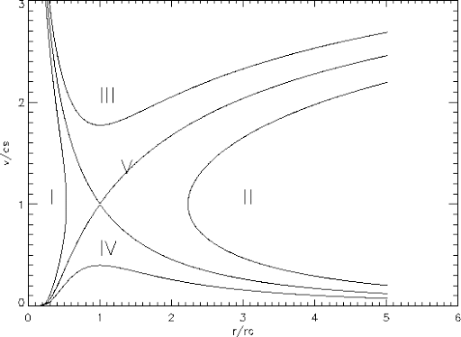

# Chapter 4. Spherically Symmetric Flow

## Basics

Let us consider systems in steady state (**Parker's wind & Bondi accretion**)

The EoC requires that $\dot M=4\pi r^2\rho u$ is a constant, which gives out the relation
$$
\frac1\rho\frac{\text d\rho}{\text dr}+\frac2r+\frac1u\frac{\text du}{\text dr}=0
$$
The EoM gives
$$
\begin{align*}
u\frac{\text du}{\text dr}&=-\frac1\rho\frac{\text dP}{\text dr}-\frac{GM_*}{r^2}\\
&=-\frac{c_s^2}\rho\frac{\text d\rho}{\text dr}-\frac{GM_*}{r^2}
\end{align*}
$$
Combine EoC and EoM to eliminate the density gradient $\text d\rho/\text dr$, we find
$$
u\frac{\text du}{\text dr}=\frac{2c_s^2}r+\frac{c_s^2}u\frac{\text du}{\text dr}-\frac{GM_*}{r^2}
$$

$$
\Rightarrow \frac12\left(1-\frac{c_s^2}{u^2}\right)\frac{\text du^2}{\text dr}=-\frac{GM_*}{r^2}\left(1-\frac{2c_s^2r}{GM_*}\right)
$$

To solve this ODE, we apply the so-called **trans-sonic condition**, that is, $u=c_s$ at $r=r_\text c\equiv GM_*/2c_s^2$.

### Isothermal Solution

In isothermal flow, $c_s$ is a constant, the solution is thus
$$
\mathcal M^2-\ln \mathcal M^2=4\ln\xi+\frac4\xi-3
$$
where $\mathcal M$ is the Mach number, and $\xi\equiv r/r_\text c$. The solutions are shown as below.

- I & II - unphysical
- III - supersonic
- IV - subsonic
- V - **wind solution (Parker's wind)**
- The other trans-sonic solution - **accretion solution (Bondi accretion)**

### Accretion Solution

If the flow is not isothermal, we assume a polytropic equation of state $P=K\rho^\gamma$. Bernoulli's theorem for steady flow ensures that $\frac12u^2+h+\phi$ is a constant along each streamline, where $h$ is the specific enthalpy
$$
h(p)\equiv\int\frac{\text dp}{\rho(p)}=\frac K{\gamma-1}\gamma\rho^{\gamma-1}=\frac{c_s^2}{\gamma-1}
$$
and $\phi$ is the gravitational potential. Thus at radius $r$,
$$
\frac12u^2+\frac{c_s^2}{\gamma-1}-\frac{GM_*}{r}=\frac{c_\infty^2}{\gamma-1}
$$
where $c_\infty$ is the adiabatic sound speed at infinity. Here we have applied the boundary condition, that is, $u\to0$ as $r\to\infty$.

Setting $v=c_s$ at
$$
r=r_c\equiv\frac{GM_*}{2c_{s,\text c}},\quad c_{s,\text c}\equiv c_s(r_\text c)
$$
since we are only interested in the trans-sonic solution. As a result,
$$
\begin{align*}
r_\text c&=\frac{5-3\gamma}2\frac{GM_*}{2c_\infty^2}\\
c_{s,\text c}&=\left(\frac2{5-3\gamma}\right)^{1/2}c_\infty\\
\rho_\text c&=\left(\frac2{5-3\gamma}\right)^{1/(\gamma-1)}\rho_\infty
\end{align*}
$$
$\rho_\text c$ is calculated from the EoS.

Obviously, for $\gamma\ge5/3$, $r_\text c\le0$, so there is no trans-sonic solution for adiabatic (no radiative cooling) EoS. $\gamma=5/3$ is critical for spherical, point-mass accretion.

### Mass Accretion Rate

$$
\begin{align*}
\dot M_B&=4\pi\rho r^2u=4\pi\rho_\text c r_\text c^2u_{s,\text c}\\
&=4\pi\left(\frac2{5-3\gamma}\right)^{\frac{5-3\gamma}{2(\gamma-1)}}\left(\frac{GM_*}{2c_\infty^2}\right)^2\rho_\infty c_\infty\quad\left(\propto \rho M_*^2T^{-3/2}\right)\\
&\equiv4\pi q(\gamma)R_B^2\rho_\infty c_\infty
\end{align*}
$$

where we define
$$
q(\gamma)\equiv\frac14\left(\frac2{5-3\gamma}\right)^{\frac{5-3\gamma}{2(\gamma-1)}}
$$
and the **Bondi radius**
$$
R_B\equiv\frac{GM_*}{c_\infty^2}
$$

- For diffusive ISM accretion onto a sun-like object
  $$
  \rho_\infty\sim10^{-24}\text{ g/cm}^3,\quad T\sim10^4\text{ K},\quad \gamma\sim1.4
  $$

  $$
  \Rightarrow \dot M_B\sim10^{-15}\left(\frac{M_*}{M_\odot}\right)^2M_\odot/\text{yr}
  $$

  This rate is extremely small. Even if we neglect the accretion feedback, a sun-like object can only accrete $\sim10^{-5}M_\odot$ in Hubble time.

- For denser and colder molecular cloud
  $$
  \rho_\infty\sim10^{-20}\text{ g/cm}^3,\quad T\sim10\text{ K},\quad \gamma\sim1.4
  $$

  $$
  \Rightarrow \dot M_B\sim3\times10^{-7}\left(\frac{M_*}{M_\odot}\right)^2M_\odot/\text{yr}
  $$

  In this way, the accretion timescale is quite interesting, as it only takes several million years for a sun-like object to double its mass. For a SMBH $\sim10^6M_\odot$, the timescale to reach double mass is only 0.3 yr.

We note that in reality, BH feedback suppresses the accretion somehow. Thus, $\dot M_B$ is the upper limit of the actual accretion rate.

For Bondi case,
$$
\frac{\text dM_*}{\text dt}=AM_*^2
$$

$$
\Rightarrow\frac1{M_*}-\frac1{M_0}=-A(t-t_0)\Rightarrow M_*=\frac{M_0}{1-AM_0(t-t_0)}
$$

The growth of $M_*$ is so rapid that before $t$ goes to infinity, $M_*$ diverges within **Bondi timescale** $t_B$.
$$
t_B\equiv\frac1{AM_0}
$$
This is known as the **super-exponential growth**.

## Accretion Flows

### Radiative Luminosity

The luminosity caused by radiation can be estimated as
$$
L_\text{acc}\sim\frac{\text dE_\text{g}}{\text dt}\sim\frac{\text d}{\text dt}\left(\frac{GM^2}{R}\right)\sim\frac{GM\dot M}{R}-\frac{GM^2}{R^2}\dot R
$$
The second term is important only when there is significant orbital shrink in the system, such as binary spiral-in or stellar contraction. For steady accretion onto a point mass, it is negligable, so we can focus on the first term only.

- Neutron star
  $$
  M_*\sim M_\odot,\quad R_*\sim10\text{ km}\Rightarrow L_\text{acc}\sim\frac{GM_*}{R_*}\dot M\sim10^{38}\left(\frac{\dot M}{10^{-8}M_\odot/\text{yr}}\right)\text{ erg/s}
  $$

- Black hole
  $$
  L_\text{acc}\sim\frac{GM}{R_\text{ISCO}}\dot M
  $$
  where $R_\text{ISCO}$ is the innermost stable circular orbit. For a Schwarzschild black hole,
  $$
  R_\text{ISCO}=3R_{Sch}=\frac{6GM}{c^2}
  $$
  so the accretion rate is approximately
  $$
  L_\text{acc}\sim\frac16\dot Mc^2
  $$

We define the **radiation efficiency** $\eta$ so that
$$
L_\text{acc}\equiv\eta\dot Mc^2
$$
$\eta$ can be of the order $10^{-1}$ for black holes, but is negligible for less compact objects, such as normal stars.

### Eddington Accretion Rate

For any astrophysical system, for materials to accrete, the gravity should exceed the radiation force, that is
$$
\frac{GM}{r^2}\ge\frac{L}{4\pi r^2}\frac{\rho\kappa}{c}
$$
Immediately, we notice that $L$ cannot exceed a critical luminosity $L_{Edd}$,
$$
L\le L_{Edd}\equiv\frac{4\pi cGM}{\kappa}
$$
$L_{Edd}$ is the famous **Eddington luminosity**. Assuming $\kappa$ is solely given by the electron scattering, the typical Eddington luminosity is
$$
L_{Edd}\sim1.3\times10^{38}\left(\frac{M}{M_\odot}\right)\text{ erg/s}
$$
Since $\dot M=Mc^2$, there is also a critical $\dot M_{Edd}$, known as the **Eddington accretion rate**, given as
$$
\dot M\le\dot M_{Edd}\equiv\frac{4\pi GM}{\eta c\kappa}\propto M
$$
Note that
$$
\frac{\text dM}{\text dt}\propto BM\Rightarrow M=M_0e^{B(t-t_0)}
$$
So Eddington accretion undergoes **exponential growth**.

