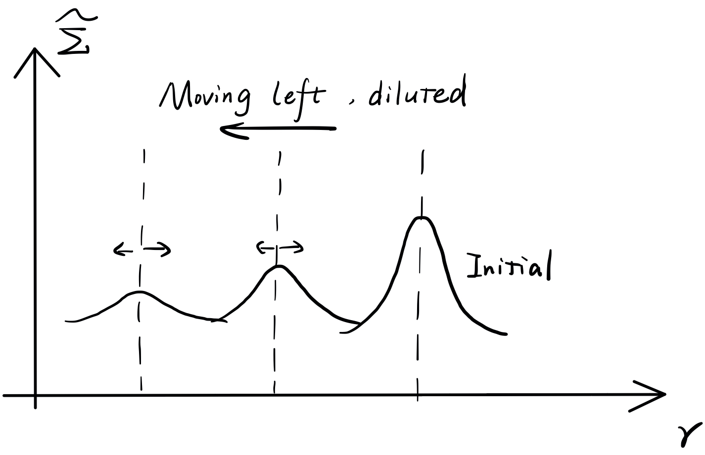

# Chapter 5. Accretion Disk Theory

## General Picture

The inflowing has a non-zero angular momentum and forms a disk. For a specific angular momentum, $j_0=rv$. Let us ignore the pressure for this moment, and compare the gravity and centrifugal force,
$$
\frac{GM}{r^2}\sim\frac{j_0^2}{r^3}
$$
At a small radius, to conserve the specific angular momentum, the centrifugal term must dominate. The critical radius is
$$
R_\text d\equiv\frac{j_0^2}{GM}
$$
It is known as the **disk radius**, or the **centrifugal radius**. It corresponds to the radius within which a disk could form due to the net angular momentum from the accreted gas.

- **Estimation of $R_\text d$** 

  At any radius, the accreted gas has a random motion velocity of the order of the adiabatic sound speed $c_s$. The effective tangential velocity component $v$ is scaled with an order-one factor $f$, $v\sim fc_s$.

  In addition, the accretion starts at Bondi radius,
  $$
  r\lesssim R_B\sim\frac{GM}{c_\infty^2}
  $$
  Consequently,
  $$
  j_0=rv\sim R_B\cdot fc_\infty\sim f\frac{GM}{r_\infty}\Rightarrow R_\text d\sim f^2 R_B=10^{-2}\left(\frac{f}{0.1}\right)^2R_B
  $$
  Usually $f\sim0.1$, so $R_\text d$ is two orders of magnitude smaller than the Bondi radius.

  - **Black Hole**

    The so-called *surface* of the object is the event horizon, whose size is approximately Schwarzschild radius
    $$
    R_{Sch}=\frac{2GM}{c^2}=\frac{2c_\infty^2}{c^2}R_B
    $$
    For HI gas, $c_s\sim10$ km/s, thus for $f\sim0.1$
    $$
    R_{Sch}\sim10^{-9}R_B\ll R_\text d\ll R_B
    $$

  - **Sun-like Star**

    Again for $f\sim0.1$, 
    $$
    R_B\sim10^{3}R_\odot,\quad R_\text d\sim10 R_\odot,\quad R_*\sim R_\odot
    $$

The disk is, obviously, axisymmetric. All our discussion below will be in the cylindrical coordinate $(r,z)$. $z=0$ corresponds to the **equator** of the disk.

### Profile along $z-$Direction

Along $z-$direction, pressure gradient is balanced with gravity.
$$
\frac{c_s}{\rho}\frac{\text d\rho}{\text dz}=-\frac{GM}{r^2+z^2}\frac{z}{\left(r^2+z^2\right)^{1/2}}
$$
Fix $r$, and consider isothermal case in which $c_s=c_0$ for simplicity, we can solve this ODE simply by integration
$$
c_0^2\ln\rho=\frac{GM}{\left(r^2+z^2\right)^{1/2}}+C\Rightarrow \rho(r,z)=f(r)\exp\left[\frac{GM}{c_0^2\left(r^2+z^2\right)^{1/2}}\right]
$$
For $z\ll r$, we can expand the exponential index into Taylor series
$$
\frac{GM}{c_0^2\left(r^2+z^2\right)^{1/2}}=\frac{GM}{c_0^2r}\left(1-\frac12\frac{z^2}{r^2}\right)
$$
Define
$$
\tilde f(r)\equiv f(r)\exp\left(\frac{GM}{c_0^2r}\right)
$$
we have
$$
\rho(r,z)=\tilde f(r)\exp\left(-\frac12\frac{GM}{c_0^2r^3}z^2\right)\equiv\tilde f(r)\exp\left(-\frac12\frac{\Omega_K^2}{c_0^2}z^2\right)
$$
where $K$ denotes for *Keplerian*. We can further define
$$
H\equiv\frac{c_0}{\Omega_K}
$$
and the $\rho(r,z)$ develops a Gaussian profile
$$
\rho(r,z)=\tilde f(r)\exp\left(-\frac12\frac{z^2}{H^2}\right)
$$
$H$ is the **disk scale height**, which corresponds to the disk thickness.

Now we need to think of the ratio of $H$ to $r$. Only if $H/r\ll1$ is our assumption that $z\ll r$ self-consistent.
$$
\frac Hr=\frac{c_s}{\Omega_Kr}=\frac{c_s}{v_K}\sim \mathcal M^{-1}\ll1\iff\mathcal M\gg1
$$
Thus we claim that the **thin disk** is equivalent to a **cold disk**, where the thermal velocity is much smaller than the rotational velocity.

### Gas Rotation in the Disk

Consider the terms of the Navier-Stokes equation in $r-$direction,
$$
\frac{\partial v_r}{\partial t}+v_r\frac{\partial v_r}{\partial r}-\frac{v_\phi^2}{r}=-\frac1\rho\frac{\partial P}{\partial r}-\frac{GM}{r^2}+\left[\nabla\cdot \sigma\right]_r
$$
In the steady state, the time derivative vanishes. If there is no viscosity, due to the conservation of angular momentum, there should not be any mass inflow and materials simply rotate, thus $v_r=0$. So
$$
\frac{v_\phi^2}{r}=\frac1\rho\frac{\partial P}{\partial r}+\frac{GM}{r^2}=\frac{c_s^2}\rho\frac{\partial \rho}{\partial r}+\frac{GM}{r^2}\Rightarrow v_\phi^2=\frac{\partial\ln\rho}{\partial\ln r}c_s^2+v_K^2
$$
For a thin disk, $c_s\ll v_K$, and $v_\phi$ is simply the Keplerian velocity. But for a relatively thick disk,
$$
v_\phi=v_K\sqrt{\frac{\partial\ln\rho}{\partial\ln r}\frac{c_s^2}{v_K^2}+1}=v_K\sqrt{\frac{\partial\ln\rho}{\partial\ln r}\frac{H^2}{r^2}+1}
$$
Usually the density gradient is negative, so the rotation is **sub-Keplerian**, where $v_\phi<v_K$. But there could be some regions where the density gradient is positive. The rotation in such region is **super-Keplerian**.

In fact, the radial velocity is led by the viscosity. Dimensional analysis gives that
$$
v_r\sim\frac\nu r
$$
In accretion disks, the consensus is that viscosity comes from turbulence excited by magnetorotational instability (MRI). We know that the kinematic viscosity $\nu$ is determined as
$$
\nu=\bar cl_\text{mfp}=\bar cL_\text{tur}
$$
where $\bar c$, here the turbulence velocity, is of the same order as $c_s$. On the other hand, the turbulence scale has a upper limit, which is the disk scale height $H$. As a result,
$$
\nu\sim c_sH
$$
In 1973, Shakura & Sunyaev proposed a trick by introducing a factor $\alpha$ so that
$$
\nu=\alpha c_sH
$$
throughout the disk. Though they have no idea of the physical origin for $\alpha-$viscosity, recent MHD simulations for MRI proves that although $\alpha$ is a time-dependent, local parameter, the variation is reasonable and the average $\alpha$ is somehow $0.001-0.01$.

With this assumption, the inflow velocity is
$$
v_r\sim\frac\nu r\sim\alpha\left(\frac Hr\right)c_s\sim\alpha\left(\frac Hr\right)^2v_K^2
$$
So $v_r\ll c_s\ll v_K$ for thin disks.

### Energy Production

In a axisymmetric accretion system, the accretion rate is
$$
\dot M=2\pi rv_r\Sigma
$$
where
$$
v_r\Sigma\equiv\int_{-H}^Hv_r(r,z)\rho(r,z)\text dz
$$
In the thin disk limit, $v_r(r,z)\sim v_r(r)$, thus
$$
\Sigma\equiv\int_{-H}^H\rho(r,z)\text dz
$$
$\Sigma$ is the **surface density** on the disk. Using our estimation of $v_r$, we have
$$
\dot M\sim 2\pi r\cdot\frac \nu r\cdot\Sigma\sim\nu\Sigma
$$
Now we can calculate the energy generation rate (**[erg/s/cm$^2$], energy flux**) due to accretion, during which gravitational energy is transformed into thermal energy via visocity.
$$
Q^+_\text{vis}\sim\frac1{\pi r^2}\cdot\frac{GM}r\cdot\dot M\sim\nu\Sigma\Omega_K^2
$$
This relation can be derived from Navier-Stokes equation directly. In fact,
$$
Q^+_\text{vis}\sim\nu\Sigma\left(\frac{\text d\Omega}{\text d\ln r}\right)^2\sim\frac94\nu\Sigma\Omega_K^2
$$
The energy is carried away mainly via radiation, convection, and advection. The convection can be important, but is really complicated and beyond the scope of this lecture. Here we mainly discuss advection and radiation.

**Advection**

In advection, the bulk fluid motion carries certain energy away. Again, out of dimensional analysis, we have
$$
Q^-_\text{adv}\sim\frac1{\pi r^2}\cdot \dot Mc_s^2
$$
where $\dot M$ describes the bulk motion and the specific internal energy is scaled with $c_s^2$. The ratio of $Q^-_\text{adv}$ to $Q^+_\text{vis}$ is
$$
\frac{Q^-_\text{adv}}{Q^+_\text{vis}}\sim\frac{\dot Mc_s^2}{\frac{GM}r\dot M}\sim\frac{c_s^2}{v_K^2}\ll1
$$
which suggests that for thin disk case, advection cannot efficiently takes energy away. For thicker disks, however, advection can play an important role in energy transportation.

**Radiation**

In a **geometrically thin disk**, we estimate the optical depth $\tau$.
$$
\tau\sim\frac12\kappa\Sigma\sim\frac12\kappa\frac{\dot M}{2\pi rv_r}
$$
We consider the fluid behavior in the vicinity of the black hole, that is, $r\sim R_{Sch}$. Because of the steep potential well predicted in GR, the infalling velocity is approximately the speed of light. In this way,
$$
\tau\sim\frac12\frac{\dot Mc^2}{4\pi GMc/\kappa}\sim\frac12\frac{\dot Mc^2}{L_{Edd}}\sim\frac1{2\eta}\frac{\dot M}{\dot M_{Edd}}
$$
For a typical efficiency $\eta\sim0.1$, when $\dot M\sim\dot M_{Edd}$, $\tau$ is significantly larger than unity. Note that $c$ is strictly an upper limit of $v_r$, so we have underestimated the optical depth. Absolutely the disk is **optically thick**. So the energy transporting rate via radiation is
$$
Q^-_\text{rad}\sim\frac{\sigma_{SB}T^4}{\tau}
$$

## Angular Momentum Transfer and Viscosity

In 1974, Lynden-Bell & Pringle claimed that rotating accretion disks should achieve minimum energy.

Suppose a test particle with specific angular momentum $j$ in a potential $\psi=-\frac{GM}r$. The motion is Keplerian, thus the specific energy is
$$
\varepsilon(j)=-\frac{G^2M^2}{2j^2}(1-e^2)
$$
where $e$ is the orbital eccentricity. The minimum energy state achieves with a circular orbit, where
$$
\varepsilon(j)=-\frac{G^2M^2}{2j^2},\quad \frac{\text d\varepsilon}{\text dj}(j)=\frac{G^2M^2}{j^3}=\frac{G^2M^2}{\Omega_K^3r^6}=\Omega_K
$$
Now consider two particles orbiting around $M$. The total energy and angular momentum are,
$$
E=m_1\varepsilon(j_1)+m_2\varepsilon(j_2)\\
J=m_1j_1+m_2j_2
$$
To conserve the total mass and angular momentum, we have
$$
\text dm_1+\text dm_2=0\\
\text d(m_1j_1)+\text d(m_2j_2)=0
$$
The lowest energy state obviously requires circular orbits. The energy differential is thus
$$
\begin{align*}
\text dE&=\varepsilon(j_1)\text dm_1+\varepsilon(j_2)\text dm_2+\frac{\text d\varepsilon}{\text dj}(j_1)\text d(m_1j_1)-\frac{\text d\varepsilon}{\text dj}(j_2)\text d(m_2j_2)\\
&=[\varepsilon(j_1)-\varepsilon(j_2)]\text dm_1+\left[\frac{\text d\varepsilon}{\text dj}(j_1)-\frac{\text d\varepsilon}{\text dj}(j_2)\right]\text d(m_1j_1)\\
&=[\varepsilon(j_1)-\varepsilon(j_2)]\text dm_1+(\Omega_1-\Omega_2)\text d(m_1j_1)\\
&<0
\end{align*}
$$
Without loss of generality, we assume $j_1>j_2$. Since
$$
\Omega_K\propto j^{-3},\quad -\varepsilon(j)\propto j^{-2}
$$
and
$$
\quad r=\frac j{\Omega_K r}\Rightarrow r\propto j^2
$$
we have $r_1>r_2$, $\varepsilon(j_1)>\varepsilon(j_2)$, and $\Omega_1<\Omega_2$. To ensure that $\text dE<0$, we have $\text dm_1<0$ and $\text d(m_1j_1)\equiv\text dJ_1>0$. Thus mass is transported inwards (to particle 2), while angular momentum is transported outwards (to particle 1).

### Evolution of Disk Surface Density

Let's now consider a real disk structure. Without viscosity, all materials follow Keplerian orbits, and no accretion actually happens, so viscosity is intrinsic in accretion disks. The most important non-diagonal component of the stress tensor is (especially out of the thin disk geometry) $\sigma_{r\phi}$. In cylindrical coordinate, it writes
$$
\sigma_{r\phi}=\rho\nu\left(\frac{\partial v_\phi}{\partial r}-\frac{v_\phi}{r}\right)=\rho\nu r\frac{\partial \Omega}{\partial r}
$$
The corresponding friction force is
$$
F_{r\phi}=\sigma_{r\phi}\cdot2\pi r\cdot2H
$$
Thus the net torque onto the belt within $r$ and $r+\text dr$ is
$$
\begin{align*}
N&=(r+\text dr)F_{r\phi}(r+\text dr)-rF_{r\phi}(r)\\
&=\frac{\partial}{\partial r}\left(rF_{r\phi}\right)\text dr\\
&=\text dr\frac{\partial}{\partial r}\left(2\rho H\cdot2\pi r^3\nu\frac{\partial \Omega}{\partial r}\right)\\
&=\text dr\frac{\partial}{\partial r}\left(2\pi r^3\Sigma\nu\frac{\partial \Omega}{\partial r}\right)
\end{align*}
$$
while the angular momentum of the belt is
$$
J=2\pi r\text dr\Sigma j
$$
Therefore, the angular momentum conservation is
$$
\frac{\partial J}{\partial t}+\frac{\partial}{\partial r}\left(Jv_r\right)=N
$$

$$
\iff\frac{\partial }{\partial t}(2\pi r\Sigma j)+\frac{\partial}{\partial r}\left(2\pi r\Sigma v_rj-2\pi r^3\Sigma\nu\frac{\partial \Omega}{\partial r}\right)
$$

Simply from the EoC, the accretion rate is
$$
\dot M=-2\pi r\Sigma v_r
$$
So we can define the advection flux
$$
F_{J,\text{adv}}=2\pi r\Sigma v_rj=-\dot Mj
$$
and the viscosity flux
$$
F_{J,\text{vis}}=-2\pi r^3\Sigma\nu\frac{\partial \Omega}{\partial r}
$$
By simply taking $\Omega=\Omega_K$ in the thin disk approximation,
$$
F_{J,\text{vis}}=3\pi r^2\Sigma\nu\Omega_K>0
$$
Again, angular momentum is transferred outwards.

**Steady State Solution ($\partial/\partial t=0$)**
$$
\Rightarrow\frac{\partial}{\partial r}\left(\dot Mj\right)=\frac{\partial}{\partial r}\left(3\pi r^2\Sigma\nu\Omega_K\right)=\frac{\partial}{\partial r}\left(3\pi \Sigma\nu j\right)
$$
If $r_\text{in}$ is the innermost radius of the disk, we have
$$
\dot M(j-j_\text{in})=3\pi \Sigma\nu j-\left(3\pi \Sigma\nu j\right)_\text{in}
$$
Let's impose the torque-free boundary condition at $r=r_\text{in}$, which suggests no viscosity in the inner boundary of the disk. 

> For black holes, $r_\text{in}\simeq r_\text{ISCO}\simeq6r_{Sch}$, inside which the GR effect suppresses any possible stable orbital motion, so the torque-free boundary condition holds. However, for accretion onto proton-stars / neutron stars, such condition is not justified.

$$
\Rightarrow \dot M=\frac{3\pi \Sigma\nu j}{j-j_\text{in}}=3\pi \Sigma\nu \left(1-\sqrt{\frac{r_\text{in}}{r}}\right)^{-1}
$$

For $r\gg r_\text{in}$, $\dot M\simeq3\pi \Sigma\nu$. When we combine this solution with the EoC, we obtain
$$
v_r=-\frac32\frac\nu r
$$
We used to claim a viscous timescale
$$
t_\text{vis}=\frac{R^2}{\nu}
$$
out of the dimensional consideration. Now we prove it.

**Non-Steady Solution**

The EoC now gives
$$
\frac{\partial \Sigma}{\partial t}=\frac1{2\pi r}\frac{\partial \dot M}{\partial r},\quad\dot M=-2\pi r\Sigma v_r
$$
And the angular momentum conservation gives
$$
2\pi rj\frac{\partial \Sigma}{\partial t}+\frac{\partial}{\partial r}\left(-\dot Mj-2\pi r^3\Sigma\nu\frac{\partial \Omega}{\partial r}\right)=0
$$

$$
\iff \dot M\frac{\partial j}{\partial r}=-\frac{\partial}{\partial r}\left(2\pi r^3\Sigma\nu\frac{\partial \Omega}{\partial r}\right)
$$

$$
\begin{align*}
\iff \frac{\partial \Sigma}{\partial t}&=\frac1{2\pi r}\frac{\partial \dot M}{\partial r}\\
&=\frac1{2r}\frac{\partial }{\partial r}\left[-\frac{\partial}{\partial r}\left(2r^3\Sigma\nu\frac{\partial \Omega}{\partial r}\right)\frac{\partial r}{\partial (\Omega r^2)}\right]\\
&=\frac1{2r}\frac{\partial }{\partial r}\left[\frac{\partial}{\partial r}\left(3r^2\Sigma\nu\Omega_K\right)\frac{2}{\Omega_K r}\right]\\
&=\frac3{r}\frac{\partial }{\partial r}\left[\sqrt r\frac{\partial}{\partial r}\left(\sqrt r\Sigma\nu\right)\right]
\end{align*}
$$

If we assume $\nu$ is roughly a constant throughout the disk, we can define
$$
\widetilde\Sigma=\sqrt r\Sigma
$$
so that
$$
\begin{align*}
\frac{\partial\widetilde\Sigma}{\partial t}&=\frac{3\nu}{\sqrt r}\frac{\partial }{\partial r}\left[\sqrt r\frac{\partial \widetilde\Sigma}{\partial r}\right]=\frac{3\nu}{2 r}\frac{\partial \widetilde\Sigma}{\partial r}+3\nu\frac{\partial^2 \widetilde\Sigma}{\partial r^2}\\
&=3\nu\frac{\partial \widetilde\Sigma}{\partial (r^2)}+3\nu\frac{\partial^2 \widetilde\Sigma}{\partial r^2}
\end{align*}
$$
The first term,
$$
\frac{\partial\widetilde\Sigma}{\partial t}=3\nu\frac{\partial \widetilde\Sigma}{\partial (r^2)}
$$
is a **wave equation**. The general solution is $\widetilde \Sigma=f(r^2-3\nu t)$, where $f(\cdot)$ is an arbitrary function. As the system evolves with time, the wave propogates while the shape remains the same.

The second term,
$$
\frac{\partial\widetilde\Sigma}{\partial t}=3\nu\frac{\partial^2 \widetilde\Sigma}{\partial r^2}
$$
is a **diffusion equation**. The general solution peaks at the same $r$, but the shape is gradually diluted. The overall solution behaves as a mixture of the two.

However, $\nu$ is in general not a constant. For a thin disk,
$$
\nu=\alpha c_sH=\alpha\frac{c_s^2}{\Omega_K}\propto T(r)r^{3/2}
$$
So we have to solve the equation numerically.

## Standard Disk Model

>Shakura & Sunyaez 1973, 1976

### Assumptions

1. Axisymmetric disk ($\partial/\partial \phi=0$).

2. Steady disk ($\partial/\partial t=0$). As a result,
   $$
   \dot M=2\pi rv_r\Sigma
   $$
   is a constant.

   In the last section, we have proved that when this assumption is applied and the torque-free boundary condition is imposed, we have
   $$
   \nu\Sigma=\frac{\dot M}{3\pi}\left(1-\sqrt{\frac{r_\text{in}}{r}}\right)\simeq\frac{\dot M}{3\pi}
   $$

3. The gravity is dominated by the central object.

4. Hydrostatic balance in the vertical direction.
   $$
   H=\frac{c_s}{\Omega_K}
   $$

   $$
   \Omega_K=\sqrt{\frac{GM}{r^3}}
   $$

5. Geometrically thin disk ($H/r=c_s/v_K\ll1$).

6. Rotation dominated ($|v_r|\ll v_\phi=v_K$).

7. **Somehow the least reasonable assumption:** viscosity is given by the $\alpha$-viscosity model.
   $$
   \nu=\frac23\alpha c_sH
   $$
   where $\alpha=\mathcal O(0.01-1)$.

8. The disk should be in thermal equilibrium ($T$ is well-defined throughout the disk) and optically thick, $Q^+_\text{vis}=Q^-_\text{rad}+Q^-_\text{adv}$.

   For the thin disk model, the advection term is negligible, and we have proved that
   $$
   Q^+_\text{vis}\sim\nu\Sigma\left(\frac{\text d\Omega}{\text d\ln r}\right)^2\sim\frac94\nu\Sigma\Omega_K^2\simeq Q^-_\text{rad}\sim\frac{2\sigma_{SB}T^4}{\tau}=\frac{8ac T^4}{3\tau}
   $$
   The disk has two sides, thus we add a factor of two in the radiation term. The optical depth $\tau$ is given by
   $$
   \tau=\kappa\cdot\frac H2
   $$

9. The opacity is mainly given by the electron scattering and free-free transition.
   $$
   \kappa=\kappa_\text{es}+\kappa_\text{ff}=\kappa_\text{es}+\kappa_0\rho T^{-7/2}
   $$
   where the density $\rho$ is given by
   $$
   \rho=\Sigma H
   $$

10. Equation of state is given by
    $$
    P=P_\text{gas}+P_\text{rad}=\frac{\rho k_BT}{\mu m_\text p}+\frac13aT^4
    $$
    and the adiabatic sound speed is given by
    $$
    c_s=\sqrt{\gamma\frac P\rho}\sim\sqrt{\frac P\rho}
    $$

For fixed $M$, $\dot M$, and $\alpha$, we still have 11 unkown quantities ($v_r,\ \Sigma,\ \Omega_K,\ H,\ \rho,\ \nu,\ c_s,\ P,\ T,\ \kappa,\ \tau)$ and exactly 11 equations, so all the quantities can be solved as a function of $r$.

The result gives a **broken power law** because the formula for $\kappa$ and $P$ include addition. The disk is thus divided into three regions.

- **Region I**, $\kappa_\text{es}$ and $P_\text {rad}$ dominate.
- **Region II**, $\kappa_\text{es}$ and $P_\text {gas}$ dominate.
- **Region III**, $\kappa_\text{ff}$ and $P_\text {gas}$ dominate.

In each region, the profile of each quantity has a individual slope, and is scale-free, by defining dimensionless quatities below
$$
m\equiv\frac M{M_\odot},\quad \dot m\equiv\frac{\dot M}{\dot M_\text{cr}},\quad \hat r\equiv \frac r{r_{Sch}}
$$
where
$$
\dot M_\text{cr}\equiv\frac{L_{Edd}}{c^2},\quad r_{Sch}\equiv\frac{2GM}{c^2}
$$
and $L_{Edd}$ is the Eddington luminosity,
$$
L_{Edd}\equiv \frac{4\pi cGM}{\kappa_\text{es}}
$$
Note that after solving the equation, one need to double check to make sure $|v_r|\ll c_s\ll v_K$ and $H/r\ll 1$ so that our assumpitions shall be valid. 

## Disk Energetics and Radiation Spectra

The energy equation is
$$
Q^+_\text{vis}= Q^-_\text{rad}
$$
So the one-side flux is
$$
F=\frac{1}{2}Q^-_\text{rad}=\frac98\nu\Sigma\Omega_K^2=\frac{3GM\dot M}{8\pi r^3}\left(1-\sqrt{\frac{r_\text{in}}{r}}\right)
$$
In an accretion disk, gravitational energy is released, and viscosity transports it to radiation. If there is significant advection, since $Q^+_\text{vis}=Q^-_\text{rad}+Q^-_\text{adv}$, the luminosity is reduced.

The total disk luminosity is
$$
L=\int_{r_\text{in}}^\infty Q^-_\text{rad}\cdot2\pi r\text dr=\frac32 GM\dot M \int_{r_\text{in}}^\infty\frac1{r^2}\left(1-\sqrt{\frac{r_\text{in}}{r}}\right)\text dr=\frac{GM\dot M}{2r_\text{in}}
$$
If $r_\text{in}=r_\text{ISCO}=6GM/c^2$, $L=\dot Mc^2/12$.