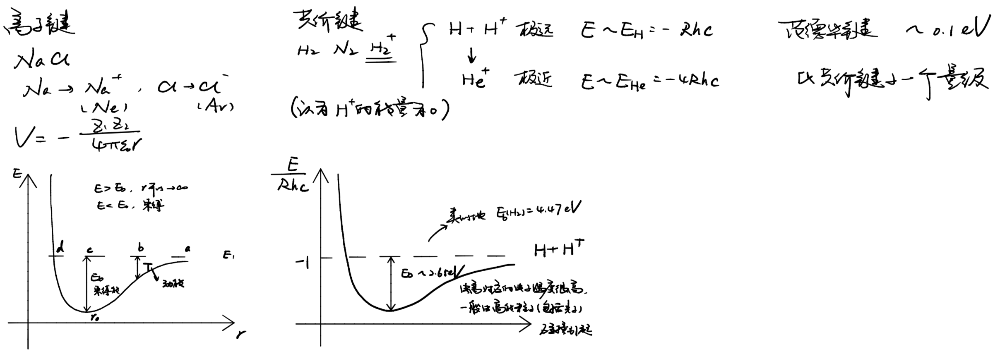
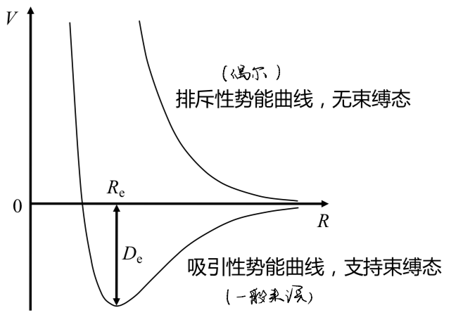

# Chapter 9 分子光谱

## 分子的结构和能量

### 双原子分子光谱

- 相对简单，但包括了分子结构和光谱的主要特征
- 多原子（多于两个原子）分子只能存在于低于 4000 度的环境，但双原子分子可以存在于高达 8000 度的环境
  - 恒星大气中通常只有双原子分子
- 比原子复杂
  - 不存在电子围绕单一中心运动
  - 原子核之间存在相对运动，包括**振动**和**转动**，形成电子谱之外新的分立能级和谱线

#### Born-Oppenheimer 近似

- 将分子中电子与原子核的运动完全分开考虑
  - 电子具有比原子核小得多的质量，运动要快得多
  - 对原子核位置和运动状态的改变，电子能迅速调整其自身的运动状态
  - 可以对原子核的每一个运动状态，将原子核看成静止不动的，再单独考察电子的运动
- **电子运动**形成的谱线就此分离开

#### 分子光谱结构

- 一个稍差的近似是将分子的**振动**和**转动**同样分开考虑
- 特征能量大小：电子运动 > 核振动 > 核转动，其中振动能比转动能高一到二个量级
- 分子发生跃迁时，三种运动状况都可能发生改变，产生能带结构
  - 电子态跃迁包含一系列振动能带
  - 一个振动能带包含一系列转动跃迁
  - 分子谱线数目通常比原子多得多，形成了分子特有的、在低分辨率下无法分辨的、由一系列波长十分相近的跃迁构成的谱线带

#### 电子能级结构

- 某一电子态下分子的能量是核间距 $R$ 的函数
  - $R\to0$
    - 原子核所带的正电荷产生很强的排斥力（势能曲线 $\propto R^{-1}$）
    - 电子间具有排斥力（势能曲线 $\propto R^{-1}$）
    - 电子（费米子）具有交换作用力（交换能 $\propto e^{a R}$）
  - $R\to\infty$
    - 分子离解成单个的原子
  - $0\ll R\ll \infty$
    - 由于原子核和电子之间存在引力，势能曲线可能有极小值——吸引态/成键的
    - 势能曲线也可能没有极小值——完全排斥性/反键的

#### 势能曲线

- 分子（电子态）典型的势能曲线

  ​	

  $R_\rm{e}$ 是核间距平衡位置，$D_\rm{e}$ 是离解能（结合能），定义为
  $$
  D_{\mathrm{e}}=V(R \rightarrow \infty)-V\left(R_{\mathrm{e}}\right)
  $$
  但严格来说离解能还要在此基础上减掉原子核的振动导致的零点能（不确定性原理）

#### 电子轨道角动量

- 每一个电子带有自旋角动量 $s_i$ 和轨道角动量 $l_i$，在 L-S 耦合下，电子总自旋角动量为 $S$，总轨道角动量为 $L$

- 分子通常非球对称

  - 对双原子分子，$L$ 与双原子分子两个原子核形成的核轴非常强地耦合在一起，单个电子的角动量不再是守恒量
  - $L$ 在核轴方向上的投影 $M_L$ 是运动常数，$L$ 绕轴进动

- 定义守恒量 $\Lambda=|M_L|$ ，可作为分子电子波函数分类的基础

  | $\Lambda$          | 0        | 1     | 2        | 3      | ...  |
  | ------------------ | -------- | ----- | -------- | ------ | ---- |
  | 电子轨道角动量投影 | $\Sigma$ | $\Pi$ | $\Delta$ | $\Phi$ | ...  |
  | 简并度             | 1        | 2     | 2        | 2      | ...  |

  如果考虑单个电子轨道角动量的投影，光谱项则记为 $\sigma(s)$，$\pi(p)$，$\delta(d)$，$\phi(f)$… 等等

#### 电子自旋角动量、多重性

- 电子的自旋角动量与核轴没有很强的耦合，多重性为 $2S+1$，以上标形式标出

  - $^1 \Sigma\Rightarrow S=0, \ \Lambda=0$
  - $^3 \Pi\Rightarrow S=1, \ \Lambda=1$

- 许多稳定的双原子分子的基态为电子闭合壳层，电子态都是 $^1\Sigma$（许多同核双原子分子，带偶数电子的异核分子）

  - 例外：$\ce{O2}$，基态为 $^3\Sigma$

- 含奇数个电子的分子的电子总自旋角动量通常为 $S=1/2$，基态电子态 $^2\Sigma$

- 非零的 $L$ 对应的基态电子态不一定是 $\Sigma(\Lambda=0)$，例如 $\ce{CH,OH,NO}$，基态电子态为 $^2\Pi$

- 同核分子波函数奇偶性——两种重要对称性

  - 与宇称类似

    - 电子的轨道波函数对核轴的中点反射对称——偶，电子倾向于在两核之间运动，将两核拉住；反射反对称——奇，电子倾向于在两核外围运动，将两核拉开
      $$
      \psi(\vec {R_A}, \vec {R_B})\to \psi(-\vec {R_A}, -\vec {R_B})\Rightarrow \left|\psi(\vec {R_A}, \vec {R_B})\right|^2= \left|\psi(-\vec {R_A}, -\vec {R_B})\right|^2\\
      \Rightarrow \psi(\vec {R_A}, \vec {R_B})=\pm \psi(-\vec {R_A}, -\vec {R_B})=\left\{
      \begin{array}{l}+: \ \text{ g(gerade) - oven}\\
      -:\text{ u(ungerade) - odd}\end{array}\right.
      $$

  - 针对 $\Sigma$ 态的反射对称性——波函数关于包含着核轴的任意平面的反射对称性

    - $\Sigma^+$——关于反射面反射对称——绝大多数分子
    - $\Sigma^-$——关于反射面反射反对称——$\ce{O2}$ 的基态是 $^3\Sigma_\text{g}^-$

- 同核分子的电子态标记

  - X 表示基态
  - A, B, C 等表示与基态相同自旋多重性的激发态
  - a, b, c 等表示与基态不同自旋多重性的激发态
  - 一般来讲，电子态依能量增加的次序用字母顺序标记，但实际中由于历史原因有很多例外

#### 分子中电子的总角动量

- 电子自旋可对分子能级产生大的影响

- 对于给定的 $S$ 和 $\Lambda$，电子态的能量可近似为
  $$
  T=T_{0}+A \Lambda {\Sigma}
  $$
  其中 $A$ 为常数，$\ita{\Sigma}$ 为电子总自旋角动量 $S$ 在核轴上的投影（$-S,-S+1,\dots,S$）

  事实上对于电子态的附加能量
  $$
  \Delta E\approx\mu_S B_\Lambda\cos\langle S,\Lambda \rangle=\mu_S B_\Lambda,\ \mu_S\propto\Sigma,\ B_\Lambda\propto\Lambda
  $$

- $\Lambda$（总是正数）和 $\ita{\Sigma}$（有正有负）的代数和可以作为下标加到光谱项上

  - $^4\Pi$
    - $\Lambda=1,\ S=3/2,\ \Sigma=3/2,1/2,-1/2,-3/2$
    - 光谱项能级 $^4{\Pi_{5/2}},\ ^{4} \Pi_{3 / 2},\ ^{4} \Pi_{1 / 2}, \ ^{4} \Pi_{-1 / 2}$
    - 分子光谱项的多重性总是足额的，但原子光谱项的多重性可能因为 $S>L$ 而不足额，如 $^3\text{S},\ ^4\text{P}$ 等

- 电子总角动量在核轴上的投影

  - $\Omega=|\Lambda+\Sigma|$
  - 常数 $A$ 可正可负，即 $^4{\Pi_{5/2}},\ ^{4} \Pi_{3 / 2},\ ^{4} \Pi_{1 / 2}, \ ^{4} \Pi_{-1 / 2}$ 中 $^4{\Pi_{5/2}}$ 能量可能最高（正常情形，regular - r）也可能最低（倒置情形，inverted - i）

#### 分子角动量的耦合—— Hund 情形

- 记原子核转动角动量为 $O$

##### Hund 情形 (a)

- 最为常见（除了没有自旋-轨道相互作用的 $\Sigma$ 态）

- 电子轨道角动量在核轴上的投影 $\Lambda$ 先与电子自旋角动量在核轴上的投影 $\ita{\Sigma}$ 耦合得到 $\Omega$，再和原子核转动角动量 $O$ 耦合得到 $J$
  $$
  \begin{aligned} \Lambda &=\left|M_{L}\right| \\ \Omega &=|\Lambda+\Sigma| \\ J &=O+\Omega \end{aligned}
  $$

##### Hund 情形 (b)

- $\Lambda$ 先和 $O$ 耦合得到 $N$，$N$ 再与 $S$ 耦合得到 $J$
  $$
  J=N+S
  $$

#### 原子核自旋角动量

- 含有非成对核子的原子核的总自旋量子数 $I$ 可以不为零，角动量的大小等于 $[I(I+1)]^{1 / 2} \hbar$ ，其中 $I$ 为整数或半整数
- $I$ 与 $J$ 相加得到分子的总角动量 $F$
- 超精细结构

#### Born-Oppenheimer 近似下的 Schrödinger 方程

- 对于双原子分子，首先对不同的 $\vec{R_A},\ \vec{R_B}$ 固定值求解，再对所得本征函数函数对 $\vec{R}=\vec{R_A}-\vec{R_B}$ 变分

  - 哈密顿量

    - 原子核动能为零，原子核静电势能为常数

    - 电子动能
      $$
      T_{\mathrm{e}}=-\frac{\hbar^{2}}{2 m_{\mathrm{e}}} \sum_{i} \nabla_{\mathrm{r}_{i}}^{2}
      $$

    - 电子静电势能
      $$
      V_{\mathrm{ee}}=\sum_{i<j} \frac{e^{2}}{4 \pi \varepsilon_{0}\left|\mathbf{r}_{i}-\mathbf{r}_{j}\right|}
      $$

    - 电子与原子核静电势能
      $$
      V_{\mathrm{ev}}=-\sum_{i} \frac{Z_{\mathrm{A}} e^{2}}{4 \pi \mathcal{E}_{0}\left|\mathbf{r}_{i}-\mathbf{R}_{\mathrm{A}}\right|}-\sum_{i} \frac{Z_{\mathrm{B}} e^{2}}{4 \pi \varepsilon_{0}\left|\mathbf{r}_{i}-\mathbf{R}_{\mathrm{B}}\right|}
      $$

- 分子波函数为电子波函数和原子核波函数乘积
  $$
  \Psi=\varphi_{\mathrm{e}}\left(\mathbf{r}_{i}, \mathbf{R}\right) \chi_{\mathrm{N}}\left(\mathbf{R}_{\mathrm{A}}, \mathbf{R}_{\mathrm{B}}\right)
  $$

##### 电子波函数

- 分子轨道模型
- 共价键模型

##### 原子核波函数

- 两体问题——简化为约化质量为
  $$
  \mu=\frac{M_{\mathrm{A}} M_{\mathrm{B}}}{M_{\mathrm{A}}+M_{\mathrm{B}}}
  $$
  的一体问题，对同核分子，$\mu=M_\text{A}/2$

  Schrödinger 方程简化为
  $$
  \left[-\frac{\hbar^{2}}{2 \mu} \nabla^{2}-V(\mathbf{R})-E\right] \chi_{\mathrm{N}}(\mathbf{R})=0
  $$

- 将振动（径向运动）和转动（角运动）分开讨论

- 角运动方程相当于一个零势能的 Schrödinger 方程，形式与氢原子 Schrödinger 方程角运动部分相同，具有相同的球谐函数解和能量本征值
  $$
  E_{\mathrm{r}}=\frac{\hbar^{2}}{2 \mu R^{2}} J(J+1)
  $$

  - 转动能级

    - 将分子看成刚体，核间距固定在 $R_0$，转动惯量 $I_0=\mu R_0^2$
      $$
      E_{\mathrm{r}}=\frac{\hbar^{2}}{2 I_{0}} J(J+1)=B_{0} J(J+1)
      $$
      $B_0$ 称为分子的转动常数

    - 实际上分子并不是刚体，当分子快速转动时原子核间的间距会增大，需要引入一项离心力畸变改正因子来改正

    - $J=0$ 时 $E_r=0$，没有转动零点能

- 径向运动

  - 将势能在平衡位置附近展开，取二阶近似，得到简谐振子势
    $$
    V_{\mathrm{HO}}(R)=V_{0}+\frac{1}{2} k\left(R-R_{e}\right)^{2}
    $$

  - 求解谐振子运动方程得到原子核振动
    $$
    E_{V}=\hbar \omega\left(v+\frac{1}{2}\right),\ \text{where }v=0,1,2,\dots,\ \omega=\left(\frac{k}{\mu}\right)^{1 / 2}
    $$
    $v$ 是振动量子数

  - 零点能

    - 谐振子近似下均匀分布
    - 分子在势能曲线的底部不能存在——零点能 $\hbar\omega/2$——不确定性关系
    - 一般来讲，转动能级比振动能级小得多

  - 分子振动零点能 (ZPE) 影响低温星际介质中的化学反应
    $$
    \ce{H2 + D+ <=> HD + H+}
    $$

    - 温度较高时
      $$
      \frac{n\left(\ce{HD}\right)}{n\left(\ce{H2}\right)}\approx \frac{n\left(\ce{D}\right)}{n\left(\ce{H}\right)}
      $$
      但在低温下不再成立

    - 实际上，由于
      $$
      \omega= \left(\frac{k}{\mu}\right)^{\frac{1}{2}}
      $$
      我们有
      $$
      \frac{\omega_{\mathrm{HD}}}{\omega_{\mathrm{H}_{2}}}=\left(\frac{\mu_{\mathrm{H}_{2}}}{\mu_{\mathrm{HD}}}\right)^{1 / 2}=\left(\frac{\mu_{\mathrm{H}}/2}{2\mu_{\mathrm{H}}/3}\right)^{1 / 2}=\frac{\sqrt{3}}2
      $$

    - 从而反应物和生成物在低温下存在显著能量差
      $$
      \Delta E=\mathrm{ZPE}(\mathrm{HD})-\mathrm{ZPE}\left(\mathrm{H}_{2}\right)\approx-389\ \mathrm{cm}^{-1} \approx-560\ \mathrm{K}<0
      $$
      这里已经记入了 ZPE 中所含的电离势的改变

      从而看到从左至右是一个释能反应，说明低温条件非常适合 $\ce{HD}$ 的形成，$\ce{HD}$ 的丰度常常比仅基于 $\ce{D}$ 和 $\ce{H}$ 丰度比所得的预期值高出 100-1000 ——氘分馏

    - 在其它一些含 $\ce{H/D}$ 的分子对中也可能观测到，其他元素同位素中也观测到，但程度上要小很多

      - 其他元素的丰度更低
      - 同位素原子的（相对）约化质量差更小

  - 非简谐振子

    - 对高激发能级，低能展开得到的简谐势不再适用
    - 真实分子中，$v$ 增大，$k$ 会随之减小（弹簧变软），能级间距越来越小，并终止于离解能处

  - Morse 势
    $$
    V=D_{\mathrm{eq}}\left\{1-\exp \left[a\left(r_{0}-r\right)\right]\right\}^{2}
    $$

    - 振动能级
      $$
      E_{\mathrm{v}}=\omega_{e}\left(v+\frac{1}{2}\right)-\omega_{e} \chi_{e}\left(v+\frac{1}{2}\right)^{2}
      $$
      即
      $$
      \omega=\omega_{e}\left[1-\chi_{e}\left(v+\frac{1}{2}\right)\right]
      $$
      恰相当于随着 $v$ 增大，能级差减小

- 振动转动能级（$^1\Sigma$ 态，势阱底部附近）
  $$
  E_{\mathrm{vr}}=\omega_{e}\left(v+\frac{1}{2}\right)+B_{e} J(J+1)-\omega_{e} \chi_{e}\left(v+\frac{1}{2}\right)^{2}-D_{e} J^{2}(J+1)^{2}-\alpha_{e}\left(v+\frac{1}{2}\right) J(J+1)+\cdots
  $$

  - $\omega_e$ - 谐振子频率
  - $B_e$ - 转动常数
  - $\omega_e\chi_e$ - 非谐振子首项改正因子
  - $D_e$ - 离心力畸变改正
  - $\alpha_e$ - 转动能级随振动能级的变化 $B_{\mathrm{v}} \cong B_{\mathrm{e}}-\alpha_{\mathrm{e}}(v+1 / 2) \ldots$
  - 以上常数通常为正值，以 $\text{cm}^{-1}$ 为单位给出

## 分子的转动光谱

## 分子的振动转动光谱

## 分子的电子振动转动光谱和能带

