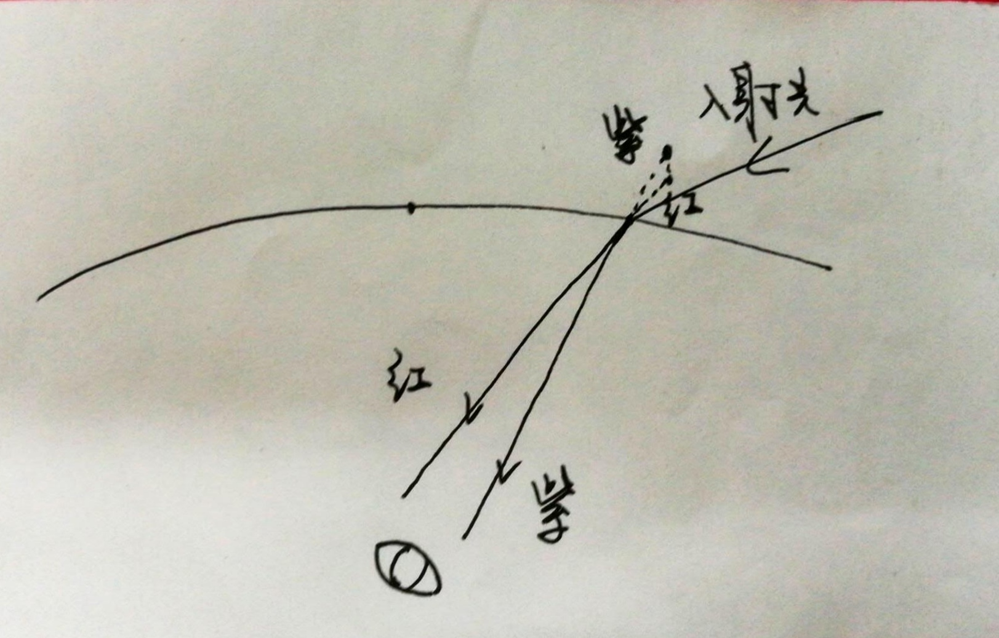
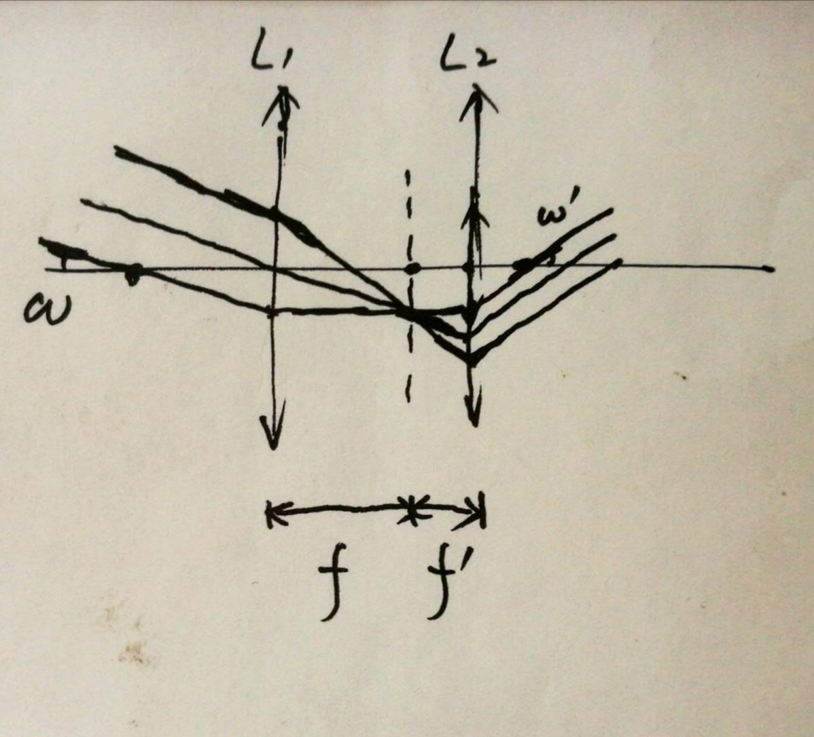
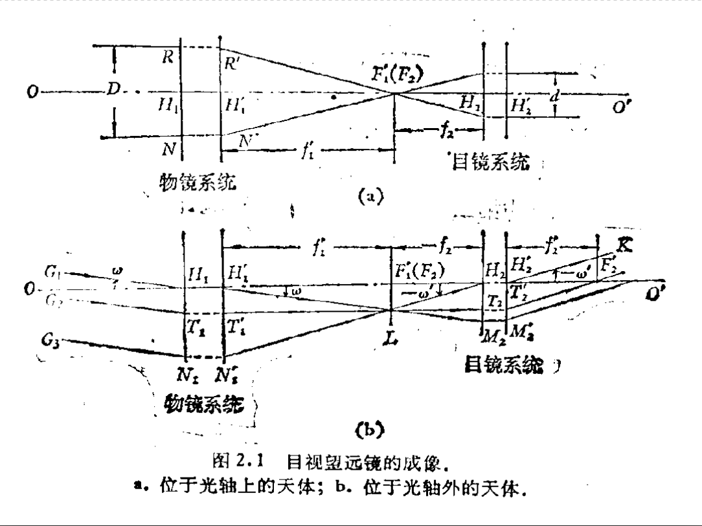
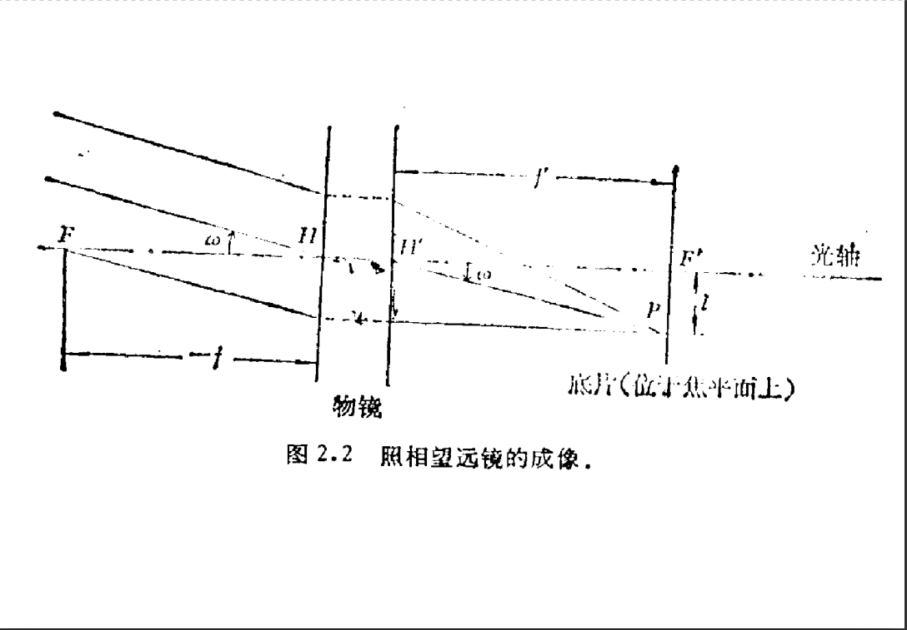
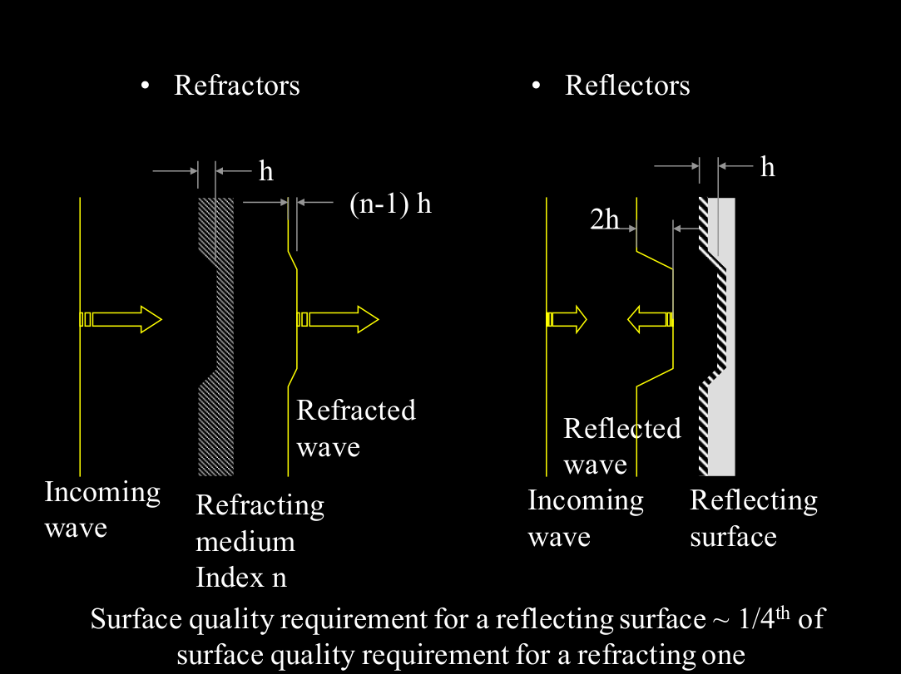
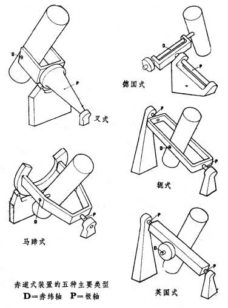

# Chapter 1 引言

## 实测天体物理学

- 天文学是一门观测的科学，观测在天体物理学的诞生和发展中起着决定性的作用
- 天文学分支
  - 天体物理：应用现代科学(尤其是物理学)的先进技术和理论来探讨各类天体的本质——形态、内部结构、物理状态、化学组成、相互关系、起源、演化规律等
  - 天体力学：研究**太阳系天体**的**力学形状**和**运动规律**
  - 天体测量：研究和测量天体的**位置**及其**变化**
- 实测天体物理学：根据预定的研究目的，利用相应的**天文仪器**，**接受**天体的辐射，以及对这些辐射进行**处理**，从而获得可供进行理论分析的各种资料

## 天体信息的来源

- 电磁波
- 宇宙线：来自宇宙空间的各种高能粒子：质子、α粒子、电子
- 引力辐射：引力波天文学
- 中微子辐射：中微子天文学
- 实物：陨石、月球岩石样本

## 得到天体信息的过程

- 天体辐射——望远镜——前置系统——辐射探测器——记录设备——观测数据处理——供理论分析用的资料

## 地球大气对天文观测的影响

- 大气折射（蒙气差）：改变天体辐射的方向

- 大气色散：大气折射率随波长的增加而减小，长波折射偏转小于短波，望远镜焦平面上的星像在高度方向上展开成一条彩色像的光带，紫端靠近天顶

  

- 大气扰动：地球大气不稳定，光波通过大气时波前发生畸变（闪烁、晃动、模糊）——大气视宁度

- 大气发射

  - 热发射：影响红外观测
  - 荧光（气辉）：大气中的离子和电子复合而产生光化离解反应会引起光子发射——连续谱+发射线

  > 气辉可能来自高层大气中许多种过程，例如白天被阳光电离的原子的复合，宇宙线撞击高能大气产生的荧光，氮、氧与羟基反应引起的发光等
  >
  > ——Wikipedia

  

- 改变天体辐射的成分和强度

  - 大气消光：改变辐射的强度和能谱
    - 大气分子的**瑞利散射**（波长越短越严重）和**尘埃微粒的吸收**作用造成大气的连续吸收
    - 大气中 $\ce{O3 ,O2 ,N2 ,CO2 ,H2O}​$ 等分子的吸收作用产生大量的吸收线和吸收带
      - 紫外
        - $\ce{O2, N2}$：2200 Å - 远紫外
        - $\ce{O3}$：2300 Å - 2900 Å
        - 波长小于 3000 埃的天体辐射地面几乎接收不到
      - 红外
        - $\ce{O3 ,CO2 ,H2O}$ 等分子对红外辐射的吸收相当强，但有几个小小的窗口
      - 在地面上无法观测紫外、X-ray、$\gamma$-ray、绝大多数的红外辐射

# Chapter 2 光学天文望远镜

## 引言

- 人眼
  - 瞳孔：$2\text{ mm}-8\text{ mm}$ 可调
  - 圆柱细胞：弱光 v.s. 圆锥细胞：强光
  - 响应波长：$4000-7000\overset\circ{\text{A}}$ ，最敏感为 $5550\overset\circ{\text{A}}$
  - 极限探测率：6 等星；$100\text{ ms}$ 内向眼睛连续发射 $100$ 个光子 
  - 极限分辨率：$0.5'$ ，一般为 $1'$
- 看得见：目标足够亮
- 看得清：足够的视角 
- 望远镜（目视望远镜、照相望远镜）

## 表征望远镜光学性能的物理量

### 口径/相对口径

- 口径 $D$ ：物镜的有效口径，未被镜框挡住那部分物镜的直径

- 相对口径 $A​$ ：物镜的口径与焦距之比

- 焦比：相对口径的倒数

- 望远镜把直径为 $D$ 的圆斑转变为艾利斑（理想状态下，直径 $1.22\lambda/D$ ），设望远镜透射/反射效率为 $\eta$ ，则流量密度增益为
  $$
  \left( \frac { D } { \frac { 1.22 \lambda } { D } \cdot f } \right) ^ { 2 } \cdot \eta = \frac { \eta D ^ { 4 } } { 1.5 \lambda ^ { 2 } f ^ { 2 } }
  $$
  事实上视影圆斑的角直径往往由大气扰动决定，流量密度增益为
  $$
  \left( \frac { D } { \delta \cdot f } \right) ^ { 2 } \cdot \eta = \frac { \eta } { \delta ^ { 2 } } \cdot \left( \frac { D } { f } \right) ^ { 2 } = \frac { \eta } { \delta ^ { 2 } } \cdot A ^ { 2 }
  $$
  短焦距（快焦比）系统威力更强

  ——只适用于探测器像素尺寸小于视影圆面的情形，否则分辨率由探测器分辨率决定

### 放大率、底片比例尺

- 放大率：角放大率——对目视望远镜而言

  
  $$
  G = \left| \frac { \tan \omega ^ { \prime } } { \tan \omega } \right| = \frac { f _ { 1 } ^ { \prime } } { f _ { 2 } ^ { \prime } } = \frac { D } { d }
  $$
  $D$：入射光瞳，物镜的有效口径

  $d$：出射光瞳，物镜本身通过目镜系统所成的像的直径

  对于目视望远镜，出射光瞳不能大于瞳孔直径

  等瞳孔放大率
  $$
  G _ { \min } = \frac { D } { d _ { e y e } }
  $$

- 底片比例尺：在**视场中央**底片上单位长度所对应的**天球上的角距**——对照相望远镜而言

  
  $$
  \tan \omega = \frac { l } { f}\approx\omega
  $$
  从而底片比例尺
  $$
  \alpha = \frac { \omega } { l } = \frac { 1 } { f  }(\text{rad/mm})=\frac{206265}{f}(''\text{/mm})
  $$

### 视场

- 能被望远镜良好成像的天空区域的角直径

- 目视望远镜：取决于物镜与目镜
  $$
  \tan \frac { \theta } { 2 } = \left( \tan \frac { \theta’ } { 2 } \right) / G
  $$
  $\theta'$ 为目镜的视场

- 照相望远镜：就是物镜的视场

### 贯穿本领（极限星等）

- 在晴朗无月的夜间用望远镜观看或拍摄天顶附近的 A0 型星所能达到的最暗星的星等
- 反映了望远镜在观测恒星方面的威力

1. 目视望远镜
   $$
   m _ { v } = m _ { v } ^ { \prime } + 2.5 \lg k \left( \frac { D } { d _ { eye } } \right) ^ { 2 } = m _ { v }' + 5 \lg \frac { D } { d _ { eye } } + 2.5 \lg k\\
   m_v'=6^m.5，d_{eye}=6\text{ mm}，k=0.6
   $$

   $$
   \Rightarrow  { m } _ { v } \approx 2 ^ { m } .1 + 5 \lg D(\text{mm})
   $$

   - 增大放大率，会增加恒星对于背景的反衬，因而一般会增加望远镜的贯穿本领
   - 放大率太大，衍射圆面显著，星象弥散，亮度降低，贯穿本领下降
   - 物镜的像差与缺陷，望远镜的调焦不良以及大气的抖动等因素都会降低望远镜的贯穿本领

2. 照相望远镜

   - 口径、底片特性、夜天光

3. 贯穿本领只适用于点光源，对于面光源，考虑天体在物镜焦平面的照度
   $$
   E _ { \omega } ^ { \prime } = k A ^ { 2 } \cos ^ { 4 } \omega
   $$

### 分辨角

- 目视望远镜：两天体(或一天体的两个部分)的像刚刚能被肉眼分辨开时对应的天球上两点的角距
  $$
  \delta=1.22\frac{\lambda}{D}\\
  \delta _ { v } ( { ''}) = \frac { 140'' } { D } (D\  以\text{ mm } 为单位)
  $$
  $\delta_v''$ 代入了人眼最敏感的波长 5500 Å

- 分辨本领：分辨角的倒数

- 当 $G \cdot \delta _ { v } ^ { \prime \prime } \geq \Delta''$ 时人眼可以分辨，其中 $\Delta''$ 是人眼的分辨率，则分辨放大率
  $$
  G _ { r } = \frac { \Delta ^ { \prime \prime } } { \delta _ { v ^ { \prime } } } = \frac { D } { 140'' } \Delta ^ { \prime \prime }
  $$

- 照相望远镜：在拍摄的底片上，两个刚刚能分开的**极限星**(能拍摄下来的最暗的星)所对应的角距

  底片中央附近两颗刚刚能分开的极限星的距离乘上底片比例尺
  $$
  { l = 1.22 \frac { \lambda } { A } + k } \\ { \delta _ { p } ''= \frac { 1 } { D } ( 251643 \lambda + 206265 k A ) }
  $$
  取 $k=1.5\times10^{-2}\text{ mm}，\lambda=4.5\times10^{-4}\text{ mm}$ 
  $$
  \Rightarrow\delta _ { p } = \frac { 1 } { D(\text{mm} )} ( 113 + 3100 A )
  $$

## 像差

- 非傍轴光线、与光轴夹角大
  - 球差（轴上物点发出的大孔径光线不会聚于一点）：与 $\omega$ 无关，与 $D^3$ 成正比
  - 彗差（傍轴物点发出的宽光束经光具组后在像平面上不再交于一点，而是形成状如彗星的亮斑）：与 $\omega D^2$ 成正比
  - 像散（非近轴物点发出的细光束，像沿轴的方向扩展，即子午焦面和弧矢焦面不重合）、场曲（成清晰像的最佳像面不为平面）：与 $\omega^2D​$ 成正比
  - 畸变（光学系统对共轭面上不同高度的物体垂轴放大率不同产生畸变）：与 $\omega^3$ 成正比，与 $D$ 无关
- 非单色
  - 色差

## 光学天文望远镜分类

### 折射望远镜

- 单透镜像差严重——用复合透镜消除（双透镜物镜、三透镜物镜和四透镜物镜）

#### 伽利略式

- 物镜是凸透镜，目镜是凹透镜
- 成正像，但视场小，不便安装十字丝

#### 开普勒式

- 物镜和目镜都是凸透镜
- 成倒像，视场大，可在物镜的焦平面上安装十字丝

### 反射望远镜

#### 主焦点系统

- 旋转抛物面，没有球差，但有严重的彗差——视场特别小
- 存在挡光问题
- 只有一块曲面反射镜，称为简单式物镜系统
- 其他的反射望远镜均有两个或两个以上的曲面反射镜，称为复杂式物镜系统

#### 牛顿系统

- 小型牛反：球面镜，无色差，其他像差都未消除，$D$ 和 $A$ 都不能太大
- 中型、大型牛反：旋转抛物面，同时消了球差，但对轴外光束彗差大，因而视场小

#### 卡赛格林系统、耐司姆斯系统

- 主镜为**抛物面**，副镜为**双曲面**
- 无球差，彗差减小，因而视场扩大
- 注意耐焦和卡焦的位置

#### R-C 系统

- 主镜十分接近**凹双曲面**，副镜十分接近**凸双曲面**
- 无色差、球差、彗差，但像散、场曲未消除
- 优点是视场比主焦点系统、卡塞格林系统大几倍

#### 折轴系统

- 将望远镜的轴做成空心的，在其中加入几块平面反射镜或转向棱镜等光学元件，使光从空心轴中射出
- 可以将光路引入控制室，不需要在观测室内安置探测器
- 能量损失多

### 折反射望远镜

- 光线先经过透镜，再由反射镜成像

#### 施密特望远镜

- 主镜为球面镜，平行光束的彗差和像散为零，但存在球差，近轴光线和远轴光线无法聚于一点
- 在球面镜的曲率中心处加一块校正板（反射镜一般为改正板口径的 1.5 倍左右），消除球差
- 优点
  - 相对口径大，可达到 1
  - 相同口径、相对口径下，视场更大
  - 校正板比折射透镜薄得多，光能损失小，口径容易比折射镜更大
- 缺点
  - 校正板形状特殊，难以加工
  - 焦面是弯曲的，又位于光路中间，增加视场还会引起挡光增加
  - 镜筒长度比具有相同焦距的反射望远镜长（改正版在曲率中心，**曲率半径大约为焦距的两倍**）

#### 马克苏托夫望远镜
- 改正透镜是一块**光焦度接近于零**的**弯月形**透镜
- 球差很小，但场曲比较大
- 优点
  - 其光学系统的所有表面均系球面，制造比较容易
  - 改正板不是放在球面曲率半径附近处，而是放在主镜的焦点附近，因此在同样口径、相对口径的条件下，镜筒比施密特望远镜的短
- 缺点
  - 和相同口径、相对口径的施密特望远镜相比，视场稍小，成像质量略差
  - 改正板较厚，光损大，从而限制了口径的增大

#### 施卡（贝克尔系统）和马卡

#### 超施密特系统

- 视场极大

## 各类望远镜的特性和用途

### 反射镜优点

- 无色差
- 近紫外和红外损失小（对折射望远镜而言，构成物镜的光学玻璃，除熔石英外，一般都不能透过近紫外光，对近红外的透过率也很低）
  - 真空镀铝，镀膜厚度控制在半个黄光波长左右，可见光波段光损略高于 10%，必须 3-6 个月冲洗一次，每隔一两年重新镀膜
- 口径大，贯穿本领比折射镜大得多（折射望远镜由于透镜的吸光和自重变形均随口径的增大而迅速增加，口径无法做得很大）
- 相对口径大，主焦点的反射望远镜的相对口径约为 1/5-1/2.5
- 一架较大口径的反射望远镜往往可以兼有主焦点系统（或牛顿系统）、卡塞格林系统、折轴系统等数种光学系统，有的甚至在加改正透镜后可变成折反射望远镜——同一架望远镜就具有不同的相对口径和视场，以便根据不同的观测项目进行选择
- 镜筒短，对于大型反射望远镜的机械装置以及圆顶的建造都比较方便，也较省钱
  - 相对口径大，焦距短
  - 对于卡塞格林系统等反射望远镜，其镜筒往往还可以比等效焦距短好几倍
- 适合于做**天体物理**方面的工作

### 折射镜优点

- 视场大，几度到几十度（反射镜：几角分到几十角分）

- 同样口径下相对口径小，即焦距长，底片比例尺小，分辨本领高（单位长度的底片线元对应更小的天球上的角元）

- 在加工精度相同的情况下，折射望远镜给出的星像比反射望远镜的好

  - 瑞利指出波像差不得超过 $\lambda/4$

  - 折射镜：准确到 $\lambda/2$

  - 反射镜：准确到 $\lambda/8$

    

- 受温度变化和镜筒弯曲的影响较小，星像较稳定
- 仪器散射光小
- 折射望远镜星像明锐稳定，星像间的距离较大，星像良好的范围大，非常适合于做**天体测量**和**恒星天文**的某些工作（例如测定恒星的**自行和视差**等），也比较适合于进行**目视观测**

### 折反射镜优点

- 很大的视场和相对口径
- 在天体物理的某些领域中非常有用
- 特别适合于做**大面积的巡天工作**，同时适合于观测**有视面天体**和**快速运动的天体**，如弥漫星云、星系、彗星、流星以及人造卫星等

## 望远镜的机架结构

- 能够方便而准确地指向待测天体
- 能跟踪因地球自转而做周日视运动的天体
- 它通常具有两个互相垂直的轴

### 赤道式

> 轭式又称为摇篮式

- 极轴（指向北天极或南天极）：当望远镜绕极轴(又称赤经轴)旋转时，只改变赤经，而不改变赤纬——天体的周日运动圈
- 赤纬轴：当望远镜绕赤纬轴运动时，望远镜始终在同一子午圈，因而赤经不变，仅在不断改变赤纬
- 装上转仪钟后就可以补偿天体的周日运动，只需要绕极轴旋转
- 对重力不对称，容易引起望远镜形变

### 地平式装置

- 垂直轴
- 水平轴
- 对重力对称，结构简单，造价较低，目前大型或较大型的望远镜都采用这种装置
- 在跟踪时，它的两个轴同时转动，运动较为复杂，但引入计算机后，可以从赤道坐标向地平坐标实时转换
- 存在天顶盲区（方位角无法瞬间转 180 度），大小由望远镜所能跟踪的最高速度而定
  - 天顶盲区是由多种因素决定的，但主要是由**等方位角速度曲线、等方位角加速度曲线、最高快动角速度曲线**所确定
  - 所谓盲区就是这几组曲线的网络线所围成的区域

## 光学望远镜的新进展

### 制造大镜面的新技术

- 薄镜面拼接技术
- 多个望远镜组阵
- 浇筑或融合蜂窝型镜面
- 采用金属镜面、碳纤维镜面及其它特殊形式镜面

### 大相对口径

- 下一代望远镜的相对口径约为 1/2-1，镜筒短可以使整架望远镜以及圆顶室的尺寸都相应减小，从而大大降低研制成本

### 主动光学和自适应光学

- 主动光学(Active Optics)
  - 改正主镜镜面本身由于望远镜指向变化引起的镜面变形，因此镜面可以做得很薄，从而减小望远镜的重量
  - **薄镜面**主动加力校准技术：用一组力促动器顶在主镜的背面，并以一定规律改变镜子的表面形状，减小重力变形和热变形的影响，从而减小像差和提高像质
  - **拼镜面**主动光学技术：将整块镜子分成若干块，同时使各个子镜的焦点以很高的精度会聚在一起
- 自适应光学(Adaptive Optics)
  - 天体入射光束经过地球大气扰动，波前发生了变化
  - 在望远镜的光路中设有探测光波波前的敏感器
  - 波前敏感器测出的信号输入计算机，计算出应该把镜面形状做多大的改正以补偿波前的变化
    - 波前探测器：探测光的波前畸变
    - 波前控制器：通过波前探测器得到的**波前斜率**，解算出**波前相位**，然后通过控制系统反馈给波前校正器
    - 波前校正器：在变形镜上安装多个压电陶瓷制成的驱动器，用来改变不同子孔径的姿势，从而改变反射光束的方向

### 光干涉技术

- 原理：像面上干涉条纹可见度与光源的角大小以及狭缝之间距离有相应的函数关系，因此测量干涉条纹消失时两狭缝的间距即可算出恒星的张角
- 进行高角分辨率成像：研究恒星表面、主序前恒星的气壳、变星、星周物质、行星状星云、密近双星等
- 射电波段的波长比光学波段长一百万倍，且射电信息可以转化为电信号来处理，使得射电干涉信息的测量大大简化

### 地平式装置

- 镜筒只在一个平面内运动，因而较易处理镜面和镜筒的重力变形问题，可以设计出既对称又轻巧的支架，从而减小望远镜和圆顶室的尺寸
- 跟踪时两根轴都需要运动
- 天顶盲区

### 计算机的应用

- 控制天文仪器
- 数据处理：汇总天文观测项目，编排观测程序，处理观测结果

### 空间天文望远镜

- 长期以来，人类的天文观测活动一直在地球的表面进行，天文观测的波段、分辨能力和成像质量受到地球大气层的严重限制
- 为了最终摆脱地球大气层的限制，一个最有效的办法就是将望远镜送到空间轨道上

### 天文圆顶

- 功能要求
  - 工作时
    - 天体辐射自由而少畸变地进入接收器
    - 尽量避免风振动、温度变化、雨、湿、灰等不利因素对望远镜的影响
  - 不工作时
    - 较好地封闭
  - 强度、寿命、可靠、安全、美观、环境协调
  - 制造成本低、外形尺寸较小、重量轻、维护保养方便
- 对视宁度的影响
  - 圆顶内宁静度：由圆顶光路内空气温差引起
  - 镜面附近的宁静度：由镜面与周围空气温度差别引起
- 新方案
  - 小尺寸圆顶：地平式装置
  - 开启式圆顶
    - 圆顶与望远镜随动旋转，外形为圆柱体或多边柱体
    - 望远镜与圆顶间没有相对转动，可以进一步缩小圆顶尺寸，成本降低
    - 有利于空气流动，改善圆顶内视宁度
  - 在开启式圆顶的基础上加上充分通风的百叶窗口
    - 进一步改善视宁度
  - 完全开启式圆顶：观测时望远镜完全暴露在露天环境下
    - 结构简单，成本低
    - 望远镜周围没有附加的构件热源，视宁度最好
    - 风力较大时需要挡风屏
  - 在完全开启式圆顶的基础上增加与望远镜随动的挡风罩
    - 克服了风大时振动问题
    - 增加成本
  - 将圆顶和望远镜镜筒合为一体，做成圆球状
    - 省去了镜筒结构，大大降低望远镜造价
    - 其跟踪运动一般由摩擦机构直接驱动圆球完成，成本较低
    - 难点在于大圆球表面的加工
  - 将风屏固定在望远镜结构上
    - 风屏在不工作时可以完全关闭，保护望远镜，因此不需要外加圆顶

## 天文台的选址

- 优良台址普遍集中在受冷洋流控制下的沿海高山地带以及大洋中的孤岛

### 台址的大气特点
- **大气宁静度（视宁度）**
- 无云或少云的天数
- 大气中的水汽含量
- 大气中雨、雪等沉降物的情况
- 风力
- 大气消光

### 台址的基本指标
- 海拔高度
- 地形情况
- 温度情况
- 沙暴和尘埃情况
- 地质活动

### 人类活动情况
- **背景天光**
- 大气污染情况

### 台址的其它情况
- 纬度（能看到的天区面积）
- 水电供应
- 交通和生活设施

### 视宁度——最重要的指标

- 描述望远镜星像的**不规则运动和弥散**，一般用**星象弥散斑的直径**来表示
- 是由于地球大气的扰动（主要是风）而形成的：温度差——密度差——变化的折射率
- 高海拔处大气薄，视宁度好
- 大气扰动一般与光的传播方向无关，但入射方向接近地平线时，光线经过的大气层距离较大，大气宁静度将下降

### 背景天光

- 除星体所占有的位置外，夜间天空背景也有一定亮度
- 天光亮度通常用**每平方角秒张角内光子对应的星等数**来表示 ($\text { mag}\cdot\text{arcsec} ^ { - 2 }$)

- 来源
  - 自然背景辐射——$21.6 \text { mag}\cdot\text{arcsec} ^ { - 2 }$
    - 空间和大气中的粒子引起的自然光的散射
    - 包括夜间辉光、黄道光、星光、银河系和河外星系的光等
  - 人为光
    - 眩光：指在视觉范围中亮度过高，以致引起眼睛不舒适甚至部分失去视觉的光——广告，灯光市招
    - 光侵害：指照到本不该照到地方的光
    - 朝天光：指毫无用处射向天空的光——天文观测的大敌
    - 过度照明：指强度超过需要的光
    - 减小光害的措施
      - 避免不必要和过强的光照
      - 使用好的照明设备
        - 选择能够避免或减少光污染的照明设备：不发出朝天光，亮度适当，只照到需要照亮的区域或对象
        - 采用高效率且波段范围较窄的光源（比如低压钠灯），其光辐射可以用滤光片滤掉，不影响在其他波段的天文观测
      - 使用照明控制
        - 空间控制：把光集中到需要照明的方向，把其他方向的光遮挡掉或反射到需要的方向
        - 时间控制：需要时照明，不需要时关掉（比如声控开关）

# Chapter 3 辐射探测器

- 辐射探测器：将辐射能转化为可测量信号的器件

- 原理：是利用辐射和探测介质中的微粒结构的相互作用，将辐射的**能量**全部或部分地**转移**给介质中的粒子，在一定的外界条件下，引起**宏观尺度**上的可测量的信号

- 常用的能量转化方式

  - 辐射能转化为化学能：辐射引起物质的化学变化——照相底片

  - 辐射能转化为电能：辐射作用使电子从物质中释放出来，产生光电流或光电压——光电器件：光电倍增管、CCD
  - 辐射能转化为热能：在辐射作用下，物质变热，温度升高——热探测器：热电偶
  - 一种波长的辐射转化为另一种波长的辐射——闪烁体

## 反映辐射探测器性能的参数

### 量子效率 (QE) 和可探测量子效率 (DQE)

- 量子效率：光子和探测器作用时，产生的光子事件和入射光子数之比——判断探测器**潜在灵敏度**的指标

- 可探测量子效率：探测器输出信噪比的平方与输入信噪比的平方之比——表示信号由于通过探测而引起的变坏

- 从天体来的光子在各个相继的等时间间隔内到达辐射探测器的光子数不是一个常数，而是一个沿某一平均值上下随机起伏的值，经验表明它服从Poisson(k)：
  $$
  p ( r ) = e ^ { - k } k ^ { r } / r !
  $$

  - 信号 $n_{in}$ 为单位时间入射光子数的期望 $k$ 

  - 均方根噪声（标准差）为 $\sqrt{k}$ 

  - 输入信噪比 
    $$
    ( S / N ) _ { i n } = \frac { k } { \sqrt { k } } = \sqrt { k } = \sqrt { n _ { i n } }
    $$

- 理想状况下（探测过程本身不引入噪声），那么探测器输出的可记录事件数：
  $$
  n _ { o u t } = Q E \cdot n _ { i n }
  $$
  同样服从Poisson(k)，则输出信噪比
  $$
  ( S / N ) _ { o u t } = \frac { n _ { o u t } } { \sqrt { n _ { o u t } } } = \sqrt { n _ { o u t } }
  $$

- 理想探测器可探测量子效率：
  $$
  D Q E \equiv \frac { ( S / N ) _ { o u t } ^ { 2 } } { ( S / N ) _ { i n } ^ { 2 } } = \frac { n _ { o u t } } { n _ { i n } } \equiv Q E
  $$
  一般情况下，$DQE<QE$ 

### 响应度 ($R$) 和线性

- 响应度（灵敏度）：入射**单位功率的辐射流**所引起的探测器**输出信号**的反应（对于人眼、光电管），或入射**单位辐射能**所引起探测器输出信号的反映（对于照相底片）
  - 线性探测器：输出信号和输入通量的比率固定不变

### 光谱响应 ($R_\lambda$)

- 又称为分光灵敏度、分光响应
- 指**单色辐射**作用时探测器的响应度，用于表示探测器**对不同波长辐射的响应特性**——选择性，即对不同光谱区等辐射量的不同反应
- 探测器的光谱响应常用量子效率来表征，量子效率随波长的变化即为光谱响应曲线

### 分辨率

- 空间分辨率：描述探测器鉴别空间密集像点的能力——通常以**每毫米所能分辨的线对的数目**来表示
- 时间分辨率：指探测器记录或反应辐射快速变化的能力——从辐射进入探测器到探测器发生反应的这段时间称为响应时间

### 探测率

- 探测器能探测到的**最小辐射功率的倒数**称为探测率
- 噪声等效功率(NEP)：产生如噪声那样大的信号所需的辐射功率——探测率是噪声等效功率的倒数

## 照相底片

### 照相原理

- 某些物质在辐射下发生化学反应（如卤化银分离出银）
  $$
  \ce{Br- + }h\nu\ce{->Br + }e\\
  \ce{Ag+ +}e\ce{->Ag}
  $$

- 照相乳胶：由大量卤化银小晶体和明胶组成，最敏感的感光层往往是在溴化银内加入碘化银的杂质

- 硬片：玻璃底板($\sim100\ \mu\text{m}$) + 照相乳胶($\sim1\ \mu\text{m}$)

- 软片：赛璐璐薄片 + 照相乳胶

- 像中心包含的银毕竟太少，只有经过**显影**和**定影**后，才能得到所需要物体的像

### 照相底片的优点 ——强行加戏

- 具有与望远镜大视场相配的尺寸（数百毫米×数百毫米），CCD 相机可能只能到几十×几十（日新月异）
- 底片颗粒非常细，像素尺寸小，分辨率高（数微米×数微米）
- 每一像素可存储 6 bits 信息
- 大尺寸×高分辨率×高单位信息量——巨大的信息容量

### 照相底片的缺点

- 量子效率低，DQE 一般在 $0.1-1\%$ ，敏化后也不超过 $4\%$ 
- 响应非线性，且响应特性曲线取决于具体的乳胶性质、显影过程、入射光的颜色等等，找不到一般的函数形式
- 动态范围小（宽容度小）
- 响应不均匀（10 cm 范围内可达 $2\%$ ，且无法改正）
- 存在一系列影响测量精度的效应：扩散圆、反光晕、边缘效应
- 无法实时监视，也无法直接用计算机处理其信息

### 底片数字化

- 照相天文时代结束，建立底片信息库，拍摄并保存底片信息
- 底片清洁、底片扫描
- 作用：大时间尺度星象对比——变源光变研究、恒星和星团的运动学研究、长周期双星/聚星的动力学研究、太阳系天体的天然卫星历史轨迹研究

## 光电倍增管

- 光电器件：利用光电效应（**辐射能转化成电能**）制成的辐射探测器
- 光电效应的分类：
  - 外光电效应：电子从电极物质的表面发射出来——光电管、光电倍增管
  - 内光电效应（光电导效应）：半导体材料的电阻发生变化——光敏电阻
  - 阻挡层光电效应（光伏效应）：产生一定方向的电动势——光电池

### 结构

- 光敏阴极 + 若干电子倍增级（倍增系统）+ 电子收集极（阳极）

### 原理

- 当光照射到光阴极时，光阴极向真空中激发出光电子

- 这些光电子按聚焦极电场进入倍增系统，并通过进一步的二次发射得到的倍增放大

- 把放大后的电子用阳极收集作为信号输出

### 测量方式

- 脉冲计数：每 $10^8-10^{10}$ 个电子组成的单个脉冲被当做一个单位来进行计数，每个脉冲持续 $10^{-8}\text{ s}$ ——适合弱光源
- 电流测量：测量阳极的电流——适合亮光源

### 光谱响应

- 取决于光电**阴极**材料的性能

- 取决于辐射**照到阴极之前**所经过的**窗材料**特性

### 电流增益

- 次极电子发射因子 $\delta=AE^\alpha$

  - $E$ 为场强，$V$ 为电压
  - $A$ 为常数，$\alpha$ 为与次极的材料和结构有关的参数，通常在 $0.7-0.8$ 之间

- 具有 $n$ 级次级的光电倍增管的光电子增益
  $$
  G = \left( A E ^ { \alpha } \right) ^ { n } = \left[ B \left( \frac { V } { n + 1 } \right) ^ { \alpha } \right] ^ { n } = \frac { B ^ { n } V ^ { \alpha n } } { ( n + 1 ) ^ { \alpha n } } = k V ^ { \alpha n }
  $$

- $n=10，G\sim 10^6$

### 暗电流

- 即使是在严格无光照射的条件下，光电倍增管仍然会有信号输出

- 来源

  - 管脚的**漏电流**
  - 光电阴极或次极的**热辐射**
  - 管内残留气体的**电离**（光电倍增管是真空器件）
  - 场致发射

  > 利用外界强电场，把电子拉出固体表面的现象

  

- 处理

  - 脉冲计数法（完全消除影响）
  - 降温（降低热发射）
  - 阴极上接正电压（很大程度上消除场致发射）

### 优缺点

- 优点
  - 量子效率高（$\sim30\%$）
  - 动态范围大，对于变化于 $0-10^7(10^8)​$ 范围的辐射呈线性反应
  - 联机方便
  - 时间分辨率高——增益高，响应时间短，特别适合观测快速变化的弱源
  - 噪声小
- 缺点
  - 一元探测器，只能探测光强，不能记录二维图像

## 像管（像增强器）

- 记录光电阴极各点发射的光电子数（与该点照光强度成正比），从而同时记录二维图像

### 结构

- 光电阴极
- 涂荧光层的阳极
- 电子透镜

### 原理

- 当把光学像投在光电阴极上时，所产生的光电子将被静电场加速
- 再用由磁场组成的**电子透镜**进行成像，在其像面上就能得到与光学像对应的电子像（可以多级聚焦，制成多级像管）
- 在电子透镜的像面上置 CCD 或 Reticon 读出，那么电信号的像将与光学像对应
  - 配置 Reticon 器件的电子成像仪器—— Digicon
  - 配置 CCD 器件的电子成像仪器—— I+CCD

## 固体器件

- 利用**半导体**材料的光敏特性制成的**光电**探测器

### 半导体材料

- 半导体结构

  - 价带：束缚电子
  - 禁带
  - 导带：自由电子
  - 价带中的束缚电子——获得足够跨越禁带的能量——进入导带

- 半导体分类

  - N 型：电子导电——原子外层电子除组成原子间共价键结
    构外还有多余的电子，它们被驱使到高能级的导带上
  - P 型：空穴导电——如果原子在组成原子间共键时电子数不足，就存在空键，在外电压的作用下这些空穴会逐次被临近价电子填充，形成空穴的迁移
  - PN 结：两种半导体接触
    - N 型物质中的自由电子因能级较高扩散到 P 型物质中
    - N 型物质中正电荷过剩，P 型物质中则负电荷过剩，从而在PN 结两边产生一个内部电位差
    - 当这种内部电位差达到足以阻止这一电子流动时，平衡产生，形成一个简单的PN结二极管

- 硅二极管

  - PN 结光敏二极管

  - 在硅片上涂一层氧化物绝缘层，然后在上面制成电极，形成一个小电容

  - 工作时，先将二极管偏置，即将小电容**充电到一定偏压**

  - 当受到光照射时，光子的能量使硅片释放出电子-空穴对，二极管因此放电；或者说，入射在硅片上的光产生电荷，在积分周期内被收集和储存在二极管电容内，然后存储的电荷转化成视频输出

  - 将很多硅二极管制作在一个很小的面积上，即组成一个**硅二极管阵**

  - 把这种二极管阵曝光于要观测的天体像，像上照度强的地方二极管储存的电荷就多些，照度低的地方储存的电荷就少些——形成了相应的电潜像

  - 测量出这些电潜像各部分的强弱，就测得了待观测天体的光学像

### 自扫描硅二极管阵 IDA

- 集成型硅二极管阵，主要生产厂是美国 Reticon 公司，所以 IDA 有时也称为 Reticon
- PN 二极管阵列，二极管上再扩散一层 $\ce{SiO2}$ ，对应每个二极管再制作一个场效应管开关
- 通过开关，使所有二极管都和一个公共母线相连，场效应管开关受一个移位寄存器控制
- 当移位寄存器输入移位脉冲（时钟脉冲）时，顺序打开每个开关，使每个二极管顺次和公共母线相通，这样收集和存储在二极管内的电荷就按顺序输出

### 电荷注入器件 CID

- 硅片上每个光敏像元由两个电容组成
  - 一个连在行母线上——行电容
  - 另一个连在列母线上——列电容
  - 两个电容间有一个 P 型扩散层相耦合，通过这一扩散层，电容内的电荷可以用控制电容电极的电压变化来互相转移
  - 在硅二极管阵的两侧，沿行和列各有一个寻址器，通过寻址器选定要读的像元
- 读取
  - 开始，各二极管都加以偏置
  - 曝光后，光生电荷使二极管放电，在光敏面上形成电荷潜像
  - 如果要读第 n 行，第 m 列的像元
    - 先把要读的 n 行悬浮，测出该行的行电容内的总电荷
    - 将要读的 m 列置为 $0\text{ V}$。这样第 m 列电容的电荷都转移到相应的行电容中，而使各行电容的电位发生变化
    - 第二次测出第 n 行的电容总电荷
    - 将得到的结果和第一次结果相减，就可以得到第n行，第m列的像元中因曝光所储存的电荷量
  - 读出后，如果要将该像元清零，则将第 n 行置为 $0\text{ V}$，将电荷注入基板
  - 如果要恢复读出前状态，则将该行恢复偏置状态。这样使第n行的各行电容内部份电荷，重新注回相应的列电容，该像元就回到读出前状态
- 特点
  - 无破坏读出，可以反复读出多次以降低随机噪声，但读出时间长
  - 可以选择任一像元读出（只读感兴趣的一块、回过来再读前面的部分）

## 电荷耦合器件 CCD

### 结构

- 硅衬底-绝缘层 $\ce{SiO2}$-间隔很小的电极
- 金属-氧化物-半导体电容（MOS电容）阵列，通过金属化布线，形成三相结构

### 工作原理

- 当在器件表面的某一个电极加上电压(对于 P 型衬底的 CCD 加正电压，对于 N 型衬底的 CCD 加负电压)，则在该电极下面形成势阱，代表信息的少数载流子可以储存在势阱中。势阱的深度取决于所加电压和少数载流子的数目
- 对于一个未制冷的MOS电容，热电子将很快充满这一电容
- 但对制冷的器件，除非因光子轰击而产生光致电离，否则它将不被充满——可以积累由光致电离而产生的电子，并且电子的数目与入射光子数成正比
- 常用冷却方式
  - 经典杜瓦瓶：液氮
  - 连续流动制冷器
  - 闭环制冷机：机械制冷
  - 热电冷却器

### 图像读出——逐行读出

- 光电效应将光子转化成电荷（电子）
- 曝光时间里电荷在势阱中累积
- 曝光结束后，电荷逐行转移到 readout 寄存器并依次读出
- 模数转化

### 不同的读出方法

- 逐行读出——电荷传送的过程不能曝光
- 帧转移读出：将CCD分成曝光区和缓冲区，电荷转入缓冲区后曝光区可以继续曝光
- 行间转移读出：将曝光线元和缓冲线元相间排列，电荷转入缓冲区后曝光区可以继续曝光
- 漂移扫描读出
- 可变积分时间的漂移扫描读出
- 简并读出：将相邻几格的电荷转入一格之后读出
- 局部读出：部分像素正常读出，其他像素简并读出
- 分块读出：多个读出口，分别读出某一块

### CCD图像处理

- 平场：改正不同像元响应的不同
  - 对一均匀漫射光源进行多次曝光，每次曝光时间相同
  - 天光平场：清晨和黄昏太阳出没前后
  - 圆顶平场：借用白色圆顶内侧作反射体
  - 超级平场：用观测图像改造
- 偏场：电极内固有电荷的影响——不开快门，直接读出
- 暗场：暗流影响——不开快门，一定时间后读出
- 宇宙线
- 处理方式：(得到的图像-偏场-暗场-宇宙线)/平场

### 优缺点

- 优点
  - 量子效率高，一般可达到 $60\%$，红区峰值可达 $80\%$ 
  - 空间分辨率高，可与照相底片相当
  - 动态范围大，一般可达 $10^4 -10^5$ ，远优于照相底片
  - 工作范围内，线性响应好（超出工作范围会有饱和现象）
  - 有较好的累积效应，在冷却情况下可以累积几小时
- 缺点
  - 无内部增益，必须配备放大系统
  - 紫区响应较差——改为背面照光器件以减小厚度
  - 需要冷却使用以降低暗流
  - 黑白
    - 分光后用不同CCD接收不同色光——贵
    - 相邻四个像元：一红一蓝二绿——牺牲像素点数目

## 探测器的新动向

- 对天文用 CCD 性能的追求
  - 更高的 QE
    - 镀波段转换介质
    - 减薄
    - 镀抗反膜
    - 采用高阻半导体材料
  - 更大的视场覆盖
    - 大的单片 CCD
    - 多片 CCD 拼接——趋势
  - 更大的动态范围（低噪声、暗流）
  - 更宽的响应波段（IR，EUV，X-ray）
  - 适应特殊使用要求（快速、正交、空间）
- 其他器件
  - 微光电荷耦合器件 (L3CCD，EMCCD)：为CCD提供倍增——电荷在倍增水平寄存器内和原子碰撞引起电离而得到倍增
  - 正交转移 CCD (OTCCD)
  - pnCCD：更好的短波响应
  - 互补金属氧化物半导体(CMOS)：更快的读出

# Chapter 4 天体物理研究需要的主要观测数据

## 天体的位置

- 天球上投影的位置：球面坐标（赤道、黄道、银道坐标系）

- 距离：很难测

  - 直接方法

    - 三角视差：利用地球的公转，半年间隔中天体在天球上视位置移动 $2θ$ 角，则天体的距离（一般只能测 $100\text{ pc}$ 以内的天体）
      $$
      \rho(\text{AU})=\frac{1}{\tan\theta}\approx\frac{1}{\theta(\text{rad})}=\frac{206265}{\theta('')}\\
      \rho(\text{pc})=\frac{1}{\theta('')}\\
      $$

  - 间接方法：利用天体的绝对星等和某些物理特征之间的关系求出绝对星等 $M$（$10\text{ pc}$ 处的视星等），再根据测量得到的视星等 $m$ 求出距离
    $$
    m-M=-2.5\lg\frac{L}{\rho(\text{pc})^2}+2.5\lg\frac{L}{(10\text{ pc})^2}\\
    \Rightarrow\lg\rho(\text{pc})=\frac{1}{5}(m-M+5)
    $$

    - 天体光谱中的特定谱线（$\ce{H}$ 的巴尔末线的宽度，$\ce{CaII}$ 的 H、K 线发射核的强度）
    - 造父变星周光关系
    - 新星和超新星星等的极大值
    - Hubble 定律 $u = H _ { 0 } \rho$ & Doppler 定律 $u=cz$，$z$ 为红移

- 重要性

  - 流量密度推算绝对光度
  - 视直径推算线尺度
  - 银河系结构的确定、河外天体空间分布的研究

## 天体的空间运动——两个分量

1. 在天球上的投影：自行 $\mu​$ (角秒/年)——长时间跨度测量
   $$
   \mu=0.211\cdot\frac{v_⊥(\text{km/s})}{\rho(\text{pc})}
   $$

   $$
   \begin{align*}
   &1\text{ pc}=3.086\times10^{13}\text{ km}\\
   &1\text{ rad}=206265''\\
   &1\text{ yr}=3.156\times10^7\text{ s}
   \end{align*}
   $$

2. 在视线方向：视向速度 $v_r$（$\text{km/s}$ ，利用Doppler定律）——多次测量取平均
   $$
   v_r=\frac{\Delta\lambda}{\lambda}c
   $$

## 天体的物质分布、所处的物理状态和内部运动

1. 恒星：除太阳外无视面

2. 星云、星系等：它们具有一定的可分辨视面，利用不同的方法和手段，我们可以了解其物质分布、不同部分物质的物理状态以及它们的内部运动

## 天体的物理参数

温度（颜色）、密度（质量+半径）、化学丰度（谱线）、磁场（塞曼分裂）……

## 光学天文测量

光度、分光、偏振（磁场、辐射机制）

# Chapter 5 天体光度测量

## 引言

- 测光：用辐射探测器配合望远镜测定天体的照度，常用视星等来表示

### 星等的概念

- 人眼——对数系统
  $$
  m_1-m_2=-2.5\lg\frac{F_1}{F_2}
  $$

- 视星等：只反映视亮度（目视星等：用眼睛做探测器）

- 绝对星等：未受消光，10 pc
  $$
  m=M+5-5\lg\rho-A(r)
  $$
  $A(r)$ 为星际消光

## 可以解决的问题

1. 视星等（流量）+色指数（温度）——证认天体
2. 和其他方法配合——获得绝对星等、距离、有效温度、天体总辐射
3. 多色测光：暗星的光谱能量分布和色温度，对暗星进行光谱分类，天体分光学难以做到——太暗
   - 测光巡天相比其他巡天的优势
     - 更深的极限星等
     - 准确的流量
     - 好的空间分辨本领
     - 准确的天体相对位置
4. 星团测光资料：星团分类、年龄、演化等问题
   - 由一团气体塌缩而成，认为距离相同，年龄相同

   - 画在 HR 图上（视星等-色指数）——利用自行等将恒星解析出来

   - 等时线：小质量恒星还在主序支上，大质量恒星已经在巨星支上——用等时线拟合

   - 得到距离模数 $m_V-M_V$、消光、距离等等
5. 测量双星、变星、新星、耀星、超新星的光变曲线

## 测光系统

- 由探测器的光谱响应+所用望远镜和滤光片的选择特性决定

- 通常在规定的几个通带分别对天体辐射进行测量——多色测光系统

### 响应函数

- 天体在地球大气外的单色辐射流 $F_ {0\lambda}$ ，经过大气衰减，变为：
  $$
  F_{\lambda}=P_{\lambda}(z)F_{0\lambda}
  $$
  $z$ 为天顶距，$P_\lambda(z)$ 是单色大气透射系数

- $q_{\lambda}$：望远镜的透射（反射）系数

  $T_{\lambda}$：滤光片的透射（反射）系数

  $R_{\lambda}$：探测器的绝对光谱响应

  分光特性由响应函数 $\Phi_\lambda=q_{\lambda}T_{\lambda}R_{\lambda}$ 决定

  相对响应函数：
  $$
  \phi_\lambda=\frac{q_{\lambda}T_{\lambda}R_{\lambda}}{q_{\lambda_0}T_{\lambda_0}R_{\lambda_0}}
  $$
  $\lambda_0$ 为响应函数最大处所对应的波长

- 在 $\lambda$ 处 $\text{d}\lambda$ 范围内测光响应为：
  $$
  D_\lambda=k\phi_\lambda F_\lambda\text{d}\lambda=k\phi_\lambda P_{\lambda}(z)F_{0\lambda}\text{d}\lambda
  $$

  总响应 $D$ 只需要对波长积分

- 响应观测星等： 
  $$
  m=-2.5\lg\int_0^\infty\phi_\lambda P_{\lambda}(z)F_{0\lambda}\text{d}\lambda+a
  $$
  $a$ 为零点参数，与星等零等规定有关

- 大气外星等：
  $$
  m_0=-2.5\lg\int_0^\infty\phi_\lambda(z)F_{0\lambda}\text{d}\lambda+a\equiv-2.5\lg D_0+a
  $$

### 平均波长与通带半宽：表示出响应函数

- 平均波长 $\lambda_m$：$\phi_\lambda$ 对 $\lambda$ 的加权平均
  $$
  \lambda_m=\frac{\int_0^\infty\lambda\phi_\lambda\text{d}\lambda}{\int_0^\infty\phi_\lambda\text{d}\lambda}
  $$
  有效波长 $\lambda_{eff}$：还要考虑观测天体的流量
  $$
  \lambda_m=\frac{\int_{\lambda_1}^{\lambda_2}\lambda\phi_\lambda f^0(\lambda)\text{d}\lambda}{\int_{\lambda_1}^{\lambda_2}\phi_\lambda f^0(\lambda)\text{d}\lambda}
  $$

- 通带半宽：$\Delta\lambda=\lambda_b-\lambda_a$ 是**响应函数**为最大值一半时对应的波长间隔
  - 用 $\Delta\lambda$ 的大小将测光工作分为三大类，以70 $\overset{\circ}{\text{A}}$ 、400 $\overset{\circ}{\text{A}}$ 为界（宽带、中带、窄带）

## 基本的测光系统

### 国际二色系统 (1922, IAU)

- IPv：国际仿视星等，模拟人眼
- IPg：国际照相星等

### Vega 系统

- 所有波段 Vega 的星等为 0 ——不同波段的零等星流量不同
  $$
  m_{Vega}\equiv0\\
  m_i\equiv2.5\lg f_{i,Vega}-2.5\lg f_i
  $$

#### UBV 系统 (Johnson)

- 宽带系统

- 国际三色系统

  |                                                        | U    | B    | V    |
  | ------------------------------------------------------ | ---- | ---- | ---- |
  | $\lambda _ {  { m } } ( \overset{\circ}{\text{ A }} )$ | 3500 | 4300 | 5500 |
  | $\Delta\lambda  ( \overset{\circ}{\text{ A }} )$       | 600  | 950  | 1400 |
  | $F_V(0)(\text{Jy})$                                    | 1900 | 4270 | 3670 |

  $$
  1\text{ Jy}=10^{-26}\text{W}\cdot\text{m}^{-2}\cdot\text{Hz}^{-1}=10^{-23}\text{erg}\cdot\text{s}^{-1}\cdot\text{cm}^{-2}\cdot\text{Hz}^{-1}
  $$

- 习题：已知 $F_V(0)​$ ，求星等为 $m​$ 的流量值
  $$
  F_V(m)=F_V(0)\times10^{-m/2.5}
  $$
  这是对任一波段而言的

- 可扩展至RIJHKLMNQ系统（红外）

#### uvby 测光系统

- 中带系统
- 干涉滤光片滤光

|                                                        | u    | v    | b    | y    |
| ------------------------------------------------------ | ---- | ---- | ---- | ---- |
| $\lambda _ {  { m } } ( \overset{\circ}{\text{ A }} )$ | 3500 | 4110 | 4670 | 5470 |
| $\Delta\lambda  ( \overset{\circ}{\text{ A }} )$       | 300  | 190  | 180  | 230  |

- 包含 $\ce{H}_\beta ​$ 线的信息：$\ce{H}_\beta ​$(wide) 和 $\ce{H}_\beta​$(narrow) 波段

### AB 星等系统

- 绝对流量定标基于 Vega 的 V 波段流量
  $$
  m_V^{{Vega}}\equiv m_V^{AB}\equiv0
  $$

- 任何波段零等星流量都为 $3631 \text{ Jy}​$ 

- 星等、流量的转化

  - CGSE

  $$
  \begin{align*}
  m_{\nu}^{AB}&=-2.5\lg \frac{f_\nu(\text{erg}\cdot\text{s}^{-1}\cdot\text{cm}^{-2}\cdot\text{Hz}^{-1})}{f_\nu^0(\text{erg}\cdot\text{s}^{-1}\cdot\text{cm}^{-2}\cdot\text{Hz}^{-1})}\\
  &=-2.5\lg\frac{f_\nu}{3631\times10^{-23}}\\
  &=-2.5\lg{f_\nu}+2.5\lg({3631\times10^{-23}})\\
  &=-2.5\lg{f_\nu}-48.60
  \end{align*}
  $$

  - Jy

$$
  \begin{align*}
  m_{\nu}^{AB}&=-2.5\lg \frac{f_\nu(\text{Jy})}{3631(\text{Jy})}\\
  f_\nu(\text{Jy})&=3631\times10^{-0.4m_{\nu}^{AB}}
  \end{align*}
$$

#### ugriz​ 测光系统

- 大气消光（大气质量1.2）+大气外——两条响应曲线

#### 空间望远镜星等（STMAG）

不使用单位频率间隔，而使用单位波长间隔 $m_\lambda​$ 
$$
f_\lambda|\text{d}\lambda|=f_\nu|\text{d}\nu|
\Rightarrow f_\lambda=\left|\frac{{d}\nu}{{d}\lambda}\right|f_\nu=\frac{c}{\lambda^2}f_\nu\\
\begin{align*}
m_\lambda&=-2.5\lg{f_\nu(\text{W}\cdot\text{m}^{-3})}+2.5\lg(3631\times10^{-26})\\
&=-2.5\lg e_\lambda(\text{W}\cdot\text{m}^{-2}\cdot\mu\text{m}^{-1})-56.10+2.5\lg\frac{c(\mu\text{m/s})}{0.550^2(\mu\text{m})}\\
&=-2.5\lg e_\lambda(\text{W}\cdot\text{m}^{-2}\cdot\mu\text{m}^{-1})-18.6
\end{align*}
$$
其中 $0.550\text{ }\mu\text{m}$ 是人眼最敏感的波长，也即 V 波段平均波长

> Standard Photometric Systems
>
> - Bessell， M. S.
> - ARA&A， 2005， 43， 293

### 测光标准星

- 测光标准：在**一定的测光系统中**精确亮度和色指数已知的恒星的总称
- 天文观测中需要给定天球坐标的历元（春分点移动）；实测的是 V 波段的星等和各色指数

## 大气消光改正

### 大气消光现象

- 天体的辐射经过地球大气时，其流量密度会有所下降
- 原因
  - 瑞利散射：$\sim\lambda^{-4}$
  - 小颗粒水汽散射
  - 小尘埃散射
  - 氧分子和水分子的吸收

### 大气质量 $M(z)$

- 表示不同天顶距处大气消光作用的差别

- $z$ 较小时，采用大气平面平行层假设，不考虑折射：
  $$
  M(z)=\sec{z}
  $$

- $z>45^\circ$ ，上述假设不再成立：
  $$
  M(z)= \sec z \left[ 1 - 0.0012 \left( \sec ^ { 2 } z - 1 \right) \right]
  $$

### 大气内外星等关系

- 大气外流量密度 $f^0(\lambda)$ ，地面流量密度 $f(\lambda)=f^0(\lambda)e^{-\tau_\lambda}$

- $\tau_\lambda=M(z)k(\lambda)$ 为大气光厚，$k(\lambda) $ 为大气不透明度

- 转化为星等
  $$
  m _ { \lambda } - m _ { \lambda } ^ { 0 } = - 2.5 \lg \frac{ f ( \lambda ) }{ f ^ { 0 } ( \lambda ) }=-2.5\tau_\lambda\lg e=1.086\tau_\lambda\\
  m_\lambda^0=m_\lambda-K_\lambda M(z)
  $$
  $K_\lambda=1.086k(\lambda)$ 为单色星等消光系数，是一个变化的量

- 实际观测所用的星等都有**一定的带宽**，在零级近似下有星等 $i$ 的一次消光系数 $K_i'=1.086k(\lambda_i)$
  $$
  m_i^0=m_i-K_i' M(z)
  $$
  $\lambda_i$ ：平均波长或有效波长

  - 带宽较窄时，可以近似认为 $f(\lambda)$ 与 $\lambda$ 无关——一次消光系数

  - 带宽较宽时，$f(\lambda)$ 的变化较大，此时有
    $$
    m_i^0=m_i-K_i'M(z)-K_i''c_{ij}M(z)
    $$
    $c_{ij}=m_i-m_j​$ 是地面观测到的色指数

## UBV 系统的归化

- Johnson 在建立 UBV 系统时对滤光片、光电倍增管、望远镜、天文台的海拔都做了规定

- 各天文台都接近标准系统但仍有差别

- 标准系统（带上标 0）和仪器系统（带上标 *）间的差别可用他们的有效波长之差表示
  $$
  \Delta \lambda_{eff}= \lambda^0_{eff}- \lambda_{eff}^*
  $$

- 转化为星等，进行展开：
  $$
  m_i=m_i^*+c\Delta\lambda+c'
  $$
  $c=\frac{\partial m^0(\lambda)}{\partial \lambda}​$ 代表颜色，利用色指数表示，$c'​$ 是不同系统星等常数之差

  据此可以**同时进行大气消光的改正和星等系统的归化**

- 联立方程
  $$
  \begin{array}
  { l } { m _ { i } = m _ { i } ^ { * } + c \Delta \lambda + c' } \\ { m _ { i } ^ { 0 } = m _ { i } - K _ { i } ^ { \prime } M ( z ) - K _ { i } ^ { \prime \prime } c _ { i j } M ( z ) } 
  \end{array}
  \Rightarrow{ m _ { i } ^ { 0 } = m _ { i } ^ { * }  - K _ { i } ^ { \prime } M ( z ) - K _ { i } ^ { \prime \prime } c _ { i j } M ( z ) } + c \Delta \lambda + c' 
  $$

  - 对于UBV系统，大气内观测得到的仪器星等为 $u，b，v$，大气外的标准星等为 $U，B，V$
    $$
    \begin{array} { l } { V = v - K _ { v } ^ { \prime } M ( z ) + K _ { v } ^ { \prime \prime } ( B - V ) M ( z ) + \varepsilon ( B - V ) + c _ { v } } \\ { B - V = \mu ( b - v ) - \mu K _ { b v } ^ { \prime } M ( z ) - \mu K _ { b v }'' ( b - v ) M ( z ) + c _ { b v } } \\ { U - B = \psi ( u - b ) - \psi K_ { u b }' M ( z ) - \psi K _ { u b } ''( u - b ) M ( z ) + c _ { u b } } \end{array}
    $$
    零级近似下 $K _ { u b }''= K _ { v } '' = 0$，但 $K_{bv}''\neq0$ ，则有
    $$
    \begin{array} { l } { V = v - K _ { v } ^ { \prime } M ( z )  + \varepsilon ( B - V ) + c _ { v } } \\ { B - V = \mu ( b - v ) - \mu K _ { b v } ^ { \prime } M ( z ) - \mu K _ { b v }'' ( b - v ) M ( z ) + c _ { b v } } \\ { U - B = \psi ( u - b ) - \psi K_ { u b }' M ( z ) + c _ { u b } } \end{array}
    $$
    此即 UBV 系统的归化公式，其中 $\varepsilon,\mu,\psi$ 是转换常数

  - UBVRI 系统的归化公式

   

- 利用多元线性回归，多测一些标准星，求出未知参数

  - $(B-V)$ 和 $(U-B)$ 有较大跨度
  - 在天球上分布均匀，$M(z)$ 变化大
  - 数目尽可能多

## UBV 系统包含的物理信息（以恒星为例）

- $B​$ 与 $V​$ 之差代表光学波段恒星能量分布的梯度——温度

  在 $T<10^4\text{ K}​$ 时，利用 Planck 公式
  $$
  F _ { \lambda } ^ { 0 } = \frac { 2 \pi h c ^ { 2 } } { \lambda ^ { 5 } \left[ \exp \left( \frac { h c } { \lambda k T } \right) - 1 \right] }
  $$
  利用 $\lambda_{eff，B}\approx4400\ \overset{\circ}{\text{A}}，\lambda_{eff，V}\approx5500\ \overset{\circ}{\text{A}}$ 以及 $T_{eff}=10^4\text{ K}$ 时 $B-V=0$ 得到
  $$
  B-V=-0.71+\frac{7090}{T}\\
  T=\frac{7090}{B-V+0.71}
  $$
  因为 UBV 系统为宽带系统，$\lambda_{eff}​$ 与天体温度有关，上式符合并不好，应该做修正（$4000\text{ K}<T<10000\text{ K}​$）：
  $$
  T=\frac{8540}{B-V+0.865}
  $$

## MK 光谱分类

- 光谱性：OBAFGKM(RNS)，分十个次型
- 光度型：超巨星（通常又分为 $\mathrm{I_a}$ 和 $\mathrm{I_b}$）、亮巨星、巨星、亚巨星、矮星（$\mathrm{I\sim V}$）：反映重力加速度（质量、半径）
- 双色指数图：(U-B) - (B-V)
  - 恒星的双色图和黑体相去甚远——恒星大气模型
  - 不同光谱型和光度型的恒星有特定的色指数，可以利用双色图对恒星进行光谱分类

## 星际消光和 UBV 系统的星际消光改正

- 星际消光和星际红化

  - 星际消光：衰减——星际空间存在大量的分子、原子气体和固态微粒
  - 星际红化：颜色变红——可见区和红外区，星际消光与波长有关，短波方向消光严重，长波方向消光轻微

- 消光量（大气外**视星等**和**未受星际消光的星等**之差）
  $$
  A_\lambda=m_{\lambda,0}-m_{\lambda,real}
  $$
  相对星际消光值（与 V 波段消光之比）
  $$
  \frac{A_\lambda}{A_V}
  $$

- 色余（观察到的色指数和实际色指数之差）
  $$
  E(U-B)=(U-B)-(U-B)_0=A_U-A_B\\
  E(B-V)=(B-V)-(B-V)_0=A_B-A_V
  $$
  银河系平均色余之比
  $$
  \frac { E ( U - B ) } { E ( B - V ) } = 0.72 \pm 0.03
  $$

- 颜色因子
  $$
  \begin{align*}
  Q&=(U-B)-\frac{E(U-B)}{E(B-V)}(B-V)\\
  &=(U-B)_0+E(U-B)-\frac{E(U-B)}{E(B-V)}[(B-V)_0+E(B-V)]\\
  &=(U-B)_0-\frac{E(U-B)}{E(B-V)}(B-V)_0\\
  &\approx(U-B)_0-0.72(B-V)_0
  \end{align*}
  $$
  颜色因子与红化无关，只与恒星本身颜色有关，与 MK 分类中的光谱有很好的对应关系

- 红化率（与星际介质的性质有关）
  $$
  R=\frac{A_V}{E(B-V)}=R_0+qE(B-V)
  $$
  $R_0$ 和 $q$ 是与光谱型有关的常数

- 上面讨论的关系只是平均值，对某些红化特异的天区,上面公式并不成立

- 星际消光改正的粗略方法：用已经发表的待测天区附近的天区的平均消光值乘以用其它方法得到的天体距离

## uvby​ 系统包含的物理信息

- 波长 $u<v<b<y$，巴尔末跃变在 $u，v$ 之间，波长长于 $b$ 时近似为连续谱 
- $b-y$ 的含义：$\lambda>4600 \overset{\circ}{\text{A}}$ ，金属吸收线较少，只与连续谱分布的斜率——能量随波长的分布有关，相当于只与温度有关
- $m_1=(v-b)-(b-y)$：$v$ 受到较多金属线的影响，$(v-b)$ 同时包含温度和金属丰度的信息，减去 $(b-y)$ 后只与金属丰度有关
- $c_1=(u-v)-(v-b)$：只与巴尔末跃变有关
- $\beta=m_n-m_w$：对应 $\ce{H}_\beta$ 的等值宽度
  - O、B、早 A：指示光度
  - 晚 A、F、G：指示温度
- 大气消光：可以沿用 UBV 系统的讨论，且可以忽略颜色项（因为带宽较窄，可以忽略颜色项）
- 缺点：波段窄，金属干涉滤光片透光率低——极限星等较低

## 热星等与热改正

- 单色辐射流 $E_\lambda$

- 天体的照度 $E=\int_0^\infty E_\lambda\text{d}\lambda​$ ——对应于天体光度

- 热星等和绝对热星等 $M_b$
  $$
  m _ { b } = - 2.5 \lg E + c ^ { \prime } = - 2.5 \lg \int _ { 0 } ^ { \infty } E _ { \lambda } \text{d}\lambda + c'\\
  \lg L = 0.4 \left( 4 ^ { m } .75 - M _ { b } \right)
  $$
  $4.75$ 是太阳的绝对热星等，$L$ 以太阳光度为单位

- 热改正
  $$
  B C = m _ { b } - m _ { v } = M _ { b } - M _ { v }\le0
  $$
  $v​$ 表示目视星等：以人眼为探测器观测到的星等

  $BC​$ 可以具体计算，从而由 $M_v​$ 求出 $M_b​$ 

  计算过程：用理论光谱积分得到 $M_b$ ，用 V 波段响应曲线卷积理论光谱后得到 $M_v$

## 光度测量的方法

### 照相光度测量

- 照相时代结束了，我们很想念它

### 光电光度测量

- 三通道测量变星：变星+比较星+天光：两条光变曲线扣除天光之后流量相除，消除天气变化的影响

### CCD 光度测量

- 图像预处理
  - Bias
  - Dark
  - Flat field
- 测量参数
  - 位置 (x，y) 转换成赤经赤纬——利用参考星
  - FWHM——半高全宽——反映像质（视宁度+望远镜性能）
  - 峰值流量
  - 总流量——积分——**孔径测光**
  - 天光背景、噪声
  - 如果是面源——离心率、位置角

- 孔径测光法——画一系列圈，用被测量的源的光子数减掉背景光子数——较稀疏的星场

- 点扩散函数测光（PSF）——密集星场

  找出星点的点扩散函数，把像斑恢复成星点

  - 找出没有其他源干扰的星，测量形状，求出点扩散函数（在一个小的天区里认为不变）
  - 用点扩散函数拟合

## 光学测光巡天举例

- 国际
  - SDSS
  - Pan-STARRS
- 国内
  - BATC 类星体巡天
  - XSTPS-GAC
- 合作
  - SCUSS: The South Galactic Cap U-band Sky Survey

### SDSS

测光+光谱

- 望远镜
  - 阿帕奇点天文台
  - 2.5 米主镜，焦比 f/5，视场 3 度
  - 露天观测，解决 dorm seeing 问题
  - 多台光谱仪
  - 巨大的CCD
    - $2048\times2048$ ，测光 30 块，加上不同颜色的滤光片（ugriz），天体测量 24 块
    - 漂移扫描读出：控制电荷转移的速度与天体移动的速度相等——边积分，边读出
- 利用测光数据研究星系
- 利用测光数据研究恒星
  - 有效温度
  - 金属丰度
  - 测光视差

### BATC

Beijing-Arizona-Taiwan-Connecticut 合作计划——大视场 CCD 多色巡天

- 望远镜：兴隆站 60/90 cm Schmidt Telescope
  - 改正镜口径 60 cm，主镜 90 cm ，焦距 180 cm
  - 滤光片系统
    - 15 片中带滤光片
    - 5 片窄带滤光片
    - UBVRI 宽带滤光片
- 类星体巡天
  - 测光选择（多个颜色的双色图）候选体，再测光谱确认
  - 类星体的光谱能量分布与恒星完全不同
  - 在双色图（以某个色指数为横轴，另一个色指数为纵轴，显示了所考察波段内天体流量的比值）上，类星体的位置孤立于恒星之外
- 测光红移
  - 没有分光观测精确，但有更深的极限星等、高效、节省望远镜时间
  - 两种方法:
    - 经验公式方法：利用红移与星等（或颜色）间的经验线性关系确定红移
    - 光谱能量分布 (SED) 拟合法：基于对光谱整体轮廓的拟合，即主要依赖于对 Lyα-forest、Balmer 跳变这类显著光谱特征的探测。其拟合是通过与从同一测光系统得到的光谱模板进行比较进行
- 大视场 CCD 小行星巡天
  - 无法做高精度天文测光观测的非测光夜以及天文昏影终之前和天文晨光始之后的一段时间进行专门的小行星搜寻工作（鸡肋天气）
  - 一般对选定的同一天区拍三或四幅图像，首先进行平场改正和图像的位置定标，然后计算机自动搜寻程序进行小行星搜寻
- 天气评估
  - 研究台址的背景天光（扣除月光影响后）、大气透明度、视宁度

# Chapter 6 天体分光测量

## 引言

- 天体分光学：**光谱分析**+**分光光度测量**（非常窄的波段，分光与测光的过渡）来研究天体的特性

- 基本问题：获得天体光谱

- 基本仪器：光谱仪

- 分光光度测量——测定天体某波长的单色光流量，研究天体辐射按波长的分布

  按测量的波长分为

  - 连续光谱测量
  - 测量谱线

- 连续谱、发射线、吸收线

  - 有一些波长处的辐射会突然有较大的增强或减弱，这种在**狭窄波段范围**内，光谱能量的突变部分称为发射光谱线或吸收光谱线
  - 在天体光谱中没有发射线和吸收线影响的部分称为连续光谱

## 分光仪器

- 光谱仪（分光仪）：将来自天体的辐射分解为由各种波长单色光组成的光谱

  - 准直系统：使进入光谱仪的光成平行光束
  - 色散系统（或干涉系统）：将天体辐射分解为光谱
    - 色散：光栅光谱仪、棱镜光谱仪
    - 干涉：法布里-珀罗干涉仪、迈克尔逊干涉仪
  - 接收系统：用探测器记录光谱

- 物理参量

  - 色散度

    - 角色散度：单位波长间隔的光被分解开的角度 $\mathrm{d}\theta/\mathrm{d}\lambda​$
    - 线色散度：照相物镜焦平面上每单位波长对应的线长度 $\mathrm{d}l/\mathrm{d}\lambda$
    - 倒线色散度：照相物镜焦平面上每单位线长度对应的波长 

  - 分辨本领 $R=\lambda/\Delta\lambda$ ，$\Delta\lambda$ 是恰好能分辨的两条谱线的波长差

    - 瑞利判据：两单色像叠加后，只有当中间总强度最多为单色像中心强度的 0.811 倍时，两个单色像才算分开，$Δλ​$ 为单色像中心强度 0.405 处的宽度

    - 阿贝判据：两单色像中间的总强度最多等于单色像中心强度就能分开，$Δλ$ 为单色像中心强度 0.5 处的宽度

    - 理论分辨本领：对于具有理想光学系统的光谱仪，若入射狭缝宽度无限小，狭缝单色像的宽度由衍射决定
      $$
      R=\frac{\lambda}{\Delta \lambda_衍}
      $$

    - 实际分辨本领：实际光学系统，狭缝有有限宽度 $s$ ，同时有衍射和散射光的影响——通过测量得到
      $$
      R=\frac{\lambda}{\Delta \lambda_衍+\Delta \lambda_散+\Delta \lambda_s}
      $$

    - 实际上也取决于探测器的分辨本领

    - 实际工作中，选择一条无限窄的谱线，经过实际的光学系统后，测出该线的分布，按阿贝准则或瑞利准则来确定该线的宽度

  - 光谱纯度：用完善的光学器件和具有一定宽度的狭缝时光谱仪的分辨本领
    $$
    P=\frac{\lambda}{\Delta \lambda_s}
    $$

    $\Delta\lambda_s$ 是狭缝宽度在光谱中对应的波长间隔（狭缝像宽度与线色散度的乘积），有时也将其称为光谱纯度
    $$
    \Delta\lambda_s=s\frac { \mathrm{d} \lambda } { \mathrm{d} l }
    $$

  - 光谱照度：描述光谱上各波长处照度强弱的物理量，与光源的分光亮度、辅助光学系统的分光投射系数以及光谱仪本身的分光特性都有关系

    连续谱、带谱：光谱照度与狭缝宽度成正比，与光谱仪的分辨本领成反比

  - 透光率：光谱仪收集和透射光的能力，是入射狭缝在准直镜上所张的立体角 $ω$ ，准直镜面积 $A$ 和光谱仪透射系数 $τ_λ$ 的乘积，表示光谱仪收集和透射光的能力
    $$
    T=\omega A\tau_\lambda
    $$
    透光率-分辨率积 TR：标志光谱质量的高低

## 常用光谱仪

### 光栅光谱仪

- 衍射光栅——由许多互相平行、等宽、等距的狭缝所组成，利用**多缝衍射**使光发生色散

  - 不同波长的光，达到极大对应的衍射角不同
  - 缺陷：能量最大值处无色散——改用定向光栅、闪耀光栅

- 定向光栅（又称镜面光栅、闪耀光栅）——利用一定形状的刻刀在金属反射面上刻划出具有确定形状的刻槽（锯齿形的阶梯面）

  - 光栅反射的绝大部分光集中在所应用的那一级光谱的一定波段范围内——闪耀波长

- 理论分辨本领：$R=mN$

  光谱级序数 $m$ 和刻线总数 $N$ 的乘积

### 阶梯光栅光谱仪

- 利用高级光谱和大入射角而特殊设计的衍射光栅——大多数闪耀角为 $63.5^\circ$ 

- 先后在两个方向色散
  - 角色散度高（大入射角）
  - 曝光时间短（能量集中在某级次上）
  - 分辨本领高（高级次）

### 棱镜光谱仪和棱镜照相机

- 色散系统：棱镜——色散本领小
- 分辨本领：$R=t\frac{\text{d}n}{\text{d}\lambda}$ ，$t$ 为底边长，棱镜越大，分辨本领越高
- 无缝光谱仪——效率高

### 干涉仪——傅里叶分光术

- F-P 光谱仪—— F-P 腔内的多光束干涉，分辨本领高
- 迈克耳逊干涉仪——傅里叶变换光谱仪

| 分辨本领    | 可采用的仪器       | 可进行的课题 |
| :---------: | :--------------------- | ---------------- |
| $10^0-10^1$ | 宽带测光 | 连续谱分布的确定 |
| $10^1-10^2$ | 窄带测光 超低色散物端棱镜 | 连续谱分布的确定 特征谱线的证认 特殊天体巡天 |
| $10^2-10^3$ | 物端棱镜 低色散卡焦/主焦光谱仪 | 天体分类（恒星光谱分类，特殊天体类型确定 连续光谱测定 河外天体视向速度测定 谱线强度测定 |
| $10^3-10^4$ | 卡焦有缝平面光谱仪 | 视向速度测定 谱线证认 等值宽度工作（生长曲线） |
| $10^4-10^5$ | 卡焦阶梯光栅光谱仪 折轴平面光栅光谱仪 | 高精度视向速度测定 谱线轮廓测量 同位素丰度测量 |
| $>10^5$     | 折轴阶梯光栅光谱仪 | 超精细谱线结构分析（同位素含量之比、星震、磁场测量） |

## 多目标光谱仪

- 以前：旋转狭缝，不同的色散方向
- 多狭缝：加工铝板，在铝板上刻出狭缝，同时观测多个天体
- 多光纤：用机械手放在需要的位置上
  - SDSS：在铝板上观测目标位置上打孔（天区、时间），手插光纤（640根）——每一次观测都需要一块铝板
  - LAMOST：光纤定位单元：8000 个电机带动 4000 根光纤，可调范围为几分

## 国内具有光谱观测能力的望远镜

>  以2.16米望远镜为例

- 卡焦观测装置
    - OMR 光谱仪（绿）：狭缝+准直镜+光栅+照相机+辅助定标设备
        - 刻线数（决定分辨本领，由加工能力决定）+光栅面积+线色散度+线色散度（单位换为像素）+闪耀波长+闪耀角
    - BFOSC 光谱仪（蓝）
        - 功能
            - 直接成像
            - 长缝光谱
            - 阶梯光栅光谱
            - 冕屏成像（把中间天体 mask 掉）
            - 无缝光谱
            - 明年——多目标光谱
        - CCD
            - 读出速度+模式+增益（多少个电子转化为计算机的读数）+读出噪声+读出时间（时间越长，读出噪声越小）
            - 量子效率（蓝敏 CCD，但依然在蓝区下降快）
        - 直接成像
            - 总效率（CCD 蓝端响应+大气消光）
            - 不同信噪比下的极限星等
        - 光谱观测
            - 光栅
                - 级次（1级光谱 或 高级光谱——阶梯光栅）+线色散度+波长覆盖范围
                - 分辨本领（狭缝宽度）
            - 总效率（中途的能量消耗更多，总效率低于测光观测）
        - 天体的光谱——减去天光发射线+定标灯定标

- 折轴阶梯光栅光谱仪（已拆除）——云南1.8米望远镜
- 卡焦光纤高分辨率光谱仪
    - 主要部件
        - 卡焦接口单元
        - 光纤
        - 光谱仪本体：准直光学、阶梯光栅、横向色散棱镜、照相机、CCD
    - 工作环境要求——总体结构

## 天体光谱分类

### 正常恒星的光谱分类
- 光谱：连续谱叠加吸收线——正常恒星没有发射线
- 光谱之间差别取决于
    - 有效温度——对应光谱型
    - 表面重力加速度（取决于质量与半径）、气体压力（引力和热压力平衡，气体压力和重力加速度有直接关系）——对应光度型
    - 元素的化学分布
- MK 分类——根据**谱线成对出现的现象**进行分类

### 特殊恒星
- 异常的化学丰度
    - WR星（沃尔夫-拉叶星）：$\ce{C、N、O}$ 强而 $\ce{H}$ 弱
    - C星（诞生于宇宙形成早期）
- 特殊的星周环境
    - 具有拱星云的星——出现发射线，特别是巴耳末系——受中心星激发的星周物质产生
        - 刚诞生的年轻天体（T Tauri：主序前太阳质量；Herbig Ae/Be星：主序前小质量
        - 演化晚期（Mira变星）

### 河外特殊天体
- 正常星系按表现形态分类
- 特殊河外天体（AGN）
    - 类星体：高红移，宽发射线
    - 发射线星系

## 恒星光谱分析

### 连续光谱
- 除了晚型星，正常恒星的大气模型已经很成功了
- 对于特殊天体依然重要——行星状星云、星云状态的主序前恒星

### 谱线

- 定义
    - 剩余强度（归一化）
      $$
      r(\lambda)=\frac{f(\lambda)}{f_c}
      $$

    - 谱线轮廓
      $$
      D ( \lambda ) = \frac { f _ { c } - f ( \lambda ) } { f _ { c } }
      $$
      $f_c$ 为该谱线处的连续谱

    - 等值宽度（归一化后谱线围成的面积）
      $$
      W _ { \lambda } = \int _ { 0 } ^ { \infty } D ( \lambda ) \mathrm{d} \lambda = \int _ { 0 } ^ { \infty } \frac { f _ { c } - f ( \lambda ) } { f _ { c } } \mathrm{d }\lambda
      $$
      单位为埃或毫埃

      对于发射线同样成立，只不过等值宽度为负值
- 谱线加宽机制
    - 天体自身致宽
        - 谱线自然宽度 $A(\lambda)$
            - 不确定性关系要求能级有一定的宽度，从而谱线有内在的宽度
        - 压力致宽（碰撞致宽）$P(\lambda)$
            - 受激原子与其它粒子的碰撞，使原子能级发生变化，该变化与碰撞粒子的速度有关，而原子速度满足一定分布，所以能级以及它所形成的谱线也会是一个分布，考虑到碰撞概率和压力有关，所以把原子碰撞引起的谱线展宽称为压力致宽
        - 运动致宽
            - 第一类：热运动引起的多普勒效应 $ { T } ( \lambda )$
            - 第二类：微观湍动 $m _ { \tau } ( \lambda )$
            - 第三类：宏观湍动 $M _ { \tau } ( \lambda )$
        - 磁场引起的塞曼分裂 $Z( \lambda )$
        - 恒星自转（宏观多普勒效应）$R ( \lambda )$

    - 观测仪器轮廓 $I( \lambda )$

    - 全员卷积
        $$
        D ( \lambda ) = A ( \lambda ) * P ( \lambda ) * T ( \lambda )  { * } m _ { \tau } ( \lambda ) { * } M _ { \tau } ( \lambda )  { * } Z ( \lambda )  { * } R ( \lambda )  { * } I ( \lambda )
        $$

    - 排除轮廓信息，将致宽的各因素分离，可以提取需要的物理信息

        - 谱线的形状和致宽机制——速度场（湍流）和自转
        - 塞曼致宽——天体磁场
        - 谱线轮廓中周期性的凸起物变化——恒星黑子即自转周期
        - 谱线的不对称性——恒星的米粒组织
        - 轮廓的时序分析和径向速度的变化——脉动变星的径向振荡和非径向振荡
        - 密近双星的自转轮廓——密近双星的几何形状
        - $\ce{CaII}$ 的 H 和 K 线，$\ce{H}_\alpha​$ 线的变化——恒星色球层的变化

## 天体视向速度的测定
- 原理：多普勒频移公式
    $$
    v_r=\frac{\Delta\lambda}{\lambda}c
    $$

- 天体物理学上的意义
    - 不同类型恒星（星族 I、II、III）的空间速度分布
    - 银河系轨道运动
    - 分光双星研究（从光谱中能看出是双星：双谱双星，双星的谱线都能看到；单谱双星，能看到谱线的移动）

- 经典方法
    - 有缝光谱仪和 CCD
    - 在大型望远镜的卡焦或折轴焦点上放置高分辨率光谱仪
    - 拍摄待测天体的光谱和比较光谱（铁灯、氖灯），精确测量待测天体的谱线波长，与实验室波长比较，得到 $\Delta\lambda$
    - 精度高（几公里每秒），效率低

- 利用模板的光度方法——视向速度仪
    - 拍摄标准星（视向速度已知）的光谱片，做成光阑——只在吸收线处透光

    - 模板放在焦平面上，移动模板，吸收线重合时光电倍增管读数最小，测出 $\Delta\nu_r$
      $$
      \nu_r=\nu_{r0}+\Delta\nu_r
      $$

    - 适用于 F 及更晚型恒星

- 视向速度的交叉相关分析法

    - 依据整个光谱几乎所有谱线的信息，而不是单靠谱线之间相对位置来确定视向速度，因此可以提高测量的精度

    - 观测数据：待测恒星和相同光谱型视向速度标准星的光谱

    - 视向速度标准星的观测谱线轮廓 $T(x)$ （将仪器轮廓与恒星光谱卷积）
      $$
      T ( x ) = \int _ { - \infty } ^ { \infty } A ( x - y ) K ( y ) \mathrm{d}y + \sigma _ { 1 } ( x )
      $$
      这里的 $x=\ln \lambda​$ 是对数波长，$A(x)​$ 是观测设备和大气效应的总仪器轮廓，$K(x)​$ 是恒星光谱，$\sigma(x)​$ 是光谱中的噪声

    - 待测星的观测谱线轮廓 $G(x)$
      $$
      G ( x ) = \int _ { - \infty } ^ { \infty } A \left( x - z _ { 0 } - y \right) \mathrm{d} y \int _ { - \infty } ^ { \infty } K ( z ) S ( y - z ) \mathrm{d} z + \sigma _ { 2 } ( x )
      $$
      其中 $z_0​$ 是 $G(x)​$ 相对 $T(x)​$ 的位移，$S(x)​$ 描述 $G(x)​$ 在其源位置时的速度致宽

    - 交叉相关函数
      $$
      C ( z ) = a \int _ { - \infty } ^ { \infty } T ( x ) G ( x + z ) \mathrm{d} x
      $$
      $C(z)$ 在 $z=z_0$ 处将有一个峰值

    - 实际上常采用离散形式，设待测星数据点数为 $K$ ，标准星为 $N​$ ，离散的交叉相关函数
      $$
      c _ { j } \left( z _ { l } \right) = \frac{a}{j} \sum _ { i = 1 } ^ { j } T \left( x _ { i } \right) G \left( x _ { i } + z _ { l } \right)
      $$

    - 数据点较多时，使用 FFT 比直接计算更有效

      - 先对 $G(x)​$ 进行傅里叶变换，$T(x)​$ 进行傅里叶共轭变换
      - 再对两者之积求傅里叶逆变换

    - 对得到的交叉相关曲线，利用最小二乘法可以得到其峰值

    - 由峰值所对应的 $z$ 值可以得到待测星对于视向速度标准星的多普勒位移值，求出相对的视向速度，进而得到待测星的视向速度
- 使用物端棱镜（河外天体）
    - 精度：几公里每秒
    - 效率高，可同时拍摄大片天区内许多天体的光谱，极限星等高

- 各种改正
    - 地球自转改正，地球公转改正，地月系转动改正——改正到太阳系质心参考系
    - 和时间、地理位置（经纬度）有关
    - 改正后才能发表

## 寻找系外行星

- 直接成像：高角分辨率
    - 10 pc 观测木星，目视星等 27 等，离太阳角距 0.5 角秒，太阳的亮度是木星的十亿倍
    - Gliese 229b（褐矮星）
- 主星的光度变化：高精度测光
    - 主星由于行星穿过视线而被部分遮掩
    - 掩食概率：$0.3\%{R_{star}/R_{sun}}{a_{orbit}/\text{AU}}$
    - 流量变化，需要在在速度测量预报的位相处探测
    - Kepler
        - Kepler 4b(4是恒星编号，b是第一颗恒星，以此类推)
- 主星的位置变化：高精度位置测定
- 微引力透镜：高精度测光
- 主星的信号到达时刻变化：高时间分辨率
    - 脉冲星的脉冲到达时间测量
      $$
      \Delta t = 0.5 s \left( \frac { M _ { \text {planet} } } { M _ { \text {Juipiter} } } \right) \left( \frac { M _ { s u n } } { M _ { \text {star} } } \right) ^ { 1 / 3 } \left( \frac { P } { 1 y r } \right) ^ { 2 / 3 }
      $$

    - 脉冲星据认为是超新星爆发后形成的，围绕其前身星运转的行星会被激波驱散
    - PSR1257+12，1992年
- 主星的速度变化：高精度分光

    - 行星对主星视向速度的扰动，即使不能直接观测到行星，也可通过测量主星的运动间接探知它的存在
      - 行星对太阳速度的调制
        - 木星 12.5 m/s 
        - 地球  0.1 m/s 
    - 地面观测已经达到 3 m/s 的精度——这已成为目前搜寻木星级行星的主要方法
    - 51Peg b：在主序星周围发现的第一颗太阳系外行星
    - $υ$And: 3 颗行星环绕的恒星

## 恒星元素丰度分析

### 元素核合成

- 大爆炸
- 恒星和星际介质中的核反应

### 小质量恒星

- 小于 0.9 倍太阳质量
- 在其外层仍然保持着形成时所具有的原始化学组成，是包含着银河系演化历史的化石
- 研究其化学元素丰度可得到其形成时银河系的化学组成

### 恒星元素丰度的确定

- 高分辨率光谱观测
- 得到谱线轮廓与等值宽度
- 与恒星大气模型的结果相结合，得到各种元素丰度

### 寻找第一代恒星

- 意外发现极度贫金属的恒星
- 对高自行恒星的巡天
- 物端棱镜巡天
- 多光纤光谱巡天
- 多色测光巡天

# Chapter 7 红外天文学介绍

## 基本知识

### 红外波段

- 1800年，威廉赫歇尔发现
- $0.7-350\ \mu\text{m}$ 
  - 0.7-5 近红外 740-5200 K
  - 5-40 中红外 93-740 K
  - 40-350 远红外 11-93 K

### 红外天文观测的重要意义

- 宇宙中的 warm 物质——温度低于 3000 K 的恒星、褐矮星、行星、星际介质、拱星盘、主序前恒星等，能量辐射大部分在红外波段
  - 近红外：较冷的红色恒星、红巨星，**尘埃对近红外透明**
  - 中红外：行星、彗星、流星体、被星光加热的尘埃、原行星盘
  - 远红外：冷尘埃、星系核心、冷分子云
- 红外辐射较可见光相比可较少受到星际物质的吸收和散射，所以有些
  在光学波段被遮掩的区域（如暗星云），如星系中心、恒星形成区，光学无法探测，而红外比较容易观测
- 各种分子的**振动谱线**主要在 2-30 μm 的**近中红外区**，而**转动谱线**主要落在**远红外区**，**不少原子和离子的发射线**也在红外波段
- 对高红移天体的观测，如果它们的特征谱线的静止波长在可见光或紫外波段，则要通过红外观测来证认 ($\lambda=(1+z)\lambda_0$)
- 视宁度与 $λ^{1/5}$ 成正比，故红外的**分辨率**比可见光高。如果采用自适应光学技术，红外比光学波段的改正容易得多，更容易实现高分辨

### 地球大气对红外波段的吸收作用

- 大气吸收：$\ce{H2O, CO2, O3}$ 等气体
- 由于上述气体的消光作用，地面红外观测仅限于几个波段——**大气窗口**
- 其它波段只能在飞机、气球、火箭和卫星上进行红外观测

### 红外光度系统

- 扩展的 Johnson 系统：J H K L L‘ M N Q Z

### 红外探测器

- 热探测器、光电导探测器、光伏探测器、其它探测器
- 液氮 (77 K)，液氦 (9.2 K) 致冷
- 近红外阵列探测器

### 红外天文观测

- 红外光度测量
  - 宽带
  - 窄带
- 红外光谱测量
- 红外偏振测量
- 红外成像

## 红外天文观测的特点和采取的对策

### 特点

- 地球大气的吸收作用
- 面临背景红外辐射问题
  - 周围环境：与 300 K 黑体辐射十分相似，辐射的极大值落在 1 μm 附近，对红外波段影响很大
  - 天空背景：热辐射在大于 5 μm 波段，白天、黑夜几乎差不多——光天化日之下观测恒星

### 对策

#### 地面红外天文观测

- 选址：寒冷、干燥的高山或高原

- 望远镜设计、制造有特殊要求

  - 卡赛格林系统的焦比相对较大，主镜中心孔可以小
  - 较小的副镜
  - 取消天空挡板或挡光筒（没必要，反而引入多余的热辐射）
  - 薄而小的副镜支架
  - 镜面镀银或金（对红外波段反射率高）
  - 红外望远镜可以在白天观测，此时望远镜**不能采用光学导星方法**，因此要求望远镜有较高的定位和跟踪精度

- 调制技术

  让天空加天体的辐射以及单独天空的辐射交替地投射到探测器上，相减，则得到来自天体的信号

  $T_1$ 时刻：$S_{源}+S_{天}$

  $T_2$ 时刻：$S_{天}$ 

  两者相减

  - 焦平面调制：调制盘以一定的速度均匀旋转，焦平面上的接收器交替获得两种信号
  - 副镜调制：均匀摆动副镜，波形尽量接近方波
  - 随着红外 CCD 技术的大量使用，红外调制技术已经不很重要——可以从 CCD 拍到的影像中减去天光背景

- 地面红外望远镜

  现在世界上有大约 40 架大中型红外望远镜，其中一部分是红外专用的，一部分是对光学/红外望远镜共用

  - 下一代大型望远镜许多都是主要为红外波段服务

#### 高空和大气外天文观测

- 气球载红外观测
  - 1964 年开始，20-50 km
  - 优点
    - 大气透过率 99%
    - 造价较低
  - 缺点
    - 稳定性较难控制
    - 负荷十分有限
    - 时间短
- 机载红外观测
  - 1969 年开始，11-20 km
  - 优点
    - 大气已十分透明
    - 好的**指向和跟踪精度**
    - 几乎不受载荷限制，可放置较大口径望远镜
    - 观测时间长
  - 缺点
    - 花费较大
  - KAO 机载天文台、SOFIA平流层红外天文台
- 火箭载红外观测
  - 1969 年开始
  - 最重要的火箭载红外观测
    - 美国空军地球物理实验室 (AFGL) 于 1971-1974 年间进行
    - 9 次飞行，每次平均 5 分钟
    - 得到了包括 3000 多个天体的 CRL 和 AFGL 星表
- 红外天文卫星
  - IRAS
  - ISO
  - Spitzer
  - WISE
  - Herschel
- 地面红外巡天
  - 2MASS
  - DENIS
  - UKIDSS
  - IRSA: NASA/IPAC红外科学资料库

### 展望

- 太阳系内幕的进一步揭开，一些行星和彗星内能源的本质以及太阳系天体的起源
- 恒星诞生的细节，恒星早期从气尘物质凝聚而成的过程及以后的演化
- 恒星晚期演化的特征，从中找出恒星生命终结前的轨迹
- 银河系中气尘物质的总分布及银河系中心的结构
- 一些河外天体及特殊星系强红外辐射的来源以及宇宙学基本常数的确定
- 宇宙微波背景辐射的能量分布及其本质，星际分子的发现和分布、运动状况的研究

# 作业

- S/N=10 观测恒星，计算积分时间与g星等的关系，分析各种因素对积分时间的影响
  - 口径 D=1，4，10m
  - 视宁度（直径）、天光背景——计算天光背景光子数（星等$\to$流量$\to$光子数）
  - 只考虑光子统计噪声——天体光子起伏，天光背景光子起伏
  - 探测器量子效率QE（g波段）=0.5
  - 忽略消光即其他光损失
  - 三张图：
    - 积分时间-星等（三个口径，取定Seeing disk和Sky background）
    - 积分时间-seeing disk
    - 积分时间-sky background
- 积分一小时，所能探测的极限星等（信噪比为3）——三张表
- Dec. 11 讨论
- Dec. 18 交作业

# 期末作业

## 设计一个观测课题——独立完成！

1. 背景对象
2. 目的、目标
3. 使用仪器（望远镜……）
4. 观测对象
5. 观测方法
6. 数据处理过程
7. 可能得到的结果

## 可能的格式

1. 下载国际上望远镜的申请表
2. 自由格式，cover everything
3. 自主设计一台靠谱的仪器

## DDL——交纸质版

  2018.12.25——占最后成绩30%
  2018.11.20——交实习报告，占最后成绩10%

# 复习

## 引言

- 得到天体信息的过程

## 望远镜

- 表征望远镜光学性能的物理量
- 天文望远镜分类
    - 折射、反射、折反射
    - 光路图
- 特性和用途
- 装置
    - 赤道式、地平式
- 选址

## 辐射探测器
- 反应探测器性能的参数
- 各类探测器
    - 重点掌握CCD：工作原理——收集光子、读出、优缺点

## 主要观测数据

## 天体的光度观测
- 概念
- 测光系统的大气消光和归化处理

## 天体的分光观测
- 分光仪器的结构
- 常用光谱仪
- 等值宽度
- 视向速度的确定

## 红外天文学
- 大气窗口
- 特点、对策