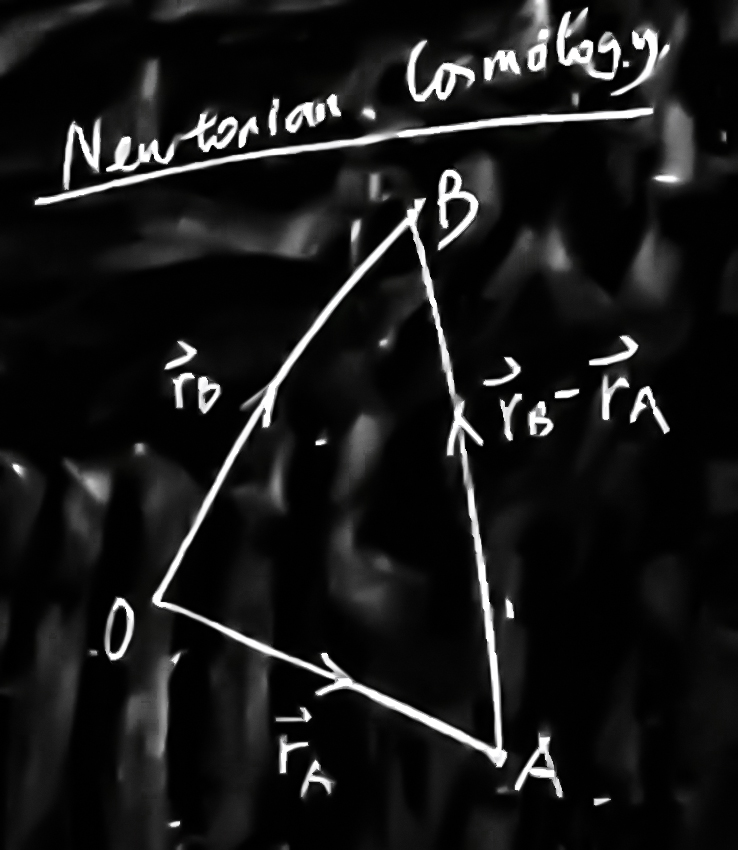

# Basics of Cosmological Physics

**Physical Processes in an Expanding Universe**

*Yingjie Peng, KIAA 204, yjpeng@pku.edu.cn*

## Chapter 0

### Isotropic & Homogeneous

- Counts of faint galaxies in different directions
- CMB ( 99% of photons in the universe ) - low fluctuations ( $10^{-5}\ \mathrm{K}$ )

### Expansion

- Hubble (1929) redshift-distance relation
  $$
  z=\frac{H_0}{c}d,\ v=H_0d
  $$

- Scatter of galaxies - peculiar motions

### Cosmic distance ladder

- Cepheids
- Ia SN

## Chapter 1 Introduction

### Fundamental Observers

- Fluid (Plasma)
- Substratum (相对宇宙静止)——comoving
- **We are not fundamental observers!** (velocity relative to the sun, the Galactic center, M31, Virgo Cluster…) - subtract all the relative velocity - confirmed by highly isotropic CMB

### Distances

- 1 AU = 1.5e13 cm
- 1 Parsec = 3.26 ly, mostly kpc or Mpc (8.7 kpc away from the Galactic center)
- Radius of the Observable Universe (Inside the horizon) $\sim$ 4450 Mpc ( $c/H_0$ )

### Masses

- Solar mass $M_\odot$ = 2e33 g
- Milky Way
  - Stellar mass $\sim​$ 1e11 $M_\odot​$
  - Total mass $\sim$ 1e12 $M_\odot$

### Luminosity and Magnitudes

- For flux $F$ and apparent magnitude $m$

$$
F_1/F_2=10^{0.4(m_2-m_1)}
$$

- Absolute magnitude $M$ - a distance of 10 pc

$$
m-M=2.5\lg\left(\frac{d\ \mathrm{(pc)}}{10}\right)^2=5\lg d-5
$$

### Cosmological Principle

- Homogeneous - each point is ordinary
- Isotropic - each direction is ordinary
- Copernican Principle - humans, on the Earth or in the Solar System, are not privileged observers of the universe
- Universal cosmic time

### Redshifts

$$
z=\frac{\lambda_{obs}-\lambda_0}{\lambda_0},\mathrm{or}\ 1+z=\frac{\lambda_{obs}}{\lambda_0}
$$

- Doppler Redshift is associated with a speed of recession

$$
v=cz,\ v\ll c\\
1+z=\sqrt{\frac{1+\beta}{1-\beta}},\ \text{in general}
$$

- We will prove that
$$
1+z=\frac{\lambda_{obs}}{\lambda_0}=\frac{a_{obs}}{a_{em}}
$$
  where $a$ is the scale factor of the universe，$em$ stands for emission

### Universal Expansion

- 1929 Hubble Law - observing Cepheids

$$
v=H_0d\\
H_0\approx 70\ \mathrm{km/s/Mpc}=100\cdot h\ \mathrm{km/s/Mpc}
$$

- Today - Ia SN
- Hubble time

$$
t_H\equiv \frac{1}{H_0}\sim14\ \mathrm{Gyr}
$$

### Components of the Universe

$$
E_{tot}=\sqrt{m^2c^4+p^2c^2}
$$

- Non-relativistic $pc\ll mc^2$

$$
E_{tot}\approx mc^2+\frac{p^2}{2m}
$$

#### Baryons

- Proton + Neutron + Electron
  - 0.5% stars
  - 4% Hydrogen/Helium
  - 0.03% heavy elements

#### 0.3% Neutrinos

- mass > 0

#### Radiation

- $E=h\nu=hc/\lambda$

#### 21% Dark Matter

- Evidence
  - Rotation velocity of galaxies
  - Cluster
  - Gravitational lensing

#### 74% Dark Energy

- Accelerate universal expansion after z = 1

#### Critical Density

$$
\rho_c=\frac{3H_0^2}{8\pi G}=1.36\times 10^{11}\ M_\odot/\text{Mpc}
$$

## Chapter 2 Newtonian Cosmology

$$
\vec v_A=H_0 \vec r_A,\ \vec v_B=H_0 \vec r_B
$$

- Recession velocity if B as seen by A is

$$
\vec v_{BA}=\vec v_B-\vec v_A=H_0(\vec r_B-\vec r_A)
$$

### Comoving coordinates

- comoving with space distance $\vec r$, comoving distance $\vec x$ (constant)

$$
\vec r_{BA} = a(t)\cdot\vec x_{BA}
$$

$a(t)$ is the scale factor - all we want to find out

- Birkhoof's theorem: total energy of a particle of mass $m$ at A, B, C, D

$$
U=T+V=\frac{1}{2}m\dot{r}^2-\frac{GMm}{r}=\frac{1}{2}m\dot{r}^2-\frac{4\pi}{3}G\rho r^2m
$$

- Friedmann equation

$$
\left(\frac{\dot{a}}{a}\right)^2=\frac{8\pi G}{3}\rho-\frac{kc^2}{a^2},\ \text{where }kc^2=-\frac{2U}{mx^2}
$$

- $k$ must be independent of $x$, therefore $U\propto x^2$; $k$ is a constant
  - $k>0\Rightarrow U<0, |V|>T$ , collapse
  - $k<0\Rightarrow U<0, V<T$ , expand forever
  - $k=0\Rightarrow U=0$ , expansion terminates when $t\to\infty$
- Hubble parameter

$$
\vec v=H_0\vec r,\ \vec r=a\vec x\\
\Rightarrow \vec v=|\dot{\vec r}|\hat{\vec r}=\frac{\dot a}{a}\vec r\\
\Rightarrow H\equiv \frac{\dot a}{a}
$$

which is a function of time, so called Hubble constant $H_0$ is the Hubble parameter at present

- Using Hubble parameter we can rewrite Friedmann equation

  $$
  H^2=\frac{8\pi G}{3}\rho-\frac{kc^2}{a^2}
  $$
  if $k=0$ , the **critical density** $\rho$ is then
  $$
  \rho_c=\frac{3H_0^2}{8\pi G}
  $$

- In thermodynamics, the first law points that

  $$
  \text{d} E+P\text dV=T\text d S
  $$
  where $P$ is the pressure, $S$ is the entropy

- Expanding volume $V$ of unit comoving radius $x=1$, $E=mc^2$, energy within the volume
  $$
  E=\frac{4\pi}{3}a^3\rho c^2\\
  \frac{\text dE}{\text{d} t}=4\pi a^2\rho c^2\frac{\text da}{\text{d} t}+\frac{4\pi}{3} a^3 c^2\frac{\text d\rho}{\text{d} t}\\
  \frac{\text dV}{\text{d} t}=4\pi a^2\frac{\text da}{\text{d} t}
  $$
- Assuming a reservable expansion $\text dS=0$ , we obtain the **fluid equation** 

  $$
  \dot\rho+3\frac{\dot a}{a}\left(\rho+\frac{P}{c^2}\right)=0
  $$

- Equation of state

  $$
  P\equiv P(\rho)
  $$

    - For non-relativistic matter, $P=0$ , **dust**
    - For highly-relativistic matter , $P=\rho c^2/3$ , **radiation pressure** of **light**

- Time-derivation on both sides of the Friedmann equation

  $$
  2\frac{\dot a}{a}\frac{a\dot a-\ddot a^2}{a^2}=\frac{8\pi G}{3}\dot\rho+2\frac{kc^2}{a^3}\dot a\\
  \frac{\ddot a}{a}-\left(\frac{\ddot a}{a}\right)^2=\frac{8\pi G}{3}\rho-\frac{kc^2}{a^3}
  $$

- Acceleration equation
  $$
  \frac{\ddot a}{a}=-\frac{4\pi G}{3}\left(\rho+\frac{3P}{c^2}\right)
  $$

- Analytical solution

  - $k=0$

    - Dust, $P=0$
      $$
      \dot\rho+3\frac{\dot a}{a}\rho=0\Rightarrow\frac{\text{d}}{\text{d}t}(\rho a^3)=0
      $$

      $$
      \rho=\frac{\rho_0}{a^3}\Rightarrow\dot a^2=\frac{8\pi G\rho_0}{3}\frac{1}{a}\\\Rightarrow a(t)=\left(\frac{t}{t_0}\right)^{2/3},\ \rho(t)=\frac{\rho_0t_0^2}{t^2}\\
      \Rightarrow H(t)=\frac{\dot a}{a}=\frac{2}{3t},\ t_0=\frac{2}{3H_0}
      $$

      However, the current age of universe $t_0​$ obtained in this model is wrong

    - Radiation, $P=\rho c^2/3$
      $$
      \dot\rho+4\frac{\dot a}{a}\rho=0\Rightarrow\frac{\text{d}}{\text{d}t}(\rho a^4)=0\\
      \Rightarrow a(t)=\left(\frac{t}{t_0}\right)^{1/2},\ \rho(t)=\frac{\rho_0t_0^2}{t^2}\\
      \Rightarrow H(t)=\frac{\dot a}{a}=\frac{1}{2t}<\frac{2}{3t},\ t_0=\frac{1}{2H_0}
      $$

    - Radiation dominated universe
      $$
      a(t)\propto t^{1/2},\ \rho_{rad}\propto t^{-2},\ \rho_{dust}\propto a^{-3}\propto t^{-3/2}
      $$
      Unstable, the radiation density decreases faster than the dust density, the universe will turn to matter dominated on day

    - Matter dominated universe
      $$
      a(t)\propto t^{2/3},\ \rho_{dust}\propto t^{-2},\ \rho_{dust}\propto a^{-4}\propto t^{-8/3}
      $$
      Stable

### Olber's Paradox

- In a shell from $r​$ to $r+\mathrm d r​$, the total number of stars is $4\pi r^2n_0\mathrm d r​$, where $n_0​$ is the number density
- Total intensity of the sky

  $$
  \mu=\int_0^{r_{max}}4\pi r^2n_0\left(\frac{L_0}{4\pi r^2}\right)\mathrm d r=n_0L_0r_{max}\\
  r_{max}\to\infty\Rightarrow \mu\to\infty
  $$

which is $10^{13}$ times brighter than it actually is

-  Thermodynamic problem
  - Infinite volume
  - Infinite time to reach thermodynamic equilibrium
  - BUT the universe is not homogeneous (not the temperature of CMB)

## Chapter 3 Relativistic Cosmology

### Robertson-Walker Metric

- Flat (Euclid) space
  $$
  (\text{d}l)^2=(\text{d}x)^2+(\text{d}y)^2+(\text{d}z)^2\\
  \Rightarrow \Delta l=\int_1^2\sqrt{(\text{d}x)^2+(\text{d}y)^2+(\text{d}z)^2}
  $$

- Flat (Minkowski) spacetime
  $$
  (\text{d}l)^2=(c\text{d}t)^2-(\text{d}x)^2-(\text{d}y)^2-(\text{d}z)^2\\
  \Rightarrow \Delta l=\int_1^2\sqrt{(c\text{d}t)^2-(\text{d}x)^2-(\text{d}y)^2-(\text{d}z)^2}
  $$

- Proper distance

  distance at $t_A=t_B$ (hypothesis on the existence of a well-defined universal time)

- Curvature
  $$
  K=\frac{3}{\pi}\lim_{D\to 0}\frac{2\pi D-C}{D^3}
  $$
  where $D$ is the radius, $C$ is the perimeter

  Some **2-D​** examples

  - Plain - zero curvature
  - Sphere - positive curvature
  - Hyperbolic paraboloid (马鞍面；双曲抛物面) - negative curvature

- 2-D curvature

  Spherical polar coordinates $(r,\theta,\phi)$
  $$
  \begin{aligned}
  (\text{d}l)^2&=(\text{d}D)^2+(r\text{d}\phi)^2\\
  &=(R\text{d}\theta)^2+(r\text{d}\phi)^2\\
  &=(r\cos\theta\text{d}\theta)^2+(r\text{d}\phi)^2\\
  &=\left(\frac{\text{d}r}{\sqrt{1-r^2/R^2}}\right)^2+(r\text{d}\phi)^2
  \end{aligned}
  $$
  In general, 2-D curvature
  $$
  (\text{d}l)^2=\left(\frac{\text{d}r}{\sqrt{1-kr^2}}\right)^2+(r\text{d}\phi)^2
  $$
  

- 3-D curvature
  $$
  (\text{d}l)^2=\left(\frac{\text{d}r}{\sqrt{1-kr^2}}\right)^2+(r\text{d}\theta)^2+(r\sin\theta\text{d}\phi)^2
  $$

- R-W Metric
  $$
  (\text ds)^2=(c\text dt)^2-\left(\frac{\text{d}r}{\sqrt{1-kr^2}}\right)^2-(r\text{d}\theta)^2-(r\sin\theta\text{d}\phi)^2
  $$

  - Proper distance
    $$
    \Delta L=\sqrt{(-\Delta s)^2},\ \text dt=0
    $$

  - Comoving distance
    $$
    K(t)=\frac{k}{a^2(t)},\ r(t)=a(t)x\\
    \Rightarrow (\text ds)^2=(c\text dt)^2-a^2(t)\left[\left(\frac{\text{d}x}{\sqrt{1-kx^2}}\right)^2-(x\text{d}\theta)^2-(x\sin\theta\text{d}\phi)^2\right]
    $$
    Traditionally, we use $r$ to represent **comoving radial distance**
    $$
    \Rightarrow (\text ds)^2=(c\text dt)^2-a^2(t)\left[\frac{\text{d}r^2}{1-kr^2}-r^2(\text{d}\theta^2+\sin^2\theta\text{d}\phi^2)\right]
    $$

- SR model - [the Milne Model](https://en.wikipedia.org/wiki/Milne_model) - **empty universe**

  
  - Time dilution
    $$
    \tau=\gamma^{-1}t\\
    (t,r)\Rightarrow(\tau,l)
    $$
    