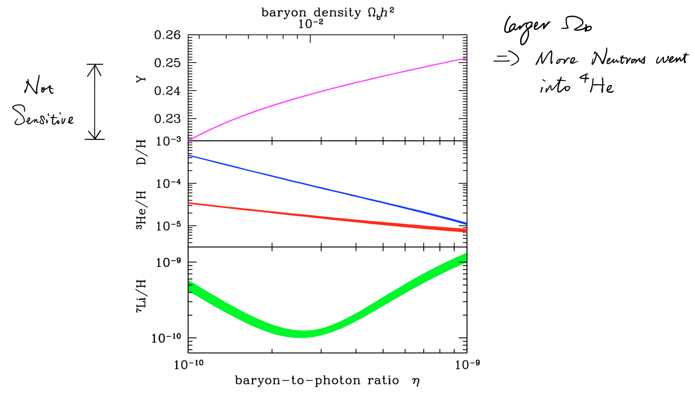

# Chapter 8 Primordial Nucleosynthesis

- From $t\sim1\text{ s}$, a number of nuclear reactions involving baryons took place - BBN
- Results
  - Lock up free neutrons
  - Produce $\ce{^4He, D, ^3H, ^7Li, ^7B}$

## The Neutron-to-Proton Ratio

- Before neutrino decoupling at around 1 MeV, neutrons and protons are kept in mutual thermal equilibrium through charged-current weak interactions
  $$
  \ce{n + e+ <-> p + \overline{\nu}_\text{e}}\\
  \ce{p + e- <-> n + {\nu}_\text{e}}\\
  \ce{n <-> p + e- + \overline{\nu}_\text{e}}
  $$
  The last reaction suggests that free neutrons are not stable ($m_n>m_p$). If protons were unstable, the world would look totally different from what it is today

- The relative number densities of neutrons and protons is
  $$
  \left(\frac{\mathrm{n}}{\mathrm{p}}\right)_{\mathrm{eq}}=\exp \left[-\frac{\Delta m c^{2}}{k T}\right]=\exp \left[-\frac{1.5}{T_{10}}\right]
  $$
  where
  $$
  \Delta m=\left(m_{\mathrm{n}}-m_{\mathrm{p}}\right)=1.29\ \mathrm{MeV}=1.5 \times 10^{10}\ \mathrm{K}
  $$
  and $T_{10}$ is the temperature in units of $10^{10}\text{ K}$

- The equilibrium will be maintained so long as the timescale for the weak interactions is short compared with the timescale of the cosmic expansion
  $$
  \frac{\Gamma}{H} \simeq\left(\frac{T}{1.6 \times 10^{10} \mathrm{K}}\right)^{3}
  $$
  That $\Gamma/H\propto t^3$ comes from

  - In radiation dominated era
    $$
    H\approx H_0\sqrt{\Omega_{\text{rad},0}(1+z)^4}\propto\Omega_{\text{rad}}^{1/2}\propto u^{1/2}
    $$
    where $u$ is the radiation energy density and
    $$
    u=\frac12 g_*aT^4
    $$
    thus $H\propto T^{2}$

  - The rate per neutron of the reactions is proportional to

    - The number of electron neutrinos, $n\left(\nu_{\mathrm{e}}, \overline{\nu}_{\mathrm{e}}\right)\propto T^3$
    - The weak interaction cross section, $\langle\sigma\rangle\propto T^2$

    Thus $\Gamma\propto T^5$

- As $T$ increases, the temperature falls to $T_\text{d}$ that
  $$
  k T_{\mathrm{d}} \approx 0.8\ \mathrm{MeV}=\left(m_{\mathrm{n}}-m_{\mathrm{p}}\right)-m_{\mathrm{e}}
  $$
  where weak interaction rate falls rather suddenly below the expansion
  rate and the ratio $\text{n/p}$ is frozen - **neutron freeze-out**
  $$
  \frac{\mathrm{n}}{\mathrm{p}}=\exp \left[-\frac{\Delta m c^{2}}{k T_{\mathrm{d}}}\right]=\exp \left[-\frac{1.3}{0.8}\right]=0.20=1 : 5
  $$

- The higher $T_\rm{d}$ is, the higher the $\rm{n/p}$ ratio and the abundance of $\ce{^4He}$ will be.

  The precise value of $T_\text{d}$
  $$
  T_{\mathrm{d}}^{3} \propto \tau_{1 / 2}\left(\frac{11}{4}+\frac{7}{8} \mathcal{N}_{\nu}\right)^{1 / 2}
  $$
  where $\tau_{1/2}$ is the neutron half-life for free decay and $\mathcal{N}_\nu$ is the number of neutrino families

  - We currently realize that there are 3 flavors of neutrinos
  - We've detected the relative rest mass of each flavor but have no idea of the absolute rest mass for any of them

## Deuterium Formation

- Before the formation of deuteron, the neutrons are 'naked' and will decay through
  $$
  \ce{n <-> p + e- + \overline{\nu}_\text{e}}
  $$
  with a mean lifetime $\tau_\text{n}=880.3\pm1.1$

- Deuteron formation
  $$
  \ce{p + n <-> d + \gamma}
  $$

  - Exothermic, release 2.225 MeV of energy
  - Strong interaction, proceeds efficiently (compared to weak interactions)

- Deuterium bottleneck

  - At $t\sim$ a few seconds, the temperature is not much lower than 2.2 MeV and, given that photons are a billion times more numerous than baryons, there are sucient photons with energies $E_{\gamma}>E_{\mathrm{D}}$ to destroy newly formed $\ce{D}$ by photo-dissociation
  - Wait until the temperature is low enough for a substantial concentration of $\ce{D}$ 
  - The formation rate of $\ce{D}$ exceeds its photo-dissociation rate at $T_\ce{D}\simeq8\times10^8\text{ K}\sim 70\text{ keV}$, which is attained at $t\sim300\text{ s}$
  - $\text{n/p}$ has fallen by a factor $\exp [-300 /(880.3)]=0.71$ to $0.14$ or $1:7$
    - This is not too much, because $t<\tau$
    - If $\tau$ were much shorter, all the neutrons would have decayed before BBN and only hydrogen would remain

- the primordial helium mass fraction
  $$
  {Y}_\text{p}=\frac{4 {\mathrm{n}}/{2}}{\mathrm{p}+\mathrm{n}}=\frac{2 \mathrm{n}}{\mathrm{p}+\mathrm{n}}=\frac{2 {\mathrm{n}}/{\mathrm{p}}}{1+{\mathrm{n}}/{\mathrm{p}}}=0.25
  $$
  because virtually all neutrons surviving after 300 s are later incorporated into $\ce{^4He}$

  By number - $^{4} \mathrm{He} / \mathrm{H}=1 / 12$

## Nuclear Reactions

- BBN stops at $\ce{^7Li}$

  - no stable nucleus of mass number 5 or 8 exists - no new nuclei can be formed in collisions of $\ce{He + He}$ or $\ce{He + p}$
  - Collisions between three nuclei are far too rare to contribute

- Parameter $\eta \equiv n_{\mathrm{b}} / n_{\gamma}$ 

  - How far the BBN nuclear reactions proceed before they are frozen out by **low density and temperature**

  - Relate to the cosmic density of baryons in units of the critical density, $\Omega_{\mathrm{b}, 0} h^{2}$ via the temperature of the CMB today, $T_{\gamma, 0}$
    $$
    \eta_{10}=273.3 \Omega_{\mathrm{b}, 0} h^{2}\left(\frac{2.7255\ \mathrm{K}}{T_{\gamma, 0}}\right)^{3}
    $$

- $Y_\text{p}$ has a minor dependence on $\eta$

  - Essentially all of the neutrons end up in $^4\ce{He}$
  - For larger $\eta$, the balance between $\ce{D}$ formation and photo-dissociation only moves to slightly larger $T_\text{D}$ - fewer neutrons decay

- $\ce{D/H}$ and $^3\ce{He/H}$ depend inversely on $\eta$

  - The higher $\eta$, the more sufficient is the conversion of $\ce{D}$ to $^4\ce{He}$ via two-body reactions with $\ce{^3He, p, n, \ce{D}}$ 

  - The same with $\ce{^3He}$, but it declines more gently because this nucleus is more robust

- $\ce{^7Li}$ has a bimodal behavior

  - Produced via two channels
    - Low baryon densities $\ce{T + \alpha -> {\gamma} + ^7Li}$
    - High baryon densities $\ce{^3He + \alpha ->{ \gamma} + ^7Be}$, $\ce{^7Be + n -> p + ^7Li}$

## Measures of Primordial Abundances of the Light Elements

- The relative abundances of the light elements created in BBN remained unaltered for the first ~ 200 Myr
- Once the first stars formed at $z\sim20$, the BBN abundances began to be changed by the process of galactic chemical evolution
  - Metallicity increased
    - Elements heavier than $\ce{B}$ were synthesised in the interior of stars
  - Identify astrophysical environments that have not been polluted by metals formed in stellar nucleosynthesis

### $\ce{^4He}$

- The abundance has increases during post-BBN era
  - Created by the fusion of 4 $\ce{H}$ nuclei in the hot cores of stars
- In the local universe, **the least massive galaxies are also the ones with the lowest fraction of metals**
  - Cannot turn a significant fraction of gas into stars
  - Cannot retain products of stellar nucleosynthesis in their shallow potential wells
- Observation
  - Measuring the $\ce{^4He/H}$ ratio from the emission lines of $\ce{H II}$ region in the lowest mass, most-metal-poor galaxies known
  - $Y_{\mathrm{p}}=0.245 \pm 0.004\Rightarrow 0.018 \leq \Omega_{\mathrm{b}, 0} \leq 0.059 \text { for } h=0.675$
    - Not sensitive

### $\ce{D}$

- Sensitive *baryonmarker* - steep inverse dependence on $\eta$
- The abundance has decreases during post-BBN era
  - Burnt in the late stage of star formation
- Observations
  - Analysis of absorption lines in pockets of interstellar gas at high redshift
    - Underwent minimum processing through stars
    - Low metallicity
  - $(\mathrm{D} / \mathrm{H})_{\mathrm{p}}=(2.527 \pm 0.030) \times 10^{-5}\Rightarrow(4.91 \pm 0.11) \times 10^{-2}$

### $\ce{^7Li}$

- Both sythesised and destroyed during the lifetime of stars/produced by the interaction of high energy cosmic rays with atoms in IGM
- Observations
  - A pair of weak absorption lines in the atmospheres of cool stars (oldest stars in the halo of the Milky Way)
  - Stars with $-3 \leq[\mathrm{Fe} / \mathrm{H}] \leq-1.5$ have a plateau $ ^{7} \mathrm{Li} / \mathrm{H}=(1.6 \pm 0.3) \times 10^{-10}$ (we *hope* that this is a good indication for the primordial value)
- $\ce{Li}$ Problems
  - For stars with lower metallicity, $^{7} \mathrm{Li} / \mathrm{H}$ is lower
  - $^{7} \mathrm{Li} / \mathrm{H}$ is three times lower than the BBN prediction

## Dark Matter

- Baryons contributes less than $5\%$ of the critical density
- Non-baryonic dark matter
  - Does not interact with photons
  - Interacts with ordinary matter only through gravity
- Baryonic dark matter
  - Stars and gas in galaxies contribute $\Omega_{\text { stars, } 0} \sim 0.003$
  - The remaining baryons are in gas in the halos of galaxies and in between galaxies