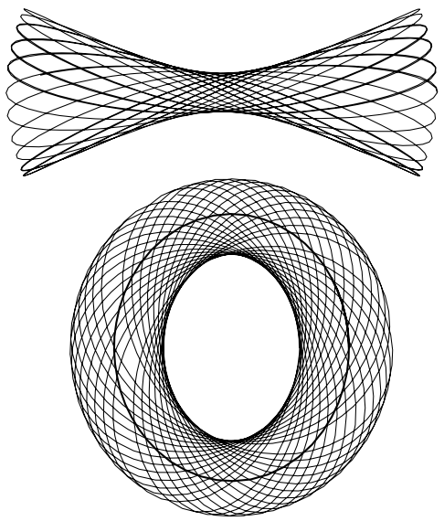

# Week6: Orbits

## Non-axisymmetric potentials

### Logarithmic potential

$$
\Phi_L(x,y)=\frac12v_0^2\ln\left(R_c^2+x^2+\frac{y^2}{q^2}\right),\quad 0<q<1
$$

Here, the angular momentum no longer conserves, though we still have a conserved Hamiltonian 

- $$
  x^2+\frac{y^2}{q^2}\ll R_C^2\Rightarrow \Phi_L(x,y)=v_0^2\ln R_c+\frac{v_0^2}{2R_c^2}\left(x^2+\frac{y^2}{q^2}\right)
  $$

  This is just the potential of an harmonic oscillator, and when $q$ is irrational, the orbit does not close

- $$
  x^2+\frac{y^2}{q^2}\gg R_C^2\Rightarrow \Phi_L(x,y)=\frac12v_0^2\ln\left(x^2+\frac{y^2}{q^2}\right)
  $$

  - if $q=1$, $\Phi_L=v_0^2\ln R$, and the circular speed is a constant - consistent with the flat circular-speed curves of many disk galaxies

In general, there are two kinds of closed orbits, namely **box orbits** (above) and **closed loop orbits** (below)

- **Box orbits**
  - $R\ll R_c$ (oscillator)
  - Zero time-averaged angular momentum