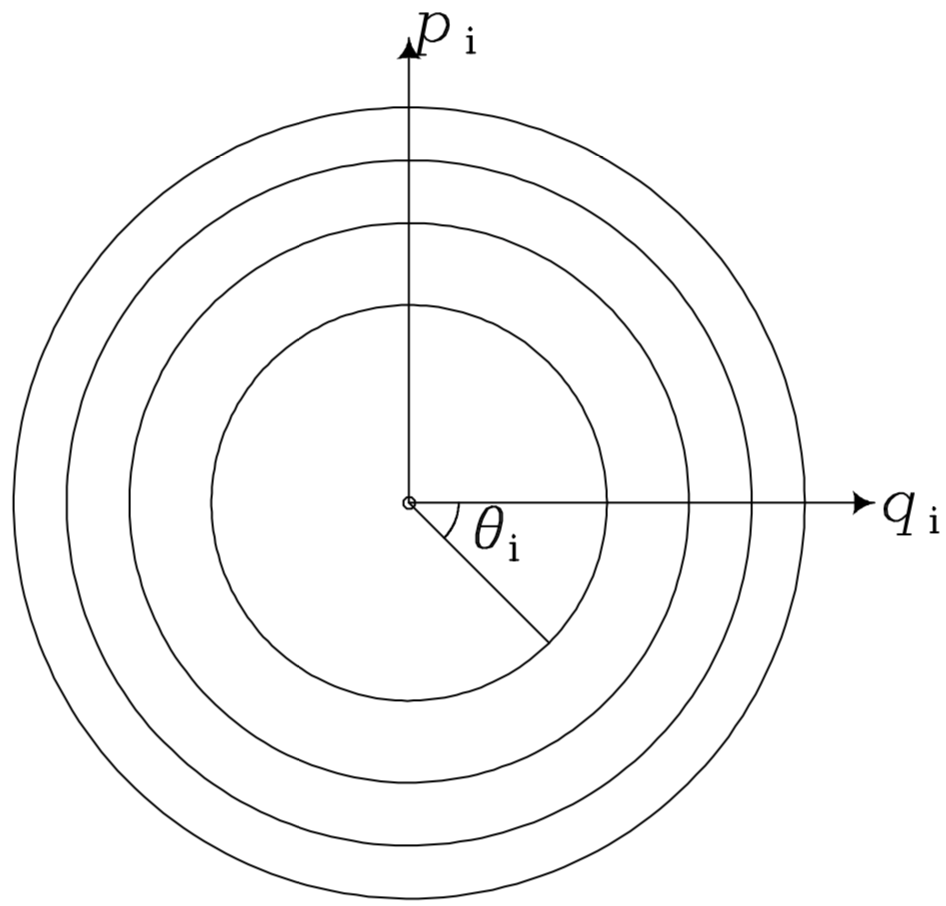

# Week8: Orbits

## Angular-action variables

Since elementary Newtonian or Lagrangian mechanics restricts our choice of coordinates to ones that are rarely integrals, we work in the more general framework of Hamiltonian mechanics.

Thus, we shall focus on a particular set of canonical coordinates, called **angular-action** variables.

- The three momenta are integrals - **actions**
- The conjugate variables - **angles**
- An orbit fortunate enough to possess angle-action variables is called a **regular orbit**

Let us denote the angle-action variables by $(\vec\theta,\vec J)$. We assume that the momenta $\vec J=(J_1,J_2,J_3)$ are integrals of motion, then Hamilton's equations read
$$
0=\dot J_i=-\frac{\partial H}{\partial\theta_i}
$$
Therefore, the Hamiltonian must be independent of the coordinates $\vec\theta$. Consequently,
$$
\dot\theta_i=\frac{\partial H}{\partial J_i}\equiv\Omega_i(\vec J)
$$
is independent of $\vec\theta$, so
$$
\theta_i(t)=\theta_i(0)+\Omega_it
$$

### Orbital tori

We restrict our attention to bound orbits, so that $x_i$ are periodic functions of the $\theta_i$. We can scale $\theta_i$ so that $\vec x$ returns to its original value every time $\theta_i$ has increased by $2\pi$. Then we can expand $\vec x$ in a Fourier series
$$
\vec x\left(\vec \theta,\vec J\right)=\sum_{\vec n}\vec X_{\vec n}(\vec J)\mathrm e^{i\vec n\cdot\vec\theta}=\sum_{\vec n}\vec X_{\vec n}(\vec J)\mathrm e^{i\vec n\cdot\vec\theta_0}\mathrm e^{i\vec n\cdot\vec\Omega t}
$$
where the sum is over all vectors $\vec n$ with integer components. The spatial coordinates are Fourier series in time, in which every frequency is a sum of integer multiples $(n_1,n_2,n_3)$ of the three **fundamental frequencies** $\Omega_i(\vec J)$. Such a time series is said to be **conditionally periodic** or **quasiperiodic**.

>*Quasiperiodic* here is like *quasicrystal* - a structure whose Fourier transform is discrete, but in which there are more fundamental frequencies than independent variables

An orbit is said to be **resonant** when its fundamental frequencies satisfy a relation of the form $\vec n \cdot\vec \Omega = 0$ for some integer triple $\vec n\neq \vec 0$. Usually this implies that two of the frequencies are commensurable, that is the ratio $ \Omega_i/ \Omega_j$ is a rational number $(−n_j/n_i)$.

In fact, incrementing $\theta_1$ by $2\pi$ while leaving $\theta_2,\theta_3$ fixed brings one back to the same point in phase space, which is also true for $\theta_2$ and $\theta_3$. In this way, we can sew together each pair of opposite edges of the corresponding *rectangular* region in phase space $(\theta_1,\theta_2,\theta_3)$. Thus we generate a **three-torus**.

We use the **Poincaré invariants** to label these three-tori
$$
J_i'\equiv\frac{1}{2\pi}\iint_{\text{interior of }\gamma_i}\text d\vec q\cdot\text d\vec p=\frac{1}{2\pi}\iint_{\text{interior of }\gamma_i}\sum_{j=1,2,3}\text d q_j\text d p_j
$$
>**Poincaré invariant theorem** 
>
>If $S(0)$ is any two-surface in phase space, and $S(t)$ is the surface into which $S(0)$ is mapped by the time-evolution operator $\operatorname{H}_t$, then
>$$
>\iint_{S(0)}\text d\vec q\cdot\text d\vec p =\iint_{S(t)}\text d\vec q\cdot\text d\vec p
>$$
>**Corollary** (by Green's theorem)
>
>If $\gamma(0)$ is any closed path through phase space, and $\gamma(t)$ is the path to which $\gamma(0)$ is mapped by the time-evolution operator, then
>$$
>\oint_{\gamma(0)}\text d\vec q\cdot\vec p=\oint_{\gamma(t)}\text d\vec q\cdot\vec p
>$$

where the integral is over any surface that is **bounded** by the path $\gamma_i$ on which $\theta_i$ increase from $0$ to $2\pi$ while everything else is held constant. Since angle-action variables are canonical, $\text d\vec q\text d\vec p=\text d\vec \theta\text d\vec J$, we have
$$
J_i'\equiv\frac{1}{2\pi}\iint_{\text{interior of }\gamma_i}\text d\vec \theta\text d\vec J=\frac{1}{2\pi}\iint_{\text{interior of }\gamma_i}\text d\theta_i\text dJ_i
$$
>Any set of phase-space coordinates $\vec W \equiv \{W_\alpha, \alpha = 1,...,2n\}$ is said to be canonical if
>$$
>[W_\alpha,W_\beta]=J_{\alpha\beta}
>$$
>where the symplectic matrix is
>$$
>\begin{equation}
>\mathbf{J} \equiv\left(\begin{array}{cc}0 & \mathbf{I} \\ -\mathbf{I} & 0\end{array}\right)
>\end{equation}
>$$
>and $[\cdot]$ denotes the **Poisson bracket**
>$$
>[A, B] \equiv \frac{\partial A}{\partial \vec{q}} \cdot \frac{\partial B}{\partial \vec{p}}-\frac{\partial A}{\partial \vec{p}} \cdot \frac{\partial B}{\partial \vec{q}}
>$$
>*The phase-space volume element is the same in any canonical coordinates.*

If we rescale $\vec q$ and $\vec p$ so that $\gamma_i$ becomes a circle, $J_i'$ is in fact closely related to the area, and thus the radius, of the circle.
$$
J_i'=\frac{A_i}{2\pi}=\frac{r_i^2}{2}\Rightarrow r_i=\sqrt{2J_i'}
$$
So $(\theta_i,J_i)$ is closely analogous to plane polar coordinates (though $J_i$ is more analogous to the area). As a result, there is a coordinate singularity within the domain of integration. With the sigularity excluded, we can derive
$$
J_i'=\frac{1}{2\pi}\left(\oint_{\gamma_i}J_i\text d\theta_i-\oint_{J_i=J_i^c}J_i\text d\theta_i\right)=J_i-J_i^c
$$
where $J_i^c$ is some definite value of a small circle around the singularity. If we set $J_i=0$ at the singularity, $J_i'=J_i$. Henceforce we assume this choice has been made.

Of course in the $(\vec q,\vec p)$ phase space there is no singularity. Therefore we can simply replace the surface integral with a line integral
$$
J_i=\oint_{\gamma_i}\vec p\text d\vec q
$$

1. **Time averages theorem**

   When a regular orbit is non-resonant, the average time that the phase point of a star on that orbit spends in any region $D$ of its torus is proportional to the integral
   $$
   V(D)=\int_D\text d^3\vec\theta
   $$
   Proof:

   Let
   $$
   f_D(\vec\theta)=\left\{
   \begin{array}{cc}
   1,&\vec\theta\in D\\
   0,&\vec\theta\notin D
   \end{array}\right.=\sum_{\vec n}F_{\vec n}\exp\left(i\vec n\cdot\vec\theta\right)
   $$
   $F_\vec n$ is the Fourier coefficient.

   Now
   $$
   \begin{align*}
   V(D)&\equiv \int_D\text d^3\vec\theta=\int_{\text{torus}}\text d^3\vec\theta f_D(\vec\theta)\\
   &=\int_{\text{torus}}\text d^3\vec\theta\sum_{\vec n}F_{\vec n}\exp\left(i\vec n\cdot\vec\theta\right)\\
   &=\sum_{\vec n}F_{\vec n}\prod_{k=1}^3\int_{0}^{2\pi}\text d\theta_k\exp\left(in_k\theta_k\right)\\
   &=\left(2\pi\right)^3 F_{\vec 0}
   \end{align*}
   $$
   On the other hand, the fraction of the interval $(0,T)$ during which the star's phase point lies in $D$ is
   $$
   \begin{align*}
   \tau_T(D)&=\frac1T\int_0^Tf_D\left[\vec\theta(t)\right]\text dt\\
   &=\frac1T\sum_{\vec n}F_{\vec n}\int_0^T\exp\left[i\vec n\cdot\left(\vec\theta_0+\vec\Omega t\right)\right]\text dt\\
   &=\frac1T\sum_{\vec n}F_{\vec n}\exp\left(i\vec n\cdot\vec\theta_0\right)\int_0^T\exp\left(i\vec n\cdot\vec\Omega t\right)\text dt\\
   &=F_{\vec 0}+\frac1T\sum_{\vec n\neq\vec0}F_{\vec n}\exp\left(i\vec n\cdot\vec\theta_0\right)\frac{\exp\left(i\vec n\cdot\vec\Omega T\right)-1}{i\vec n\cdot\vec\Omega}
   \end{align*}
   $$
   Thus
   $$
   \lim_{T\to\infty}\tau_T(D)=F_{\vec0}\propto V(D)
   $$
   But if the orbit is resonant, $\vec n\cdot\vec \Omega$ vanishes for some $\vec n\neq\vec 0$, so the theorem cannot be proved. The star is in fact confined to a spiral on the torus.

2. **Action space**

   Now we regard orbits as single points in an abstract space. We define **action space** to be the imaginary space whose Cartesian coordinates are the actions.

   - Points on the axes represent orbits for which only one of the integrals
     $$
     J'_i=\frac1{2\pi}\iint\text d\vec q\cdot\text d\vec p
     $$
     is non-zero, which represent closed orbits.

   - The local normal to the surface of constant energy is parallel to the vector $\vec\Omega$, since
     $$
     \nabla_{\vec J} H=\vec\Omega
     $$

   - Every point in the positive quadrant $J_r , J_{\theta} \ge 0$, all the way to infinity, represents a bound orbit.

   A region $R_3$ in action space represents a group of orbits. Let the volume of $R_3$ be $V_3$. The volume of the six-dimensional phase space occupied by the orbit is
   $$
   V_6=\int_{R_6}\text d^3\vec x\cdot \text d^3 \vec v=\int_{R_6}\text d^3\vec J\cdot \text d^3 \vec \theta
   $$
   where $R_6$ is the region of phase visited by stars on the orbits of $R_3$. But for any orbit the angle variables cover $(0,2\pi)$, so
   $$
   V_6=\left(2\pi\right)^3\int_{R_3}\text d^3\vec J=\left(2\pi\right)^3V_3
   $$
   Thus the **volume of a region of action space** is proportional to the **volume of phase space occupied by its orbits**

   >Phase space - the six-dimensional space with coordinates $(\vec x, \vec v)$.

   

3. **Hamilton-Jacobi equation**

   The transformation between any two sets of canonical coordinates can be effected with a **generating function**.

   >Given any closed path $\Gamma$ in phase space, if $(\vec q,\vec p)$ and $(\vec q',\vec p')$ are canonical coordinate systems, then the conservation of Poincaré invariants in canonical transformation implies that
   >$$
   >\oint_{\Gamma}\left(\text d\vec q\cdot \vec p-\text d\vec q'\cdot \vec p'\right)=0
   >$$
   >Thus the integral does not depend on the path of integration, so for a fixed initial point $\vec w_0$ we have
   >$$
   >S(\vec w)=\int_{\vec w_0}^{\vec w}\left(\text d\vec q\cdot \vec p-\text d\vec q'\cdot \vec p'\right)
   >$$
   >or
   >$$
   >\text dS=\text d\vec q\cdot \vec p-\text d\vec q'\cdot \vec p'
   >$$
   >where $\text dS$ is an exact differential. $S(\vec q,\vec q')$ is called a **generating function** of the canonical transformation from $(\vec q,\vec p)$ to $(\vec q',\vec p')$, and
   >$$
   >\vec p=\frac{\partial S}{\partial\vec q},\quad \vec p'=-\frac{\partial S}{\partial\vec q'}
   >$$
   >Every sufficiently smooth and non-degenerate function $S(\vec q, \vec q')$ defines a canonical transformation through these relations.
>
   >Similarly, let $S_2(\vec q,p')\equiv \vec q'\cdot\vec p'+S$ (Legendre transformation), then
   >$$
   >\vec p=\frac{\partial S_2}{\partial\vec q},\quad \vec q'=\frac{\partial S}{\partial\vec p'}
   >$$
   >We can also define $S_3$, $S_4$. They are all generating functions for certain canonical transformation.
   
   Let $S(\vec q,\vec J)$ be the generation function of the transformation between the angle-action variables and ordinary phase space coordinates $(\vec q,\vec p)=(\vec x,\vec v)$, then
   $$
   \vec\theta=\frac{\partial S}{\partial \vec J},\quad \vec p=\frac{\partial S}{\partial \vec q}
$$
   where $\vec p$ and $\vec \theta$ are now considered fuctions of $\vec q$ and $\vec J$. Now we can rewrite the Hamiltonian
   $$
   H\left(\vec q,\frac{\partial S}{\partial \vec q}\left(\vec q,\vec J\right)\right)
   $$
   as a function of $\vec q$ and $\vec J$. By moving along an orbit, we can vary $q_i$ while holding $J_i$ constant. The conservation of energy gives the **Hamilton-Jacobi equation**
   $$
   H\left(\vec q,\frac{\partial S}{\partial \vec q}\left(\vec q,\vec J\right)\right)=E\quad\text{at fixed } \vec J
   $$
   If we can solve this equation, which is a one-order PDE, the solution should contain some arbitrary constants $K_i$. Then we have
   $$
   J_i=\frac{1}{2\pi}\oint_{\gamma_i}\frac{\partial S}{\partial\vec q}\cdot\text d\vec q=\frac{\Delta S(\vec K)}{2\pi}
   $$
   This equation states that $J_i$ is proportional to the increment in the generating function when one passes once around the torus on the $i$th path—$S$, like the magnetic scalar potential around a current-carrying wire, is a multivalued function.
   
   When $S$ is solved, we can transform between angle-action variables and ordinary phase-space coordinates.
   
   **Example: 2-d harmonic oscillator**
   $$
   H(\vec x,\vec p)=\frac12\left(p_x^2+p_y^2+\omega_x^2x^2+\omega_y^2y^2\right)
   $$
   Since
   $$
   p_x=\frac{\partial S}{\partial x},\quad p_y=\frac{\partial S}{\partial y}
   $$
   the Hamilton-Jacobi equation reads
   $$
   \left(\frac{\partial S}{\partial x}\right)^2+\left(\frac{\partial S}{\partial y}\right)^2+\omega_x^2x^2+\omega_y^2y^2=2E
   $$
   where $S=S(x,y,\vec J)$. We assume that 
   $$
   S(x,y,\vec J)=S_x(x,\vec J)+S_y(y,\vec J)
   $$
   thus
   $$
   \left(\frac{\partial S_x}{\partial x}\right)^2+\omega_x^2x^2=2E-\left(\frac{\partial S_y}{\partial y}\right)^2-\omega_y^2y^2
   $$
   The left part does not depend on $y$ while the right hand side does not depend on $x$. Therefore, each side should be a constant regardless of $x$ and $y$, and
   $$
   K^2(\vec J)\equiv\left(\frac{\partial S_x}{\partial x}\right)^2+\omega_x^2x^2=2E-\left(\frac{\partial S_y}{\partial y}\right)^2-\omega_y^2y^2
   $$
   Consequently
   $$
   \begin{align*}
   S_x(x,\vec J)
   &=|K|\int^x\text dx'\sqrt{1-\frac{\omega_x^2x^2}{K^2}}\\
   &=\frac{K^2}{\omega_x}\int^\psi\text d\psi'\sin^2\psi',\quad \text{where } x=-\frac{K}{\omega_x}\cos\psi\\
   &=\frac{K^2}{2\omega_x}\left(\psi-\frac12\sin2\psi\right)
   \end{align*}
   $$
   Moreover
   $$
   p_x=\frac{\partial S}{\partial x}=\frac{\partial S}{\partial \psi}\frac{\partial \psi}{\partial x}=\frac{K^2}{2\omega_x}\left(1-\cos2\psi\right)\cdot\frac{\omega_x}{K}=K\sin\psi,\quad K^2=\left(\frac{\partial S_x}{\partial x}\right)^2+\omega_x^2x^2=p_x^2+\omega_x^2x^2
   $$
   so both $x$ and $p_x$ return to their original values when $\psi$ is incremented by $2\pi$. Thus
   $$
   J_x(x,p_x)=\frac{\Delta S}{2\pi}=\frac{\Delta S_x}{2\pi}=\frac{K^2}{2\omega_x}=\frac{p_x^2+\omega_x^2x^2}{2\omega_x}
   $$
   Similarly
   $$
   J_y(y,p_y)=\frac{p_y^2+\omega_y^2y^2}{2\omega_x}
   $$
   and
   $$
   H(\vec J)=\omega_xJ_x+\omega_yJ_y
   $$
   
   $$
   \Omega_x=\frac{\partial H}{\partial J_x}=\omega_x,\quad \Omega_y=\frac{\partial H}{\partial J_y}=\omega_y
   $$
   
   Finally we determine the angle variables
   $$
   \begin{align*}
   \theta_x&=\frac{\partial S}{\partial J_x}=\frac{\partial }{\partial J_x}\left[J_x\left(\psi-\frac12\sin 2\psi\right)\right]\\
   &=\psi-\frac12\sin 2\psi+J_x\left(1-\cos 2\psi\right)\frac{\partial \psi}{\partial J_x}\\
   &=\psi-\frac12\sin 2\psi+\left(1-\cos 2\psi\right)\left(\frac{\partial J_x}{\partial \psi}\right)^{-1}J_x\\
   &=\psi
   \end{align*}
   $$
   

### Angle-action variables for spherical potentials

The Hamilton-Jacobi equation for potential $\Phi(r)$ is
$$
E=\frac12\left[\left(\frac{\partial S}{\partial r}\right)^2\right]
$$

