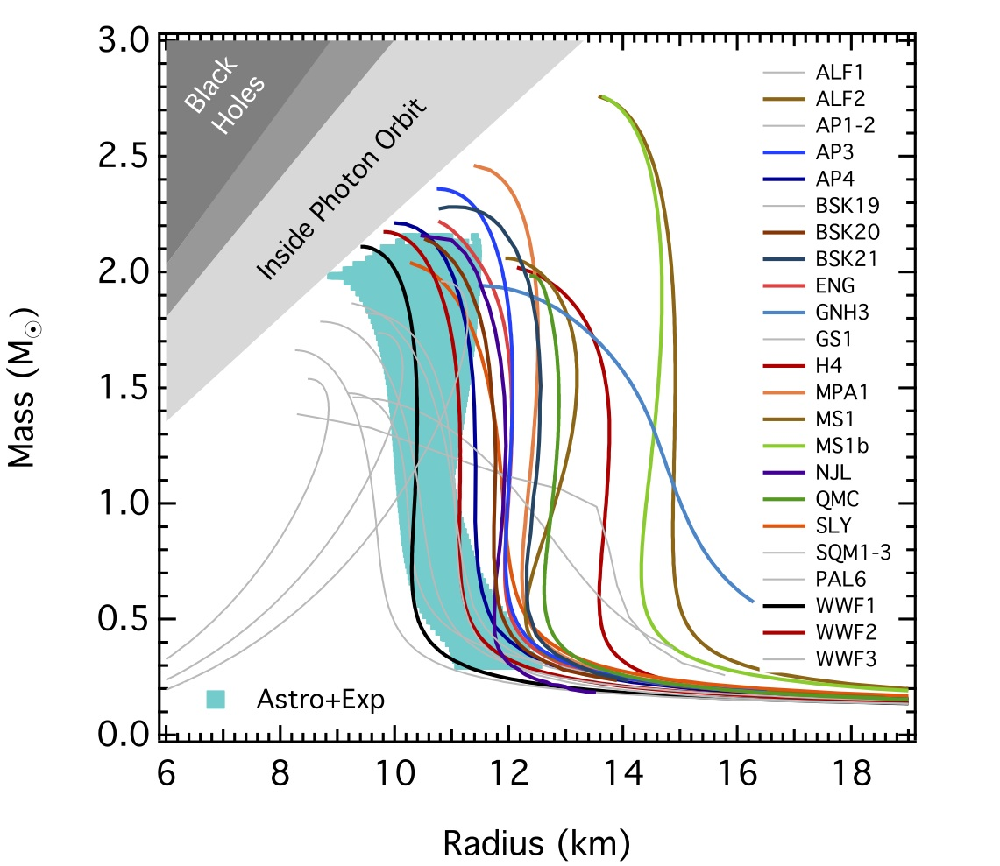
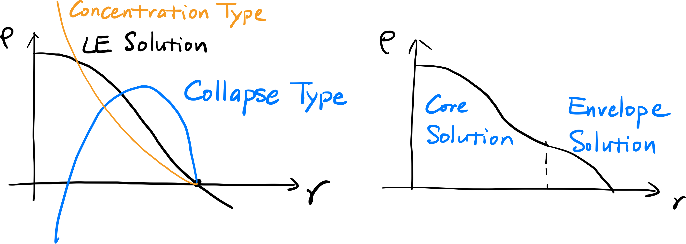

# Chapter 10 Polytrope

In reality, the solution and structure of stars are very complex. However, the EoS can often be approximated with a simple power-law.
$$
P=K\rho^\gamma,\quad\gamma=1+\frac 1n
$$
where $n$ is the **polytropic index**.

## Lane-Emden Equation

Starting from the 1-D hydrostatic equation, we will derive the stellar profile given a polytropic index $n$.
$$
\frac1\rho\frac{\text dP}{\text dr}=-\frac{Gm}{r^2}\Rightarrow\frac{\text d}{\text dr}\left(r^2\frac1\rho\frac{\text dP}{\text dr}\right)=-G\frac{\text dm}{\text dr}=-4\pi G\rho r^2
$$
Here we define a dimensionless parameter $\theta$ so that
$$
\rho\equiv\rho_c\theta^n,\quad P\equiv P_c\theta^{n+1}
$$
In this 1-D system, $\theta$ depends solely on the radius $r$. In this way
$$
\frac{(n+1)P_c}{4\pi G\rho_c^2}\frac1{r^2}\frac{\text d}{\text dr}\left(r^2\frac{\text d\theta}{\text dr}\right)=-\theta^n
$$
If we further define
$$
a\equiv\left[\frac{(n+1)P_c}{4\pi G\rho_c^2}\right]^{1/2},\quad \xi=\frac ra
$$
Then we obtain the **Lane-Emden equation**
$$
\frac1{\xi^2}\frac{\text d}{\text d\xi}\left(\xi^2\frac{\text d\theta}{\text d\xi}\right)=-\theta^n
$$
This is a second-order odinary differential equation (ODE). We need two boundary conditions to determine $\theta(\xi)$. Here we impose the so-called **regularity conditions**
$$
\theta(0)=1,\quad \theta'(0)=0
$$
The first condition is trivial. The second one denotes that at the center, the pressure/density gradient is zero. Then for each $n$, this initial value problem of Cauchy has a unique solution. But only when $n<5$ will the solution $\theta(\xi)$ has a zero point $\xi_1$.

### Analytical Solutions

- $n=0$
  $$
  \theta_0=1-\frac{\xi^2}6
  $$

- $n=1$
  $$
  \theta_1=\frac{\sin\xi}\xi
  $$

- $n=5$
  $$
  \theta_5=\left(1+\frac{\xi^2}3\right)^{-1/2}
  $$

- For any other $n$, there is no analytical solution, including the three most important $n$ for astrophysics

  - $n=3/2\iff P\propto\rho^{5/3}$ - adiabatic ideal gas, or non-relativistic degenerate electron gas
  - $n=3\iff P\propto\rho^{4/3}$ - radiation dominated region, or relativistic degenerate electron gas
  - $n\to\infty\iff P\propto\rho$ - isothermal (here we have to redefine $\theta$, and apply the Emden-Chandrasekhar equation)

### Total Mass

$$
\begin{align*}
M&=m(a\xi_1)=4\pi\rho_ca^3\int_0^{\xi_1}\theta^n\xi^2\text d\xi\\
&=-4\pi\rho_ca^3\int_0^{\xi_1}\frac{\text d}{\text d\xi}\left(\xi^2\frac{\text d\theta}{\text d\xi}\right)\text d\xi\\
&=-4\pi\rho_ca^3\xi_1^2\frac{\text d\theta}{\text d\xi}\Bigg|_{\xi_1}
\end{align*}
$$

Since $M(R)=\frac43\pi R^3\cdot\bar\rho$, the average density is related to the central density
$$
\frac{\bar\rho}{\rho_c}=-\frac{3}{\xi_1}\theta'(\xi_1)
$$

- Revisit the central temperature of the Sun

  The solar structure is approximated with an $n=3$ polytropic EoS. For $n=3$, $\xi_1=6.8968,\ \theta'(\xi_1)=-0.0424$, then
  $$
  \frac{\rho_c}{\bar\rho}=54.182\Rightarrow \rho_c=75\text{ g/cm}^3
  $$
  The central pressure is given by
  $$
  a^2=\left(\frac{R_\odot}{\xi_1}\right)^2=\frac{(n+1)P_c}{4\pi G\rho_c}\Rightarrow P_c=1.2\times10^{17}\text{ erg/cm}^3
  $$
  Finally
  $$
  T_c=\frac{\mu m_\text pP_c}{\rho k_B}\sim1.2\times10^7\text{ K}
  $$
  

### Gravitational Potential Energy

The gravitational potential energy of a mass element $\text dm$ is
$$
\text dE_\text g=-\frac{Gm(r)}{r}\text dm=\text d\left[-\frac{Gm^2(r)}{2r}\right]-\frac{Gm^2(r)}{2r^2}\text dr
$$
From hydrostatic equation
$$
-\frac{Gm(r)}{r^2}=\frac1\rho\frac{\text dP}{\text dr}=(n+1)\frac{\text d}{\text dr}\left(\frac P\rho\right)
$$
Then
$$
\text dE_\text g=\text d\left[-\frac{Gm^2(r)}{2r}\right]+\frac12(n+1)m(r)\frac{\text d}{\text dr}\left(\frac P\rho\right)\text dr
$$
The total gravitational potential energy is
$$
\begin{align*}
E_\text g&=\left[-\frac{Gm^2(r)}{2r}\right]_0^R+\frac12(n+1)\int_0^R m(r)\frac{\text d}{\text dr}\left(\frac P\rho\right)\text dr\\
&=-\frac{GM}{2R}+\frac12(n+1)\left\{\int_0^R\frac{\text d}{\text dr}\left[m(r)\frac P\rho\right]\text dr -\int_0^M\frac P\rho\text dm\right\}\\
&=-\frac{GM}{2R}+\frac12(n+1)\left\{\left[m(a\xi)\frac {P_c}{\rho_c}\theta(\xi)\right]_0^{\xi_1} -\int_0^M\frac P\rho\text dm\right\}\\
&=-\frac{GM}{2R}-\frac12(n+1)\int_0^M\frac P\rho\text dm\\
&=-\frac{GM}{2R}+\frac16(n+1)E_\text g
\end{align*}
$$

$$
\Rightarrow E_\text{g}=-\frac{3}{5-n}\frac{GM^2}R,\quad n<5
$$

Here we have applied the virial theorem,
$$
\int_0^M\frac P\rho\text dm=-\frac13E_\text{g}
$$

## The Isothermal Case

When $P=K\rho\propto\rho$, the Lane-Emden equation is no longer valid. Here we define the gravitational potential $\Phi$ so that
$$
\frac1\rho\frac{\text dP}{\text dr}=-\frac{\text d\Phi}{\text dr}=K\frac{\text d\ln \rho}{\text dr}\Rightarrow K\ln\frac{\rho(r)}{\rho_c}=-\Phi(r)+\Phi(0)
$$
For convenience we set $\Phi(0)=0$, then
$$
\rho(r)=\rho_c\exp\left[-\frac{\Phi(r)}K\right]
$$
In this way, we can calculate the mass distribution by solving the Poisson equation
$$
\nabla^2\Phi=-4\pi G\rho(r)\Rightarrow \frac1{r^2}\frac{\text d}{\text dr}\left(r^2\frac{\text d\Phi}{\text dr}\right)=4\pi G\rho_c\exp\left[-\frac{\Phi(r)}K\right]
$$
Define $\xi\equiv r/a$ and $\Phi\equiv K\theta$, where
$$
a^2\equiv\frac{4\pi G\rho_c}{K}
$$
We have derived the **Emden-Chandrasekhar equation**
$$
\frac1{\xi^2}\frac{\text d}{\text d\xi}\left(\xi^2\frac{\text d\theta}{\text d\xi}\right)=\text e^{-\theta}
$$
With the regularity conditions, the unique solution has to be numerically solved. The solution $\theta(\xi)$ does not have a zero-point.

This solution is practical when a star is embedded in an envolope, so that at the stellar surface, there is a finite external pressure $P_\text{ext}$. With the regularity conditions and the external pressure, we can still solve a stellar radius $R$.

## Mass-Radius Relation

>For finite $n<5$ only

Now that
$$
R=a\xi_1=\left[\frac{(n+1)P_c}{4\pi G\rho_c}\right]^{1/2}\xi_1= \left[\frac{(n+1)K}{4\pi G}\right]^{1/2}\rho_c^{\frac{1-n}{2n}}
$$

$$
M=-4\pi\rho_ca^3\xi_1^2\frac{\text d\theta}{\text d\xi}\Bigg|_{\xi_1}=-4\pi\rho_c\left[\frac{(n+1)P_c}{4\pi G\rho_c^2}\right]^{3/2}\xi_1^2\frac{\text d\theta}{\text d\xi}\Bigg|_{\xi_1}=-4\pi\left[\frac{(n+1)K}{4\pi G}\right]^{3/2}\xi_1^2\frac{\text d\theta}{\text d\xi}\Bigg|_{\xi_1} \rho_c^{\frac{3-n}{2n}}
$$

we have
$$
M\propto R^{\frac{3-n}{1-n}}\iff R\propto M^{\frac{1-n}{3-n}}
$$

### $n = 1,\ P\propto\rho^2$ - Neutron Star

Here we find $R$ is independent of $M$. The figure below gives mass-radius relation calulated assuming different EoSs of neutron stars, and under a framework of general relativity. The Newtonian hydrostatic equation is replaced by the **Tolman–Oppenheimer–Volkoff (TOV) equation**. Even so, many of the mass-radius relations suggest that the radii are roughly fixed when the mass is high enough.

### $n = 3/2,\ P\propto\rho^{5/3}$ - Fully Convective Star

Here $M\propto R^{-3}$. This is common for some relatively cool objects, including protostars and red giants.

Now consider a interacting binary composed of a giant star and a compact star. When the giant fills its Roche lobe, it starts to be stripped by the compact companion, marked as the onset of mass transfer. As its mass decreases, its radius however expands, leading to higher mass transfer rate. Finally the materials from the donor form a **common envelope** for the binary. In a common envelope binary system the envelope does not generally rotate at the same rate as the embedded binary system, thus the binary stars suffer friction and gradually lose orbital energy. Chances are that the envelope, with energy and angular momentum gained from the embedded binary, will be blown away, while the binary orbit keeps shrinking to finally form a compact binary with significant gravitational wave emission.

### $n = 3,\ P\propto\rho^{4/3}$ - Massive White Dwarfs/Extremely Massive Stars

$M$ is independent of $R$.

**Notes**:

- For a zero-temperature relativistic degenerate elelctron gas, $K$ is strictly a constant. Thus without any approximation, the object built up with such gas should have a constant mass.
- For massive stars where radiation pressure dominates, we also know that $P=K\rho^{4/3}$, but $K$ is only roughly a constant. It depends on the ratio between gas pressure and the radiation pressure.

## Chandrasekhar Mass

For stars composed of cold relativistic degenerate electron gas, such as massive white dwarfs, the EoS is given by
$$
P=\left(\frac3\pi\right)^{1/3}\frac{hc}{8(\mu m_\text p)^{4/3}}\rho^{4/3}
$$
This is the $n=3$ polytropic EoS with
$$
K=\left(\frac3\pi\right)^{1/3}\frac{hc}{8(\mu m_\text p)^{4/3}}
$$
The mass of such a star is
$$
\begin{align*}
M&=-4\pi\left[\frac{(n+1)K}{4\pi G}\right]^{3/2}\xi_1^2\frac{\text d\theta}{\text d\xi}\Bigg|_{\xi_1}\\
&\propto\left(\frac KG\right)^{3/2}\propto\left(\frac{\hbar c}{G}\right)^{3/2}\frac1{(\mu m_\text p)^2}\\
&\equiv\frac1{\mu^2}\left(\frac{m_{Pl}}{m_\text p}\right)^3m_\text p
\end{align*}
$$
where
$$
m_{Pl}\equiv\sqrt{\frac{\hbar c}{G}}
$$
is the Planck mass. The precise result is
$$
M_{Ch}=\frac3{\mu^2}\left(\frac{m_{Pl}}{m_\text p}\right)^3m_\text p=1.46\ M_\odot
$$
This is known as the **Chandrasekhar limit**. Mathematically it is only the mass of extreme-relativistic white dwarfs. But in [Chapter 3](./Chapter 3. Virial Theorem) we have discussed the stability of a polytropic star. Only when $\gamma>4/3$ is the star gravitationally bound. Thus $M_{Ch}$ is also an upper bound of white dwarf mass, since the white dwarf gets increasingly relativistic with higher mass, and the $\gamma$ index approaches $4/3$.

There can be Super-Chandrasekhar white dwarfs. Strong magnetic field strengthens the pressure gradient within the star so that is can still be bound over the Chandrasekhar limit.

## Extremely Massive Star

Usually, $P_\text{rad}\gg P_\text{gas}$, and $\beta=P_\text{gas}/P\ll1$, where $P=P_\text{rad}+ P_\text{gas}=\frac{\rho k_BT}{\mu m_\text p}+\frac13aT^4$. Then we can derive
$$
P=\left(\frac3a\right)^{1/3}\left(\frac{k_B}{\mu m_\text p}\right)^{4/3}\left(\frac{1-\beta}{\beta^4}\right)^{1/3}\rho^{4/3}
$$
$\beta$ is also a function of $P$, but let us assume it to be a constant in the entire stellar structure anyway.

On the other hand, the definition of $a$ requires
$$
K=\pi G\rho_c^{2/3}\frac{R^2}{\xi_1^2}\simeq4.1\times10^{14}\left(\frac{M} {M_\odot}\right)^{2/3}\text{ in cgs units}
$$
Then we can in turn solve
$$
\frac{1-\beta}{\mu^4\beta^4}\simeq3\times10^{-3}\left(\frac{M} {M_\odot}\right)^2
$$
For $\mu=0.6,\ M=10^6M_\odot$, $\beta\simeq0.0086$.

Recall that in radiation dominated region, $\gamma$ is slightly above $4/3$. In the first order of $\beta$,
$$
\gamma=\frac43+\frac\beta6\simeq1.33477
$$
The modification is $\sim0.1\%$, so the deviation from $\gamma=4/3$ is really small.

Another interesting fact is that for massive stars, Newton gravity may not be applicable anymore. GR requires a slightly larger critical $\gamma$ for the onset of instability, say
$$
\gamma_\text{cri}=\frac43+\alpha\frac{GM}{Rc^2}
$$
where $\alpha\sim\mathcal{O}(1)$. Increasing the stellar mass promotes the $\gamma$ index, while the critical $\gamma$ index decreases, until when $M\sim10^6M_\odot$, $\gamma=\gamma_\text{cri}$. So Theoretically, there cannot be stars more massive than $10^6M_\odot$.

- When astronomers were debating the mechanism of quasars, some people had assumed that they were extremely massive stars. However to be as bright as they appeared to be, these imaginary stars should weight over $10^8M_\odot$. This assumption is thus ruled out.

## Core Solution and Envelope Solution

So far we have only discussed the Cauchy problem with regularity conditions. But we can also set other conditions.

One example is we can fix $\xi_1$ and $\theta'(\xi_1)$. One fatal result is that when we numerically solve this equation by decreasing $\xi$, $\theta$ could be negative before $\xi$ reaches 0. These solutions are known as the **collapse type**. To get physical solution, we really need fine-tuning.

The outer initial conditions are really useful when we try to model the core and envelope for a giant star. We solve two different Lane-Emden equations, each with an $n$, under different initial conditions. Then with fine-tuning, these two solutions meet at a certain point $(\rho_0,r_0)$. We may add extra restrictions, such as same derivative at $(\rho_0,r_0)$, to obtain more realistic solutions.

