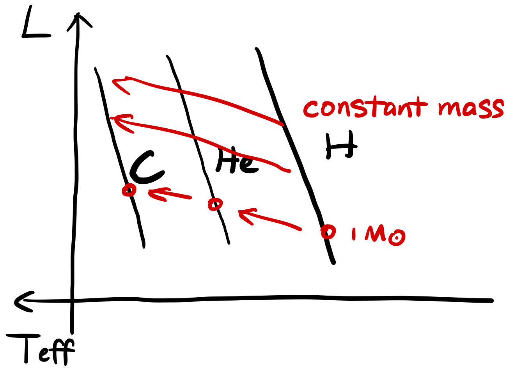

# Chapter 11. Main Sequence

Let us consider chemically homogeneous stars, that is, $\mu$ is a constant throughout the star.

## Analytical Solutions

### Energy Conservation

Assuming that
$$
\varepsilon_\text{nuc}\simeq\varepsilon_0\rho^kT^s
$$
Since the temperature is closely related to the total gravitational potential
$$
\frac{k_BT}{\mu m_\text p}\sim\frac{GM}R
$$
we have
$$
L=\langle\varepsilon_\text{nuc}\rangle M\propto\left(\frac{M}{R^3}\right)^k\left(\frac{\mu M}{R}\right)^sM=M^{k+s+1}R^{-3k-s}\mu^s
$$

### Energy Transport

$$
L\sim\frac{R}{\rho\kappa}T^4\propto M^{3+r-\alpha}R^{3\alpha-r}\mu^{4+r}
$$

where
$$
\kappa\propto \rho^\alpha T^{-r}
$$
Finally
$$
R\propto M^{1-\frac{2(k+\alpha+1)}l}\mu^{1-\frac{3k+3\alpha+4}l}
$$

$$
L\propto M^{3+2\alpha-\frac{2m(k+\alpha+1)}{l}}\mu^{4+3\alpha-\frac{m(3k+3\alpha+4)}{l}}
$$

where
$$
l=s+3k+3\alpha-r,\quad m=3\alpha-r
$$
For the Sun, in pp-chain burning, $k=1,s=5$; the opacity mainly comes from electron scattering, so $\alpha=0,r=0$, then we have
$$
R\propto M^{1/2}\mu^{1/8},\quad L\propto M^3\mu^4
$$
More precisely, $R\propto M^{0.57-0.8}$, $L\propto M^{3.2-3.9}$.

For massive stars, the luminosity is asymptotically Eddington luminosity, which is proportional to $M$. For low-mass stars, free-free transition dominates the opacity, and $\kappa$ is given by Krammer's law $\kappa\propto \rho T^{-7/2}$, so that $\alpha=1$ and $r=7/2$. This gives $L\propto M^{5.4}$.

Fix $\mu$, $L\propto R^6$. On the other hand, 
$$
L\propto R^2T_\text{eff}^4\propto L^{1/3}T_\text{eff}^4\Rightarrow L\propto T_\text{eff}^6
$$

## Interior Stellar Structure

### Radial Distribution

**Subplot (a)** - $\rho$ v.s. normalized $m$
$$
\rho_\text c\propto\bar\rho\propto\frac{M}{R^3}\propto M^{-(0.8\sim1.4)}
$$

So the central density has negative dependence on the stellar mass.

**Subplot (b)** - normalized $m$ v.s. normalized $r$

The normalized accumulated mass profile is simply given by the dimensionless Lane-Emden equation. So varying the mass only merely changes the profile.

**Subplot (c)** - $T$ v.s. normalized $m$
$$
T_\text c\propto\frac MR\propto M^{0.2\sim0.4}
$$
So the central temperature has negative dependence on the stellar mass.

**Subplot (d)** - $\varepsilon$ v.s. normalized $m$

The nuclear generation rate $\varepsilon$ is strongly dependent on the temperature. Meanwhile, the energy generation mechanism in the $10 M_\odot$ star (CNO cycle) is much more efficient than that in the $1M_\odot$ star (pp-chain).

**Subplot (e)** - $l$ v.s. normalized $m$

The luminosity generation is more concentrated in massive stars, since the temperature dependency for $\varepsilon$ in CNO cycle  is much more dramatic than that in pp-chain.

### $T_\text c$ v.s. $\rho_\text c$

In the $\rho-T$ plane, we know that at high $T$, low $\rho$ region, radiation pressure dominates; at low $T$, high $\rho$ region, electron degenerate pressure dominates. For all the other region, gas pressure dominates.

For a low-mass proto-star, as it evolves through Kelvin-Helmholtz contraction, $T_\text c$ and $\rho_\text c$ all increase. But chances are that the proto-star enters the electron degenerate pressure dominated region, when the contraction will stop, before $T_\text c$ reaches $\sim10^7$ K and pp-chain is ignited. For $M<0.08M_\odot$, pp-chain cannot be triggered at all, and the star, known as a **brown dwarf**, is dark, silent, and kind of boring to astronomers. For slightly more massive stars, hydrogen starts to burn, but there could still be a degenerate core. The nuclear fusion of degenrate materials is somehow unstable.

$\Psi$ denotes the **fraction of the degenerate electrons**. The $T_\text c$-$\rho_\text c$ curve has a turn-off at $\Psi=-2$, which should correspond to the existence of a degenerate core for $M\lesssim0.5M_\odot$. 

### Kippenhahn Diagram

- Blank region - convectively stable, radiation dominated
- Shaded region - convective unstable
  - Convection starts when the temperature gradient is unbearablily high and radiation itself cannot sufficiently take energy away. The temperature gradient is proportional to the opacity and the luminosity.
  - Low-mass stars tend to develop **convective envelopes**. Below certain temperature, free-free transition dominated the opacity, where $\kappa\propto \rho T^{-7/2}$. So for stars with lower mass, the opacity will increase dramatically, leading to a rapid grow in the size of convective envelope. Finally, extremely low-mass stars can be fully convective.
  - High-mass stars tend to develop **convective cores** because of the high energy generation rate in the center.
- Solid curves - given a stellar mass, describe how much mass is within a certain radius, say, $0.25/0.5 R$ - mass concentration.
- Dashed curves - given a stellar mass, describe where a certain fraction of total luminosity, say, $0.5/0.9 L$, is generated in the star, in mass coordinate - energy generation concentration.

## Other Main Sequence Stars

For a helium main sequence star ($Y=1$), the critical temperature for ignation is much higher. The critical mass of a helium main sequence is $0.3M_\odot$, below which the whole star would be degenerated at the termination of Kelvin-Helmholtz contraction, while no nulcear fusion is triggered. For a carbon main sequence, the critical mass reaches $0.8M_\odot$.

Recall that luminosity strongly depends on the mean molecular weight,
$$
L\propto \mu^4
$$
so for a hydrogen main sequence, a helium main sequence, and a carbon main sequence of the same mass, the total luminosity $L$, as well as the effective temperature $T_\text{eff}$, increases. The HR diagram should look like below.

Helium and carbon stars are important progenitors for core-collapse supernovae. An evolved hydrogen main sequence star could harbor a steadily burning helium core. Once the hydrogen envelope is blown away, the helium core becomes a naked helium star, progenitors of Type Ib SNe (no hydrogen lines in spectra, helium rich). If the helium envelope is also blown away, a naked carbon star is probably born. They are progenitors of Type Ic SNe (neither hydrogen lines nor helium lines in spectra).