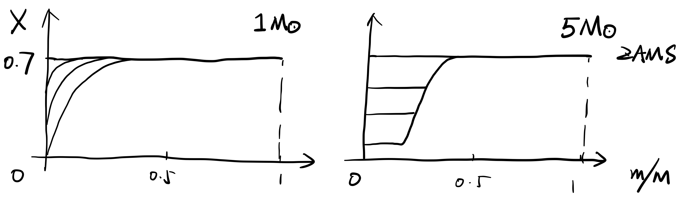
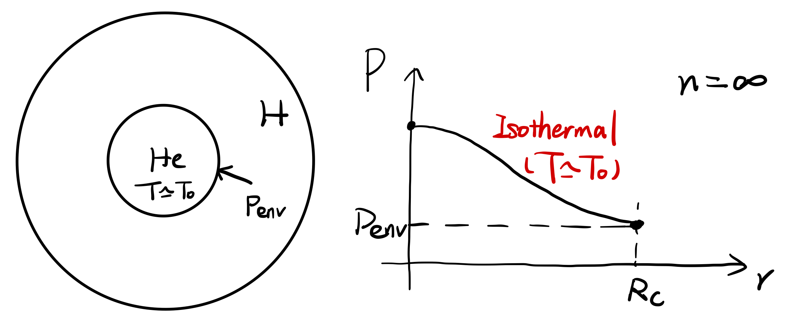
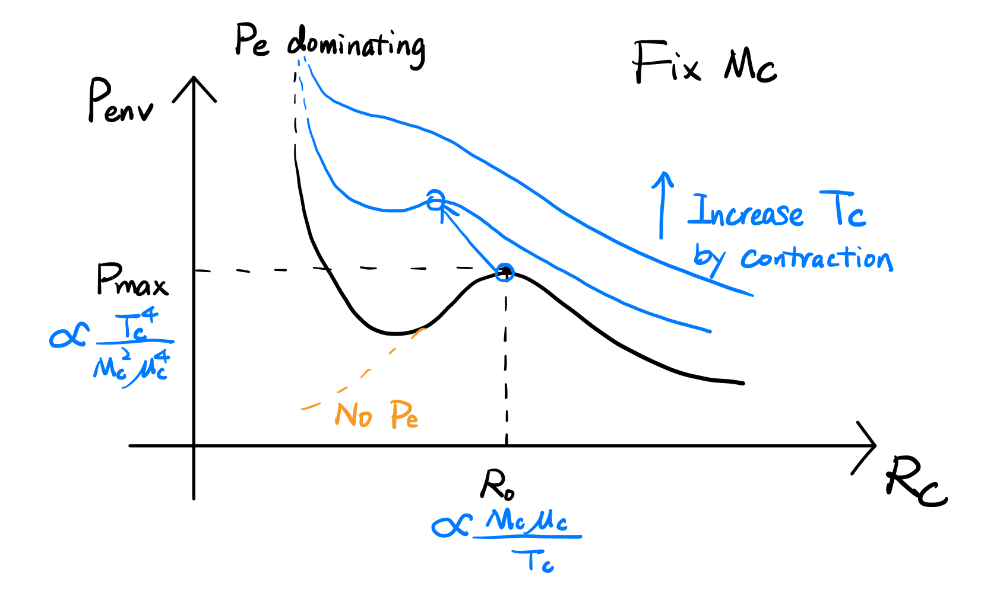
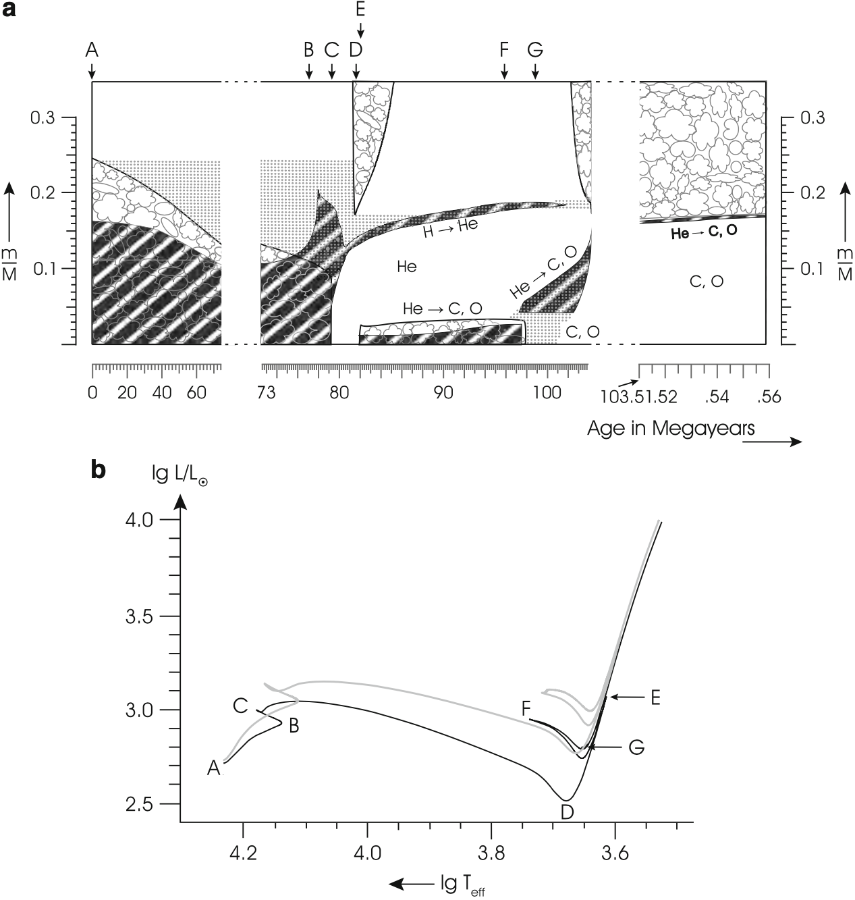

# Chapter 12. Post-Main Sequence

## Core Contraction

In the stellar core, after the depletion of hydrogen, there is no more energy generation if the central temperature $T_c<10^8$ K, at which helium cannot be ignited.

By the end of the central hydrogen burning, in low-mass stars, pp-chain dominates the nuclear burning and central luminosity is not high enough to trigger convection. Hydrogen thus smoothly depletes in the core. In high-mass stars of which the main nuclear burning mechanism is CNO cycle, the cores are convectively unstable, leading to efficient element mixing. Almost thoughout the core, hydrogen depletes evenly and simultaneously.

When hydrogen burning terminates, $L_\text{core}\sim0$, so the temperature gradient vanishes. The core can be approximated as an isothermal polytrope ($n\to\infty$). As discussed in [Chapter 10](./Chapter 10. Polytrope.md), for $n\ge5$, there is no zero point for the Lane-Emden solution. We should feel comfortable as at the surface of this isothermal core, $R_\text c$, there is a finite envelope pressure $P_\text {env}$.

Let's apply the virial theorem to the core plus external envelope pressure
$$
4\pi R_\text c^3P_\text{env}-3\int_0^{M_\text c}\frac P\rho\text dm=-\int_0^{M_\text c}\frac {Gm}r\text dm
$$
Thus the envelope pressure has to satisfy
$$
\begin{align*}
P_\text{env}=&C_1\frac{T_\text cM_\text c}{\mu_\text cR_\text c^3}\quad \left(\frac P\rho=\frac{k_BT}{\mu m_\text p}\propto\frac{T}{\mu}\right)\\
-&C_2\frac{M_\text c^2}{R_\text c^4}
\end{align*}
$$
where $C_1$ and $C_2$ are postive constants. $C_1\sim\mathcal{O}(k_B/m_\text p),C_2\sim \mathcal O(G)$.

Fix the mass and temperature of the core, $P_\text{env}$ is a function of core radius $R_\text c$ only. In fact, this function has a maximum
$$
P_\text{env}\le P_\text{max}=C\frac{T_\text c^4}{M_\text c^2\mu_\text c^4}
$$
$C$ is determined by $C_1$ and $C_2$.

On the other hand, $P_\text{env}$ should determined by the properties of the hydrogen envelope. Since the core only makes up a small fraction ($\lesssim 10\%$) of the total mass, we can neglect the core radius and mass to simply write down
$$
P_\text{env}\sim\frac{GM_*^2}{R_*^4},\quad T_\text c\sim\frac{\mu_\text cGM_*}{k_BR_*}m_\text p
$$
 If $P_\text{max}\ge P_\text{env}$, we define the mass ratio of the core to the whole star $q$, so that
$$
q^2\equiv\left(\frac{M_\text c}{M_*}\right)^2\le C\frac{T_\text c^4R_*^4}{\mu_\text c^4GM_*^4}\Rightarrow q\le q_{SC}\simeq0.3\left(\frac{\mu_\text {env}}{\mu_\text c}\right)^2\sim0.09
$$
$q_{SC}$ is the **Schönberg–Chandrasekhar limit**. Once $q>q_{SC}$, the core starts to be contracted until helium is ignited in the center ($\sim 10^8$ K). Only when the core is massive enough can the star goes to the next stage. Otherwise, the core cools down until electron degenerate pressure dominates to form a He white dwarf.

In our discussion before, we did not take electron degenerate pressure into account. If we do, the required envelope pressure should be modified
$$
P_\text{env}=C_1\frac{T_\text cM_\text c}{\mu_\text cR_\text c^3}
-C_2\frac{M_\text c^2}{R_\text c^4}+C_3\left(\frac{M_\text c}{R_\text c^3}\right)^{5/3}
$$
Here $C_3$ is also positive. Under this correction, the required envelope pressure dramatically increase at a small $R_\text c$, where the degenerate pressure effect dominates. Very easily, in the late stage, the core becomes degenerate and stops contraction. The only way to avoid this 'boring' situation is to obtain a core that is massive enough. In this way the required $P_\text{env}$ still has a maximum in the gas pressure dominated region. Once the external pressure exceeds the $P_\text{max}$, the core, initially lying in the gas pressure region, will start contraction. This critical mass is obtained by ensuring 
$$
\frac{\text dP_\text {env}}{\text dR_\text c}=0
$$
has real roots. As a result,
$$
M_\text c>M_\text{c,crit}\equiv\left(\frac{15}4\frac{C_1C_3}{C_2}\frac{T_\text c}{\mu_\text c}\right)^{3/4}
$$
Once this criterion is achieved, $M_\text c$ kept increasing by shell burning, and $T_\text c$ increases as Kelvin-Helmholtz contraction goes on. But as long as this inequality is satisfied, the contraction can in principle continues, until the helium ignation.

## Evolution for a Massive Star ($M\sim5M_\odot$)

- **(A)** Hydrogen burning (main sequence) - $t_\text{nuc}\sim10^8$ yr.

  $\mu$ and $L$ increase

- **(B)** Depletion of the central hydrogen

- **(C)** The helium core begins to contract $(\varepsilon_\text{gas})$. When temperature outside the helium core becomes high enough, hydrogen-shell burning starts $(\varepsilon_\text{nuc})$.

  In most textbooks, it is claimed that this  $\varepsilon_\text{gas}+ \varepsilon_\text{gas}$ is used for stellar expansion. The expansion timescale is given by the KH timescale - $t_{KH}\sim3\times10^6$ yr.

- **(D)** Reach Hayashi line and expansion terminates

- **(E)** Helium ignation, when the core contraction stops

- **(F)** Helium depletion, formation of a C/O core, helium and hydrogen shell burning

**Notes**

1. How much gravitational energy is released during the core contraction?
   $$
   L_\text{con}\sim \frac1{\Delta t}\cdot GM_\text c^2\left(\frac1{R_\text f}-\frac1{R_\text i}\right)\sim10L_\odot\ll L_*
   $$
   Thus the contribution of the contraction energy to the total luminosity is negligible.

2. Why is $L_*$ almost a constant during contraction?

   During contraction, hydrogen shell burning is the dominant energy source.

   - On the one hand, part of the energy is consumed by expansion throughout $t_{KH}$.
   - On the other hand, core contraction builds up $\rho,T,P$ gradients between the core and the envelope. Consequently, hydrogen shell burning is limited to a narrow mass range, outside which the temeperature quickly falls below the ignition temperature of hydrogen. In this way, $\varepsilon$ stays roughly a constant, and slightly decreases by a factor of few in the gradual hydrogen depletion.

3. **Mirror principle** (an essential empirical relation from simulations)

   When a star has an active shell burning, the **shell** acts as a mirror between **core** and **envelope**. The core contraction is accompanied by the envelope expansion, and vice versa.

   There are two imperfect explanations.

   - Since $\varepsilon\propto T^\nu$, where $\nu$ is so large that the **shell temperature** hardly changes even if the core contracts, we cheat a little bit to claim that the **mean temperature of the whole star** remains the same. This means that the total thermal energy stays a constant, which, according to the virial theorem, is proportional to the overall gravitational energy. As the core contracts, the envelope has to expand to conserve the gravitational energy.
   - According to the numerical results (e.g., the Kippenhahn diagram in earlier this section), hydrogen-shell burning takes place almost at a constant radius even when the core contracts. But simultaneously, $\rho_\text{shell}$, and thus $P_\text{shell}$, decreases. As a result, $P_\text{env}$ has to be correspondingly adjusted to keep the hydrostatic equilibrium. The envelope naturally expand as is suggested by the Lane-Emben solution.