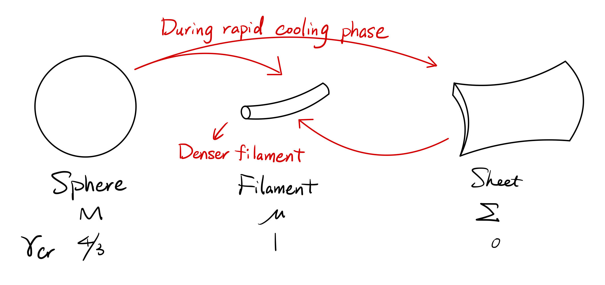
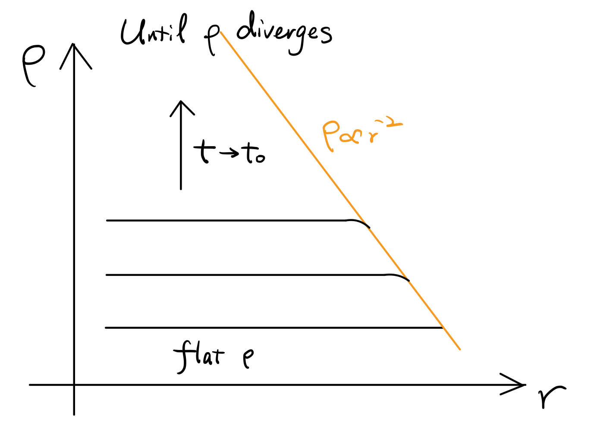
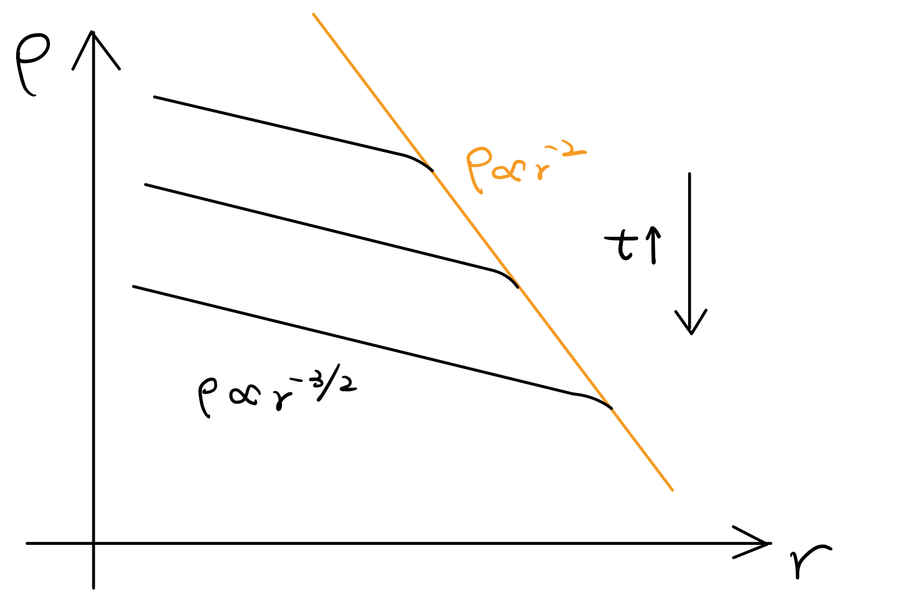

# Chapter 13. Star Formation

Generally speaking, stars come from molecular clouds which cannot support their self-gravity and collapse. Typical physical parameters for a molecular cloud and a star are listed below.

|                                            | Molecular Cloud                | Star                                                         |
| ------------------------------------------ | ------------------------------ | ------------------------------------------------------------ |
| Size                                       | $\sim1\text{ pc}$              | $\sim R_\odot$                                               |
| Density                                    | $\sim10^2-10^4\text{ cm}^{-3}$ | $\sim 1\text{ g/cm}^3$ in mass ($\sim10^{24}\text{ cm}^{-3}$) |
| Free-fall timescale ($\sim1/\sqrt{G\rho}$) | Myrs                           | Minutes                                                      |

In a word, star formation is multi-scales and interdisciplines physics, a combination of MHD, radiation physics, and astrochemistry.

## Jeans Instability

For stars we assume hydrostatic equilibrium, that is, the free-fall timescale and the sound-crossing timescale are comparible, $t_\text{ff}\sim t_\text{sc}$. But for a collapsing system, $t_\text{ff}\ll t_\text{sc}$, where pressure is negligible.

Let us take a look at the EoM,
$$
\frac{\partial^2 r}{\partial t^2}=\frac1\rho\frac{\partial P}{\partial r}-\frac{GM(r)}{r^2}<0
$$
The first term on the RHS is approximately $c_s^2/r$, while the second is roughly $G\rho r$. As long as
$$
r>\frac{c_s}{\sqrt{G\rho}}\iff t_\text{ff}<t_\text{sc}
$$
the cloud starts to collapse. Here we define **Jeans length** $\lambda_J$
$$
\lambda_J\equiv\frac{c_s}{\sqrt{G\rho}}
$$
to mark the onset of instability/hydrodynamics. For $r>\lambda_J$, self-gravity dominates.

We now estimate the Jeans length for a typical molecular cloud
$$
\lambda_J\sim3\text{ pc}\left(\frac{T}{10\text{ K}}\right)^{1/2}\left(\frac{n}{100\text{ cm}^{-3}}\right)^{-1/2}
$$
For $n\sim10^2-10^4\text{ cm}^{-3}$, $\lambda_J\sim\text{ pc}$, which is the upper limit for the size of a molecular cloud.

Accordingly we can define **Jeans radius** $M_J$
$$
M_J\sim\rho J^3\sim50M_\odot\left(\frac{T}{10\text{ K}}\right)^{3/2}\left(\frac{n}{100\text{ cm}^{-3}}\right)^{-1/2}
$$

The rigorous derivation starts with perturbing an isothermal hydrostatical system
$$
\frac{\partial \rho}{\partial t}+\nabla\cdot(\rho\vec v)=0
$$

$$
\frac{\partial \vec v}{\partial t}+(\vec v\cdot\nabla)\vec v=-\frac1\rho\nabla P-\nabla\Phi
$$

$$
\nabla^2\Phi=4\pi G\rho
$$

$$
P=\rho c_s^2
$$

where $c_s$ is a constant. If we use the index 0 and 1 to denote unperturbed quantities and corresponding linear perturbation (that is, for quantity $Q$, $Q=Q_0+Q_1$, where $Q_0$ is a constant throughout the region we are interested in, while $Q_1\ll Q_0$), to the leading order, these equations can be rewritten as
$$
\frac{\partial \rho_1}{\partial t}+\rho_0\nabla\cdot\vec v_1=0
$$

$$
\frac{\partial \vec v_1}{\partial t}=-\frac{c_s^2}\rho_0\nabla \rho_1-\nabla\Phi_1
$$

$$
\nabla^2\Phi_1=4\pi G\rho_1
$$

Note that the initial velocity $v_0=0$. Then
$$
\Rightarrow\frac{\partial }{\partial t}(\nabla\cdot\vec v_1)=-\frac{c_s^2}{\rho_0}\nabla^2 \rho_1-4\pi G\rho_1
$$

$$
\Rightarrow\left(\frac{\partial^2}{\partial t^2}-c_s^2\nabla^2\right)\rho_1=4\pi G\rho_0\rho_1
$$

This is a typical wave equation. The simpliest form of solution is known as the **plane wave solution**, which describes the wave propogation in one dimension.
$$
\delta Q=A\exp\left[i\left(\vec k\cdot\vec r+\omega t\right)\right]
$$
And for 1-D case, the equation for $\rho_1$ above can be simplified as
$$
\omega^2=c_s^2k^2-4\pi G\rho_0
$$
which gives the **dispersion relation**.

- For $k>k_J\equiv\sqrt{4\pi G\rho_0}/c_s$ (*small scale*), $\omega^2$ is positive, thus the perturbation is stable. In fact, pressure wave is produced in this way.
- For $k<k_J$ (*large scale*), $\omega=i\sigma$, where $\sigma\in \mathcal R^+$. So $\delta Q\propto\exp(\pm\sigma t)$, which are the **growing mode** and **decaying mode** respectively. The decaying mode is soon damped, while the growing mode would finally destroy the linear perturbation assumption and marks the onset of instability.

Since $k_J$ is a typical wave number, we define **Jeans length** as the corresponding wave length,
$$
\lambda_J\equiv\frac{2\pi}{\lambda_J}=\sqrt{\frac{\pi}{G\rho_0}}c_s=\sqrt\pi c_st_\text{ff}\simeq0.04\text{ pc}\left(\frac T{10\text{ K}}\right)^{1/2}\left(\frac{\rho_0}{10^{-19}\text{ g/cm}^3}\right)^{-1/2}
$$
and the **Jeans mass** as
$$
M_J\equiv\frac43\pi\left(\frac{\lambda_J}{2}\right)^3\rho_0\simeq2M_\odot\left(\frac T{10\text{ K}}\right)^{3/2}\left(\frac{\rho_0}{10^{-19}\text{ g/cm}^3}\right)^{-1/2}
$$
The **unstable condition** is $r>\lambda_J$, where $r$ is the typical scale of the system.

For polytropic EoS, $T\propto\rho^{\gamma-1}$,
$$
\Rightarrow M_J\propto T^{3/2}\rho^{-1/2}\propto\rho^{\frac32(\gamma-4/3)}
$$
For a system of the mass $M\gtrsim M_J$, if $\gamma>4/3$, increasing $\rho$ gives increasing $M_J$. But initially $M$ is only slightly larger than $M_J$, so the collapse soon stops. If $\gamma<4/3$, however, the $M_J$ further decreases as the collapses goes on. On the other hand, the free-fall timescale goes down, making the collapse timescale shorter and shorter. As a result, the system undergoes runaway collapse. So only for systems of which $\gamma<4/3$, $M>M_J$ is the **collapse criterion**.

## Different Geometry in Molecular Cloud

Let's consider a gas **filament** (of which the radial size $R$ is much smaller than the length $l$ ) with a constant line mass
$$
\mu=\frac{M_\text{tot}}l
$$
and we only consider the radial collapse (two-dimensional collapse) so that the filament gets thinner ($R$ decreases) while $l$ is fixed. Again, whether the collapse will start depends on the battle of the gravitational force and the pressure gradient force. First let us calculate the gravitational force at the surface of a filament.
$$
4\pi G\iiint\rho\text dV=\iiint\nabla^2\Phi\text dV=\oiint\nabla\Phi\cdot\text d\vec S=-\oiint \vec F_\text{g}\cdot\text d\vec S
$$
Due to the cylindrical symmetry,
$$
\Rightarrow 4\pi G \mu l=F_\text g\cdot2\pi Rl\Rightarrow F_\text g\propto R^{-1}
$$
The pressure gradient force is
$$
F_P\propto\frac1\rho\frac{P}{R}\propto\frac{\rho^{\gamma-1}}{R}\propto\frac{\left(\mu/R^2\right)^{\gamma-1}}{R}\propto R^{1-2\gamma}
$$

$$
\Rightarrow \frac{F_\text g}{F_P}\propto R^{2(\gamma-1)}
$$

So for the filamentary structure, the critical $\gamma_\text{cr}\equiv1$.

Similarly we can also consider a gas **sheet** with a fixed surface density $\Sigma$. The collapse is one-dimensional (the thickness of the sheet $h$ decreases). The gravitational force is given by
$$
4\pi G\Sigma r^2=F_\text g\cdot 2\pi r^2\Rightarrow F_\text g\propto h^0
$$
And the pressure gradient force is
$$
F_P\propto\frac{\rho^{\gamma-1}}{h}\propto\frac{\left(\Sigma/h\right)^{\gamma-1}}{h}\propto h^{-\gamma}
$$

$$
\Rightarrow \frac{F_\text g}{F_P}\propto R^\gamma
$$

The critical $\gamma$ is $0$.

Spherical clouds are inevitably slightly elongated, so the gravitational collapse is not fully spherically symmetric, leading to the formation of sheets and filaments. Similarly, once collapses, sheet-like structure will soon form filaments. In conclusion, all systems end up with forming filamentary structures.

One of the best ways to understand the basic processes in star formation is to consider the $\rho-T$ plot. Before the protostar formation, there are roughly three different stages in the $\rho-T$ phase space.

- Rapid cooling phase

  Usually, near the onset of collapse, the pressure remains roughly a constant, thus $\gamma\sim0$. Spherical clouds definitely collapse, while sheets also marginally do so, thus filamentary structure forms. As $\gamma$ is still lower than $\gamma_\text{cr}$ for filaments, they can further collapse.

- Isothermal phase

  As the density goes up, the cooling is increasingly insufficient, and the system finally reaches a stage where the temperature reaches a minimum $T_\text{min}$. Around that time, the system is almost isothermal, thus $\gamma\sim1$. Filaments become hydrostatic so collapse stops. Another mode of instability, known as **fragmentation** whose timescale is much longer than collapse, dominates. Filaments slowly break into smaller, somehow spherical fragments.

- Re-collapse

  Temperature increases for higher density, when $\gamma>1$. Each fragments simply re-collapse, until $\gamma$ finally reaches $\sim4/3$, when spherical structures become hydrostatically stable.

## Dynamical Collapse of Gas

>Larson (1969) & Penstone (1969)

Now we try to analytically model the dynamical collapse for isothermal gas in spherical symmetry. The basic equations are listed as follows,
$$
\frac{\partial\rho}{\partial t}+\frac1{r^2}\frac{\partial}{\partial r}\left(\rho r^2v\right)=0
$$

$$
\frac{\partial v}{\partial t}+v\frac{\partial v}{\partial r}+\frac{c_0^2}\rho\frac{\partial \rho}{\partial r}+\frac{GM(r)}{r^2}=0
$$

where $M(r)$ denotes the total mass within radius $r$, (**without assuming any point mass at the center**)
$$
M(r,t)=\int_0^r4\pi r^2\rho(r',t)\text dr'
$$
and $c_0$ is the isothermal sound speed. It is difficult to derive the general solution for these PDEs, but we can try to contruct one self-similar solution. Here we define a series of dimensionless radius,
$$
\xi\equiv\frac r{c_0|t-t_0|}
$$
and consider the self-similar forms
$$
v(r,t)=c_0V(\xi),\quad \rho(r,t)=\frac{\Omega(\xi)}{4\pi G|t-t_0|^2},\quad M(r,t)=\frac{c_0^3|t-t_0|}Gm(\xi)
$$
Here $V$, $\Omega$, and $m$ are all dimensionless. As a result,
$$
\frac{\partial}{\partial t}\Bigg|_r=-\frac r{c_0|t-t_0|^2}\frac{\text d}{\text d\xi},\quad \frac{\partial}{\partial r}\Bigg|_t=\frac 1{c_0|t-t_0|}\frac{\text d}{\text d\xi}
$$
and the PDEs are now transferred to ODEs, say,
$$
\left[(\xi-V)^2-1\right]V'=\left[\Omega(\xi-V)-\frac2\xi\right](\xi-V)
$$

$$
\left[(\xi-V)^2-1\right]\frac{\Omega'}{\Omega}=\left[\Omega-\frac2\xi(\xi-V)\right](\xi-V)
$$

$$
m=(\xi-V)\xi^2\Omega
$$

We first impose static boundary condition at the center,
$$
V(0)=0
$$
which simply means that there is no gravity at the center. In addition, we notice that when $(\xi-V)^2=1$, we must have
$$
\Omega(\xi-V)-\frac2\xi=\Omega-\frac2\xi(\xi-V)=0
$$
Otherwise $V'$ and $\Omega'$ diverge, which is unphysical. It requires that $\Omega=\pm\frac2\xi$ when $V=\xi\pm1$. This is really similar to the trans-sonic boundary condition when solving spherically symmetric accretion.

The solution that satisfies these two boundary conditions is calculated numerically. At two ends, say $\xi\to0$ and $\xi\to\infty$, we have
$$
V(\xi)=0.667\xi,\ \Omega(\xi)=1.667 \text{ as }\xi\to 0
$$
and
$$
V(\xi)=3.28\xi,\ \Omega(\xi)=8.86\xi^{-2} \text{ as }\xi\to \infty
$$
respectively.

**Notes**

1. When $\xi\gg1$,
   $$
   \Omega=\frac A{\xi^2}=\frac A{r^2}c_0^2|t-t_0|^2
   $$
   So the density
   $$
   \rho = \frac{\Omega}{4\pi G|t-t_0|^2}=\frac{Ac_0^2}{4\pi G}r^{-2}
   $$
   has no time dependency. 

2. When $\xi\to0$,
   $$
   \Omega=B\Rightarrow \rho=\frac{B}{4\pi G|t-t_0|^2}
   $$
   Interestingly, the density has no radius dependency, and is thus evenly distributed.

3. At $\xi\sim1$, the radius $r$ is roughly $c_0|t-t_0|$. So as we have argued, at $L>c_0|t-t_0|$, the system is gravity dominated, and the density follows a power-law profile with index of $-2$. Within this critical radius, however, the density profile is somehow flat.

   Note that during the gravitational collapse,
   $$
   \rho\sim\frac1{Gt_\text{ff}^2}
   $$
   that is, density diverges with free-fall timescale. Here, we claim that
   $$
   |t-t_0|\sim t_\text{ff}
   $$
   to ensure that when $\xi\to0$, $\rho$ diverges as we expect. Then we find
   $$
   L=c_0|t-t_0|\sim\lambda_J
   $$
   consistent with the fact that within $\lambda_J$, gravity dominates. And since $\lambda_J\sim c_0 t_\text{ff}\sim\rho^{-1/2}$, it keeps decreasing as the (isothermal) collapse goes on. The core is always larger in size than $\lambda_J$ until protostar formation.

Larson-Penstone solution gives an overall picture of density profile evolution as shown the the figure below. The break point gradually moves to smaller $r$ as the system collapses.

Frank Shu, however, proposed another self-similar solution for the dynamical collpase equations. He presumed the existence of a central point mass and different boundary conditions. In his solution, the core density decreases after a point mass dominates the center.

This is generally in consistence with the situation after the protostar formation.

By numerically solving the equations, we would see that before protostar formation ($t\lesssim t_0$), Larson-Pentone solution works pretty well. For $t\gtrsim t_0$, late-type Larson-Pentone solution looks similar to Shu solution (Hunter 1977), though they have totally different mathemcatical structures.

## Thermal Evolution of a Collapsing Cloud

The real collapsing process cannot be strictly isothermal. In this section we discuss the thermal evolution. 

1. Molecular clouds begin to collapse ($T\sim10$ K, $\rho\propto r^{-2}$). At such low temperature, dust cooling is quite efficient, and may exceed the heat generated by cosmic ray and gravitational collapse. During this collapsing phase, the heating rate for gravitational compression is
   $$
   \Gamma_\text{comp}=-P\frac{\text d}{\text dt}\left(\frac1\rho\right)\sim\frac P\rho\frac1{t_\text{ff}}\sim\frac{c_s^2}{t_\text{ff}}
   $$
   This heating rate goes up as the collapse goes on, and pressure gradient is gradually built.

2. The optical depth given by dust absorption, $\tau\sim\rho\kappa_\text d\lambda_J$, is
   $$
   \tau\sim1.2\left(\frac{T_\text{gas}}{10\text{ K}}\right)^{1/2}\left(\frac{\rho}{10^{-13}\text{ g/cm}^3}\right)^{1/2}\left(\frac{T_\text{d}}{10\text{ K}}\right)^{2}
   $$
   Crossing $\rho\sim10^{-13}$ g/cm$^3$ (initially this is $\sim10^{-24}$ g/cm$^3$), collapsing is stopped by the pressure gradient force, when the core becomes optically thick (the dust opacity has positive dependency on dust temperature until $T_\text d$ reached $\sim1500$ K and dust grains suffer significant **sublimation**). This marks the formation of the first hydrostatic core with a size of $10$ AU, which is the Jean length at this stage.

3. $\rho$ and $T$ adiabatically increases as the first core grows via accretion. Note that initially, because the gas temperature is too low to excite the rotational and vibrational degrees of freedom for hydrogen molecules, the adiabatic index $\gamma$ is approximately $5/3$. Only when the temperature gets high enough will $\gamma$ reaches the normal $7/5$ for diatomic gas. Throughout this stage, $\gamma>4/3$, so the core is roughly hydrostatic and contracts slowly.

   The accretion rate is given by
   $$
   \dot M\sim\frac{M_J}{t_\text{ff}}\sim A\frac{c_s^3}{G}
   $$
   

   In Larson-Penstone solution, $A\sim50$, while in Shu solution, $A\sim1$.

4. $\ce{H2}$ dissociation

   When $T\sim2000$ K, the $\ce{H2}$ dissociation timescale is comparable to the free-fall timescale. A significant fraction of thermal energy is then used to dissociate hydrogen molecules, and $\gamma$ suddenly decreases. The central region dynamically collapses again until all hydrogen molecules are dissociated. This is known as the **second collapse**. In this phase, the subtle competition between gravitational compression heating and $\ce{H2}$ dissociation makes $\gamma\sim4/3$.

5. The depletion of $\ce{H2}$ marks the final adiabatic core formation. This core is known as the **protostar**, of which $M\sim M_J\sim0.01 M_\odot$. This mass further increases via accretion.