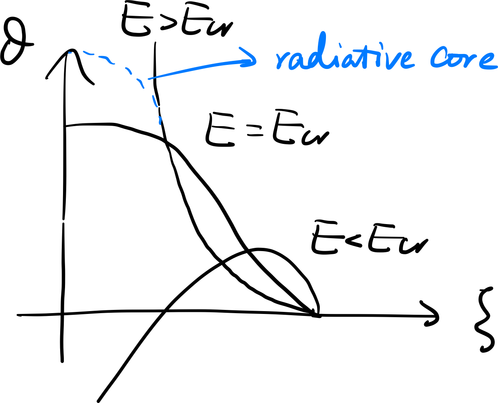

# Chapter 14. Protostar

## Hayashi's Line (Track)

All types of stars have a radiative layer at the surface, even including low-mass stars, of which the outermost region is super-adiabatic. As a result, the following conditions are satisfied.

For the hydrostatic equation,
$$
\int_R^\infty\text dr\frac{\text dP}{\text dr}=-\int_R^\infty\rho\frac{GM}{r^2}\text dr
$$
Here the lower limit of the integral is taken as a certain radius $R$ close to the stellar surface, while the upper limit is formalistically taken to be infinity. The integrant in the RHS of the equation, however, contributes mainly in a small region around $R$. As a result,
$$
P_\infty-P_R=-\frac{GM}{R^2}\int_R^\infty\rho\text dr=-\frac{GM}{R^2}\frac1{\langle\kappa\rangle}\int_R^\infty\rho\kappa\text dr
$$
where
$$
\langle\kappa\rangle\equiv\frac{\int_R^\infty\rho\kappa\text dr}{\int_R^\infty\rho\text dr}
$$
 Now we consider a special $R$ so that
$$
\tau\equiv\int_R^\infty\rho\kappa\text dr=\frac23
$$
This is the so-called **photospheric condition** and gives the definition of the **photosphere radius** $R$. For simplicity we set $P_\infty\sim0$, so we have
$$
P_R=\frac23\frac{GM}{R^2}\frac1{\langle\kappa\rangle}\simeq\frac23\frac{GM}{R^2}\frac1{\kappa_0\rho_R^aT_\text{eff}^b}
$$
Let's consider a fully convective star within radius $R$, of which the main atmospheric opacity comes from $\ce{H-}$, and $a\sim0.5,\ b\sim9$. This is usually the case for protostars and red giants with huge, cool, convective envelope. Now that $\nabla\simeq\nabla_\text{ad}$, the EoS is
$$
P_R=K\rho_R^{5/3}\equiv EGM^{1/3}R\rho_R^{5/3}
$$
where $E\equiv0.4242$ is a numerical factor by solving Lane-Emben equation of $n=3/2$ numerically. And for ideal gas, this EoS is equivalent to
$$
P_R=\frac{k_B}{\mu m_\text p}\rho_RT_\text{eff}
$$
We have substituted $T_R$ with $T_\text{eff}$ because the effective temperature also denotes the temperature at the photoshpere.

Finally, the luminosity is given by
$$
L=4\pi\sigma_{SB}R^2T_\text{eff}^4
$$
For given $M$, we have four equations and five unknown quantities ($L,\ R,\ T_\text{eff}, \rho_R, P_R$), so they can be reduced to ONE final relation,
$$
\log T_\text{eff}=A\log L+B\log M+C
$$

$$
A=\frac12\cdot\frac{3a-1}{9a+2b+3},\quad B=\frac{a+3}{9a+2b+3}
$$

Recall that $a\ll b$ for $\ce{H-}$ opacity, thus $A,\ B\simeq0$. Precisely, $A\simeq 0.01,\ B\simeq 0.14$, so $T_\text{eff}$ does not change a lot when $L$ and $M$ vary.

**Notes**

- For given mass, the Hayashi's line is a very steep, almost vertical line in the HR diagram.

- The dependency of position of Hayashi's line on $M$ is also weak, though $T_\text{eff}$ would slightly increase for higher mass.

- The solution is realized when $E=E_\text{cr}=0.4242$. For fixed $M$ and $L$, if we allow $E$ to vary,
  $$
  \log T_\text{eff}=3B\log E+C'
  $$
  It seems that if $E$ goes down, so will $T_\text{eff}$, and the stars goes to the right hand side, known as the **forbidden region**. But if $E<E_\text{cr}$, the Lane-Emden solution becomes **collapse-type**, which is unphysical (Hayashi 1961). On the contrary, $E$ could be larger than $E_\text{cr}$, when the actual stellar structure is given by a nested polytrope (radiative core + convective envelope).

  

- In Hayashi's original paper, the definition of $E$ is different from ours.
  $$
  E'\equiv(2.5)^{3/2}\xi_1^{2.5}\theta_1'^{0.4}=4\pi E^{-3/2}=45.48
  $$
  and
  $$
  \Rightarrow T_\text{eff}=-2B\log E'+C''
  $$
  

  

