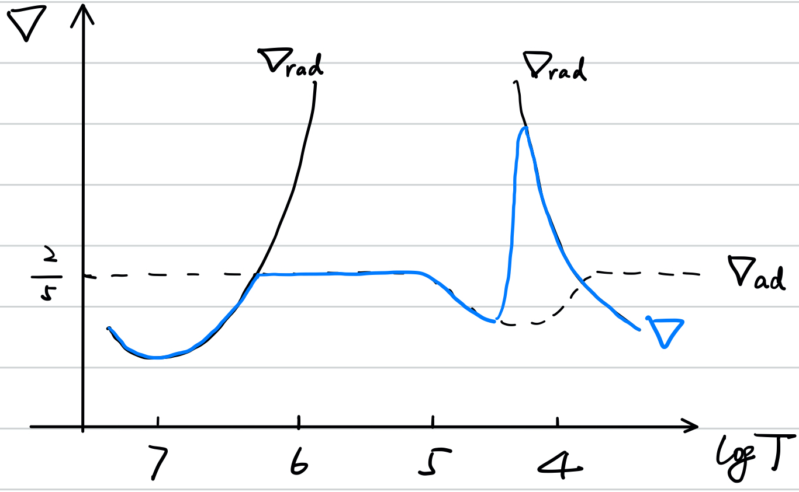
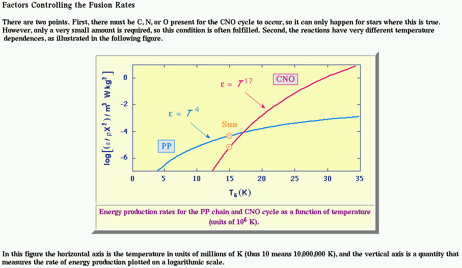

# Chapter 6. Convection

In a star with hydrostatic equilibrium achieved, we have several profiles
$$
\rho(r),\ P(r),\ T(r),\ s(r),\ \cdots
$$

## Dynamical Instability

Now imagine a small bubble, a fluid element $\text e$ located at $r$, moves up by $\Delta r$ keeping its entropy (adiabatic perturbation). Through this displacement, the density of the element changes to
$$
\left.\begin{align*}
\rho_\text e(r+\Delta r)&=\rho(P_\text e(r+\Delta r),s_\text e(r+\Delta r))\\
&=\rho(P(r+\Delta r),s(r))\\
\rho(r+\Delta r)&=\rho(P(r+\Delta r),s(r+\Delta r))
\end{align*}\right\}\Rightarrow \text D\rho\big|_{r+\Delta r}\equiv\rho_\text e(r+\Delta r)-\rho(r+\Delta r)=-\left(\frac{\partial\rho}{\partial s}\right)_P\frac{\text ds}{\text dr}\Delta r
$$
Here we consider the density as a function of pressure and specific entropy, because pressure equilibrium is achieved super quickly (within hours).

Since
$$
\begin{align*}
\left(\frac{\partial\rho}{\partial s}\right)_P&=\left(\frac{\partial\rho}{\partial T}\right)_P\left(\frac{\partial T}{\partial s}\right)_P=\frac{T}{c_P}\left(\frac{\partial\rho}{\partial T}\right)_P\\
&=\frac{T}{c_P}\frac{\rho}{T}\left(\frac{\partial\ln\rho}{\partial \ln T}\right)_P=\frac{\rho}{c_P}\left(\frac{\partial\ln\rho}{\partial \ln T}\right)_P\\
&\equiv -\frac{\rho}{c_P}\delta
\end{align*}
$$
where $\delta$ is defined as
$$
\delta\equiv -\left(\frac{\partial\ln\rho}{\partial \ln T}\right)_P
$$
Normally $\delta\sim1$ (ideal gas).
$$
\Rightarrow \text D\rho\big|_{r+\Delta r}=\frac{\rho\delta}{c_P}\frac{\text ds}{\text dr}\Delta r
$$
If the element is heavier than the background, that is, has higher density, the element must move back, so the system is stable. In other words, in a stable system,
$$
\Rightarrow \text D\rho\big|_{r+\Delta r}>0
$$

$$
\iff \frac{\text ds}{\text dr}>0
$$

When ${\text ds}/{\text dr}<0$, the convection starts. This is thus the criterion for the onset of convection. However, it is not easy to measure (or even intuitionally understand) the entropy. We would really like to rewrite ${\text ds}/{\text dr}<0$ to conditions of ${\text dT}/{\text dr}$.
$$
\frac{\text ds(T,P)}{\text dr}>0
$$

$$
\iff \left(\frac{\partial s}{\partial T}\right)_P\frac{\text dT}{\text dr}+\left(\frac{\partial s}{\partial P}\right)_T\frac{\text dP}{\text dr}>0
$$

$$
\iff \frac{c_P}{T}\frac{\text dT}{\text dr}-\left[\frac{\partial (1/\rho)}{\partial T}\right]_P\frac{\text dP}{\text dr}>0
$$

where we have applied one of the Maxwell's relations
$$
\left(\frac{\partial S}{\partial P}\right)_T=-\left(\frac{\partial V}{\partial T}\right)_P
$$
 to the second term. Thus the criterion can be further rewritten as
$$
\begin{align*}
\frac{\text dT}{\text dr}&>\frac{T}{c_P}\left[\frac{\partial (1/\rho)}{\partial T}\right]_P\frac{\text dP}{\text dr}\\
&=\frac{\delta}{\rho c_P}\frac{\text dP}{\text dr}\\
&=-\frac{g\delta}{c_P}
\end{align*}
$$
In the last equation we have applied the hydrostatic equilibrium,
$$
\frac1\rho\frac{\text dP}{\text dr}=-\frac{GM}{r^2}\equiv -g
$$
$\delta$, $g$ and $c_P$ are all positive, so as long as the temperature gradient is not **too negative**, the star is free of convection.

## Buoyancy and Oscillation

The buoyancy is given by
$$
f_\text b=-g\cdot\text D\rho=-\frac{\rho g\delta}{c_P}\frac{\text ds}{\text dr}\Delta r
$$
Thus the EoM is
$$
\rho\Delta \ddot r+\frac{\rho g\delta}{c_P}\frac{\text ds}{\text dr}\Delta r=0\Rightarrow \omega^2=\frac{g\delta}{c_P}\frac{\text ds}{\text dr}
$$
For $\text ds/\text dr>0$, $\omega$ is a real number, and the fluid element thus oscillates at a frequency of $\omega$. For $\text ds/\text dr>0$ however,
$$
\omega=\pm i\sigma
$$
where $\sigma$ is real, and
$$
\Delta r\propto e^{\pm\sigma t}
$$
By replacing $s$ with $s(\rho,P)$, we have
$$
\begin{align*}
\omega^2&=\frac{g\delta}{c_P}\left[\left(\frac{\partial s}{\partial \rho}\right)_P\frac{\text d\rho}{\text dr}+\left(\frac{\partial s}{\partial P}\right)_\rho\frac{\text dP}{\text dr}\right]\\
\end{align*}
$$
Since
$$
\left(\frac{\partial\rho}{\partial s}\right)_P\equiv-\frac{\rho}{c_P}\delta
$$
while
$$
\left(\frac{\partial P}{\partial s}\right)_\rho\left(\frac{\partial s}{\partial \rho}\right)_P\left(\frac{\partial \rho}{\partial P}\right)_s=-1\Rightarrow \left(\frac{\partial P}{\partial s}\right)_\rho=-\left(\frac{\partial\rho}{\partial s}\right)_P\left(\frac{\partial P}{\partial \rho}\right)_s=c_s^2\frac{\rho}{c_P}\delta
$$
where $c_s$ is the **adiabatic sound speed**. The the frequency is given by
$$
\begin{align*}
\omega^2&=\frac g\rho\left(\frac1{c_s^2}\frac{\text dP}{\text dr}-\frac{\text d\rho}{\text dr}\right)\\
&=-\frac g\rho\frac{\text dP}{\text dr}\left(\frac{\text d\rho}{\text dP}-\frac1{c_s^2}\right)\\
&=g^2\left(\frac{\text d\rho}{\text dP}-\frac1{c_s^2}\right)
\end{align*}
$$
This frequency is called [**Brunt–Väisälä frequency** (or **buoyancy frequency**)](https://en.wikipedia.org/wiki/Brunt–Väisälä_frequency), which is the frequency of the **gravity wave** inside a star.

## Stable Criteria

First of all, we have
$$
\frac{\text dT}{\text dr}>\frac{\delta}{\rho c_P}\frac{\text dP}{\text dr}
$$
Since $\text dP/\text dr<0$, this inequality is the same as
$$
\frac{\text dT}{\text dP}<\frac{\delta}{\rho c_P} \iff \frac{\text d\ln T}{\text d\ln P}<\frac{\delta}{\rho c_P}\frac PT
$$
We define the **actual temperature gradient**
$$
\nabla\equiv \frac{\text d\ln T}{\text d\ln P}
$$
and the **adiabatic temperature gradient**
$$
\begin{align*}
\nabla_\text{ad}&\equiv\left(\frac{\partial\ln T}{\partial\ln P}\right)_s=\frac PT\left(\frac{\partial T}{\partial P}\right)_s\\
&=\frac PT\left(\frac{\partial (1/\rho)}{\partial s}\right)_P\quad (\text{Maxwell's relation})\\
&=-\frac PT\cdot\frac1\rho\left(\frac{\partial \ln\rho}{\partial \ln T}\right)_P\cdot\frac1T\left(\frac{\partial T}{\partial s}\right)_P\\
&=\frac{\delta}{\rho c_P}\frac PT
\end{align*}
$$
In this way, the criterion of stability is
$$
\nabla<\nabla_\text{ad}
$$

- $\nabla$ is the temperature gradient of the background matter, which is determined by solving the basic equations.

  If the energy is transported via radiation, which is true in most regions inside a stable star, $\nabla$ is then determined by photon diffusion.
  $$
  \begin{align*}
  \nabla&=\left(\frac{\text d\ln T}{\text d\ln P}\right)_\text{rad}\equiv \nabla_\text{rad}\\
  &=\frac{3}{16\pi ac G}\frac{\kappa LP}{mT^4}
  \end{align*}
  $$

- $\nabla_\text{ad}$ is the temperature gradient when the gas is kept adiabatic. It is determined solely by the EoS.

  So far in our discussion, $\nabla_\text e=\nabla_\text{ad}$. So currently, the full version of the stable criterion is
  $$
  \nabla_\text{rad}\simeq\nabla<\nabla_\text{e}\simeq\nabla_\text{ad}
  $$

  >**Schiwarzchild criterion**
  >$$
  >\nabla_\text{rad}<\nabla_\text{ad}
  >$$

  

- In general, the mean molecular weight also has a gradient
  $$
  \nabla_\mu\equiv\frac{\text d\ln\mu}{\text d\ln P}
  $$
  Now that
  $$
  \frac{\text d\rho}{\rho}=\alpha\frac{\text dP}P-\delta\frac{\text dT}T+\varphi\frac{\text d\mu}\mu\quad (\alpha,\ \delta,\ \varphi>0)
  $$
  The stable criterion should be modified
  $$
  \nabla<\nabla_\text e+\frac{\varphi}{\delta}\nabla_\mu
  $$
  Since $\mu$ usually increase when approching the stellar center, $\nabla_\mu>0$. The gradient in mean molecular weight tends to stabilize the star. It is even possible when
  $$
  \nabla_\text e<\nabla<\nabla_\text e+\frac{\varphi}{\delta}\nabla_\mu
  $$
  If this so-called **Ledoux criterion** is satisfied, the certain region is under semi-convection.

## Convectively Unstable

1. $\nabla>\nabla_\text e$, which is the original condition

2. $\nabla_\text{rad}>\nabla$

   After the onset of convection, the actual temperature gradient is not determined by the radiation, as the convection takes energy away somehow.

3. Still we have $\nabla_\text{e}\simeq\nabla_\text{ad}$ according to our assumption

$$
\nabla_\text{rad}>\nabla>\nabla_\text{e}\simeq\nabla_\text{ad}
$$

> In the outermost layer, where the energy is effciently radiated away due to the low density, the fluid element cannot be treated as adiabatic any longer. In fact,
> $$
> \nabla_\text{e}\gtrsim\nabla_\text{ad}
> $$
> So in this so-called **super adiabatic layer**,
> $$
> \nabla_\text{rad}>\nabla>\nabla_\text{e}>\nabla_\text{ad}
> $$

## Solar Model

- Why does $\nabla_\text{rad}$ behave like this as $T$ decreases?
  $$
  \nabla_\text{rad}=\frac{3}{16\pi ac G}\frac{P}{T^4}\cdot\frac{L}{m}\cdot\kappa
  $$

  - $L/m$ is of the same order as $\varepsilon_\text{nuc}$, which has high dependency on temperature

    

    As a result, in the core region, $\nabla_\text{rad}$ decreases as the temperature falls.

    Note that in more massive stars when CNO cycle dominates the core, $\varepsilon_\text{nuc}$ is much higher than that when p-p chain mechanism dominates, with much stronger dependency on $T$. In this way, $\nabla_\text{rad}>\nabla_\text{ad}$ can be achieved throughout the core. Thus convection in the core is possible.

    We will revisit $\varepsilon_\text{nuc}$ in [Chapter 9]().

  - The $\kappa-T$ relation has already been shown in [Chapter 5](./Chapter 2. Hydrostatic Equilibrium), and will be discussed in detail in [Chapter 8](Chapter 8. Opacity). 

    In general,

    - when $T\lesssim 10^4$ K, the photo-dissociation of $\ce{H^-}$ leads $\kappa$ to fall drastically as $T$ goes down;
    - when $T\gtrsim 10^4$ K, the free-free transition dominates the $\kappa$, which promotes $\kappa$  in a cooler region.

- Why is $\nabla_\text{ad}$ slightly lower than $2/5$ around $10^{4-5}$ K?

  At this temperature ($T\sim 1-10$ eV), $\ce{He}^{2+},\ \ce{He}^{+},\ \ce{H}^{+}$ start to recombine. The recombination changes 'adiabaticity' due to the release of chemical energy.

- Why does $\nabla$ look like this?