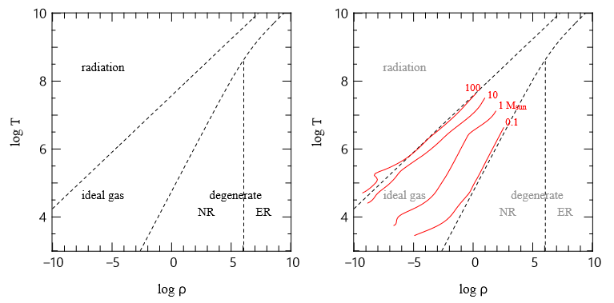

# Chapter 7. Equation of State

Here we discuss two effects producing pressure. 

## Ideal Gas

Above all, for ideal gas, the EoS gives
$$
P_\text{gas}=\frac{\rho k_BT}{\mu m_p}
$$

## Radiation Pressure

$$
P_\text{rad}=\frac13aT^4
$$

Let us consider gas-radiation mixed fluid
$$
P=P_\text{gas}+P_\text{rad}=\frac{\rho k_BT}{\mu m_p}+\frac13aT^4
$$
Define
$$
\beta\equiv\frac{P_\text{gas}}{P}
$$

>Let's check the $\beta$ value for different stars
>
>- Sun: $\rho_c\sim150$ g/cm$^3$, $T_c\sim10^7$ K, $\Rightarrow\beta\sim1$
>- Massive star ($20\ M_\odot$): $\rho_c\sim5$ g/cm$^3$, $T_c\sim4\times10^7$ K, $\Rightarrow\beta\sim0.84$

Since the density
$$
\rho=\frac{\mu m_p}{k_BT}\left(P-\frac a3T^4\right)=\rho(P,T)
$$
We can define two derivatives
$$
\alpha\equiv\left(\frac{\partial \ln \rho}{\partial \ln P}\right)_T=\frac{P}{P_\text{gas}}=\frac1\beta,\quad \delta\equiv-\left(\frac{\partial \ln \rho}{\partial \ln T}\right)_P=\frac{P+3P_\text{rad}}{P_\text{gas}}=\frac{4-3\beta}{\beta}
$$
The specific internal energy is
$$
e(\rho,T)=e_\text{gas}+e_\text{rad}=\frac{3}{2}\frac{k_B}{\mu m_p}T+\frac1\rho aT^4
$$
Thus the specific heat capacity (when the pressure is a constant) is
$$
\begin{align*}
c_P&\equiv\left(\frac{\text d e}{\text d T}\right)_P=\left(\frac{\partial e}{\partial T}\right)_P+P\left[\frac{\partial (1/\rho)}{\partial T}\right]_P\\
&=\left(\frac{\partial e}{\partial T}\right)_\rho+\left(\frac{\partial e}{\partial \rho}\right)_T\left(\frac{\partial \rho}{\partial T}\right)_P-\frac{P}{\rho^2}\left(\frac{\partial \rho}{\partial T}\right)_P\\
&=\frac{k_B}{\mu m_p}\left[\frac{3}{2}+(4+\delta)\frac{3P_\text{rad}}{P_\text{gas}}\right]+\frac{k_B}{\mu m_p}\frac{\delta P}{P_\text{gas}}\\
&=\frac{k_B}{\mu m_p}\left[\frac{3}{2}+\left(4+\frac{4-3\beta}{\beta}\right)\frac{3(1-\beta)}{\beta}+\frac{4-3\beta}{\beta^2}\right]\\
&=\frac{k_B}{\mu m_p}\left[\frac{3}{2}+\frac{3(4+\beta)(1-\beta)}{\beta^2}+\frac{4-3\beta}{\beta^2}\right]
\end{align*}
$$
When gas pressure dominates, $\beta=1$, thus
$$
c_P=\frac52\frac{k_B}{\mu m_p}
$$
When radiation dominates, $\beta=0$, and $c_P$ diverges.

The adiabatic temperature gradient
$$
\begin{align*}
\nabla_\text{ad}&=\frac{\delta}{\rho c_P}\frac PT=\frac{k_B}{\mu m_pc_P}\frac{\delta}{\beta}\\
&=\left[\frac{3}{2}+\frac{3(4+\beta)(1-\beta)}{\beta^2}+\frac{4-3\beta}{\beta^2}\right]^{-1}\frac{4-3\beta}{\beta^2}\\
&=\frac{8-6\beta}{32-24\beta-3\beta^2}
\end{align*}
$$
The heat index is
$$
\begin{align*}
\gamma&\equiv\left(\frac{\partial \ln P}{\partial\ln \rho}\right)_s=\left[\left(\frac{\partial \ln \rho}{\partial\ln P}\right)_T+\left(\frac{\partial \ln \rho}{\partial\ln T}\right)_P\left(\frac{\partial \ln T}{\partial\ln P}\right)_s\right]^{-1}\\
&=\frac1{\alpha-\delta\nabla_\text{ad}}\\
&=\frac{32-24\beta-3\beta^3}{24-21\beta}\\
&=\left\{
\begin{array}{l}
5/3,\quad \beta=1\\
4/3+\beta/6+\mathcal{O}(\beta^2),\quad \beta\to0\\
\end{array}
\right.
\end{align*}
$$
This fact is extremely important for the stability of a star.

- We revisit the virial theorem,
  $$
  E_\text{tot}=\frac{3\gamma-4}{3(\gamma-1)}E_\text g
  $$
  When $\beta\to0$, $E_\text{tot}\to\beta E_\text g/2$. Since $E_\text g<0,\ \beta>0$, the star can exist (thanks to the fact that $\beta>4/3$).

- We try to compress a star of the mass $M$ and discuss the stability afterwards.

  The gravitational force and the pressure gradient force are
  $$
  F_\text g\sim-\frac{GM}{R^2},\quad F_{P}\sim\frac1\rho\frac{P}{R}\propto\frac{\rho^{\gamma-1}}{R}
  $$
  Since $M\propto\rho R^3$ is fixed, $\rho\propto R^{-3}$, thus
  $$
  F_\text g\propto-R^{-2},\quad F_{P}\propto\frac{\rho^{\gamma-1}}{R}\propto R^{-3\gamma+2}\propto R^{-3(\gamma-4/3)-2}
  $$
  Obviously, when $\gamma>4/3$, when $R$ is compressed, $F_\text{g}+F_P>0$, so the net force resists the compression. If $\gamma<4/3$, the star is dynamically unstable and the star would finally collapse.

## Degenerate Electron Gas

For cold and dense gas, quantum effects cause **degenerate pressure**.

For zero-temperature Fermions such as electrons, in the phase space, they all lie beneath a **Fermi momentum**. The total number of electrons $N$ is given by
$$
N=2\int\frac{\text dx\text dy\text dz\text dp_x\text dp_y\text dp_z}{h^3}=\frac{2V}{h^3}\int_0^{p_\text F}4\pi p^2\text dp
$$
where the factor of 2 comes from the electron spin. Thus the number density $n_e$ is given by
$$
n_e=\frac NV=\frac{8\pi p_\text F^3}{3h^3}
$$
Note that pressure is simply the surface integral of **momentum flux crossing each surface element** $\Omega_s$
$$
P_e=\frac1{4\pi}\int_{2\pi}\int_0^\infty f(p)u(p)p\cos^2\theta\text dp\text d\Omega_s
$$
where $f(p)$ is the distribution function
$$
f(p)=\left\{
\begin{array}{c}
\frac{8\pi p^2}{h^3},\quad p>p_\text F\\
0,\quad p>p_\text F
\end{array}
\right.
$$
thus
$$
P_e=\frac{8\pi}{3h^3}\int_0^{p_\text F}p^3u(p)\text dp
$$
Since special relativity gives
$$
p=\frac{m_eu}{\sqrt{1-{u^2}/{c^2}}}\iff u=\frac{p}{\sqrt{m_e^2+p^2/c^2}}
$$
Let $\xi=p/m_ec,\ x=p_\text F/m_ec$, we have
$$
P_e=\frac{8\pi c^5m_e^4}{3h^3}\int_0^x\frac{\xi^4}{\left(1+\xi^2\right)^{1/2}}\text d\xi
$$
Define
$$
f(x)=\int_0^x\frac{\xi^4}{\left(1+\xi^2\right)^{1/2}}\text d\xi=\frac18\left\{x\left(2x^2-3\right)\left(1+x^2\right)^{1/2}+3\ln\left[x+\left(1+x^2\right)^{1/2}\right]\right\}
$$
For non-relativistic case, $x\to 0$
$$
f(x)\sim\int_0^x\xi^4\text d\xi=\frac15x^5
$$

$$
\Rightarrow P_e=\frac1{20}\left(\frac3\pi\right)^{2/3}\frac{h^2}{m_e}n_e^{5/3}\sim10^{13}\left(\frac{\rho}{\mu_e}\right)^{5/3}\text{ g/cm/s}^{-2}
$$

For extreme relativistic case, $x\to \infty$
$$
f(x)\sim\int_0^x\xi^3\text d\xi=\frac14x^4
$$

$$
\Rightarrow P_e=\left(\frac3\pi\right)^{1/3}\frac{hc}{8}n_e^{4/3}\sim10^{15}\left(\frac{\rho}{\mu_e}\right)^{4/3}\text{ g/cm/s}^{-2}
$$

## EoS in a Star

In our discussion above, we see that
$$
P_\text{gas}\propto \rho T
$$

$$
P_\text{rad}\propto T^4
$$

$$
P_e\propto\rho^{4/3-5/3}
$$

Therefore, radiation pressure dominates when $T$ is high and $\rho$ is low, while the degenerate pressure dominates in the exact opposite. So the $T-\rho$ plane can be divided into three

**Notes:**

1. Our Sun generally lies in the region of ideal gas.
   - Increase the mass - the stellar center may become radiation dominated (e.g., maassive stars);
   - Decrease the mass - the stellar center may fall into the electron degenerate region (e.g., brown dwarfs).
2. For white dwarfs in non-relativistic region, $E_\text{tot}<0$, even if nuclear burning is lighted somewhere, the star itself is still stable - **helium flash**. For white dwarfs in relativistic regions, however, since $E_\text{tot}$ is only slightly below 0, any nuclear fusion may lead to destructive explosions, such as **Type Ia SN**.