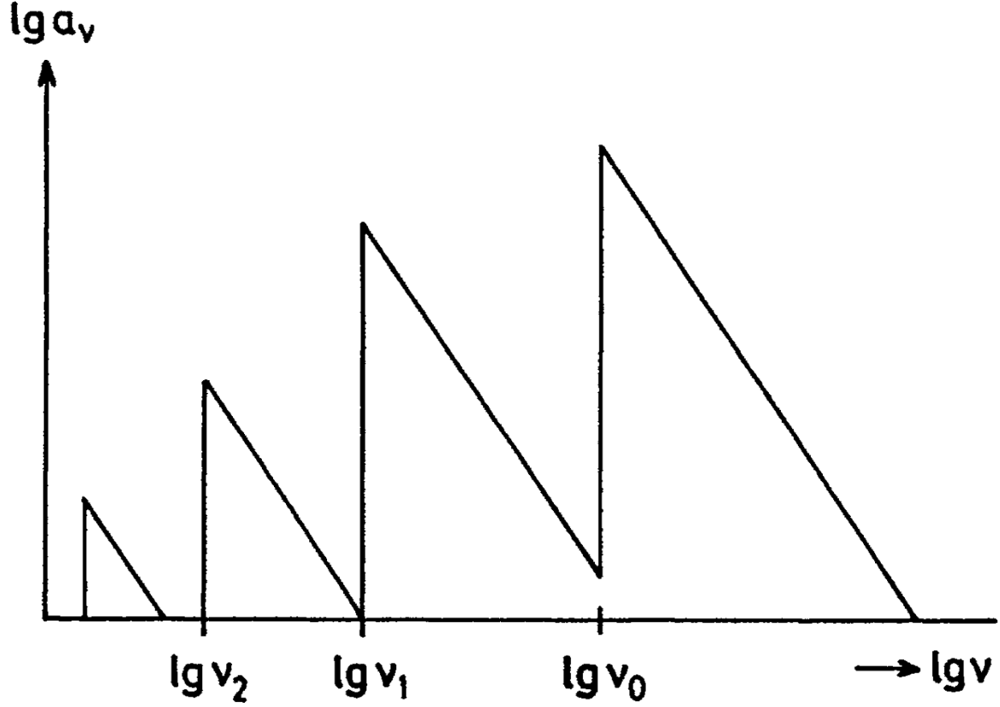
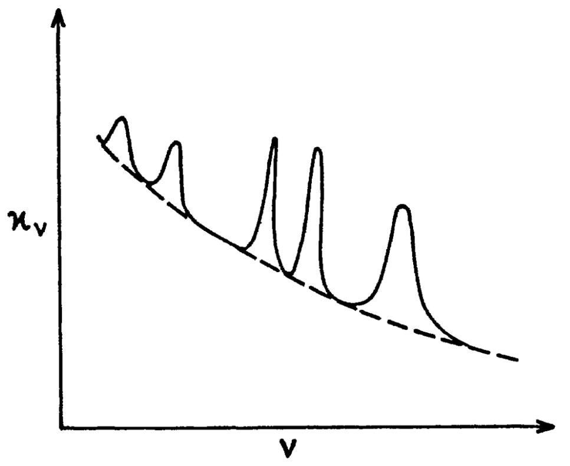

# Chapter 8. Opacity

In this chapter we deal with the **opacity** $\kappa(\rho,T)$ [cm$^2$/g], which corresponds to the efficiency of energy transport via radiation.

In optically thick gas, energy is transported via photon diffusion. As is discussed in [Chapter 5](./Chapter 5. Energy Transport.md), we have
$$
F_\nu=-\frac{c}{3\rho\kappa_\nu}\frac{\text de_\text{int}}{\text dr}
$$
where $e_\text{int}$ is given by the blackbody radiation luminosity $B_\nu$
$$
e_\text{int}=\frac{4\pi}cB_\nu(T)=\frac{8\pi h\nu^3}{c^3}\frac1{e^{h\nu/k_BT}-1}
$$
Thus
$$
F_\nu=-\frac{4\pi}{3\rho\kappa_\nu}\frac{\partial B_\nu}{\partial T}\frac{\partial T}{\partial r}
$$
The total flux is
$$
F=-\frac{4ac}{3\rho\kappa_R}T^3\frac{\partial T}{\partial r}
$$
where $\kappa_R$ is the Rosseland mean opacity. Obviously, the efficiency of energy transported outward is inversely proportional to the opacity.

We can further define optical depth $\tau$,
$$
\tau_\nu=\int\rho\kappa_\nu\text dr\sim\rho\kappa_\nu r
$$
So when $\tau\gg1$ so that energy is transported via photon diffusion, the flux is approximately
$$
F\sim\frac{acT^4}{\rho\kappa r}\sim\frac{\sigma_{SB}T^4}{\tau}
$$

## Electron Scattering

If an electromagnetic wave passes an electron, the electric field makes the electron oscillate. The oscillating electron represents a classical dipole that radiates in other directions, i.e. the electron scatters part of the energy of the incoming waves.

From classical electrodynamics, elastic scattering of non-relativistic electrons, namely **Thomson scattering**, yields a cross section of
$$
\sigma_T=\frac{8\pi}{3}{r_\text e^2}
$$
where $r_\text e$ is the classical electron radius. Thus the opacity is
$$
\kappa_\nu=\frac{8\pi}{3}\frac{r_\text e^2}{\mu_em_\text p}\simeq0.35\text{ cm}^2\text{/g}
$$
This opacity is $\nu$-independent, but when $T>10^8$ K, $\kappa_\nu$ slightly decreases ($\sim20\%$ at $10^8$ K) for higher $T$. At that time the kinetic energy of electron is over $\sim10$ keV, $\gtrsim1\%$ of $m_\text{e}c^2$. Therefore relativistic corrections (**Compton scattering**) become important.

## Absorption Due to Free-free Transitions

If during its thermal motion a free electron passes an ion, the two charged particles form a system which can absorb and emit radiation. This mechanism is only effective as long as electron and ion are sufficiently close.

Let us first consider the emissivity $\varepsilon_\nu^\text{ff}$ [erg/s/cm$^3$/Hz]. In a super, super rough estimation, it should be proportional to the densities of both electron and ions, as well as the duration of the fly-by, which inversely proportional to the magnitude of their relative velocity.
$$
\varepsilon_\nu^\text{ff}\propto \frac{n_\text{e}n_\text{ion}}{|v|}
$$
Assuming the thermal equilibrium, electrons obey the Boltzmann distribution, $|v|\propto T^{1/2}$. As a result,
$$
\varepsilon_\nu^\text{ff}\propto \rho^2T^{-1/2}
$$
Thus the opacity due to free-free transitions is
$$
\kappa_\nu^\text{ff}=\frac{\alpha_\nu}{\rho}=\frac{\varepsilon_\nu^\text{ff}}{\rho B_\nu(T)}
$$
The second equation is given by Kirchhoff's law of thermal radiation, which states that

>For a body of any arbitrary material emitting and absorbing thermal electromagnetic radiation at every wavelength in thermodynamic equilibrium, the ratio of its emissive power to its dimensionless coefficient of absorption is equal to a universal function only of radiative wavelength and temperature. That universal function describes the perfect black-body emissive power.

And thus
$$
B_\nu(T)=\frac{\varepsilon_\nu^\text{ff}}{\alpha_\nu}
$$
where the **absorption coefficient** $\alpha_\nu\equiv\rho\kappa_\nu$ [1/cm] denotes the attentuation of radiation per unit distance. So,
$$
\kappa_\nu^\text{ff}\propto\rho^{-1}{\varepsilon^{\text{ff}}_\nu}\nu^{-3}\propto\rho T^{-1/2}\nu^{-3}
$$
And the Rosseland mean opacity is
$$
\kappa^\text{ff}=\frac{\int\frac{\partial B_\nu(T)}{\partial T}\text d\nu}{\int\frac{1}{\kappa_\nu}\frac{\partial B_\nu(T)}{\partial T}\text d\nu}\propto\rho T^{-7/2}
$$
This $\rho T^{-7/2}$ dependence is known as the **Kramer's law**. Precise derivation gives,
$$
\kappa^\text{ff}=4\times10^{22}\left(\frac{\rho}{\text{g}\cdot\text{cm}^3}\right)\left(\frac{T}{\text K}\right)^{-7/2}\text{ cm}^2\text{/g}
$$

## Bound-free Transitions

The best-known example is ionization of atoms. For a hydrogen atom at its ground state, the ionization process is
$$
\ce{H + \gamma -> H+ + e-}
$$
Here the energy of $\gamma$ must be higher than 13.6 eV, otherwise this reaction will not occur. In other words, for $h\nu<h\nu_0=13.6$ eV, $\alpha_\nu=0$. For $h\nu>h\nu_0$, $\alpha_\nu\propto\nu^{-3}$. Different excitation states have different $\nu_0$. The opacity $\kappa^\text{bf}_{\nu}$ for a mixture of hydrogen atoms in different states of excitation is a superposition of $\alpha_\nu$ for different stages of excitation. The resulting $\kappa^\text{bf}_{\nu}$􏰁􏰂 is a sawtooth function.

The relative scale of $\kappa^\text{bf}_{\nu}$ comparing to $\kappa^\text{ff}_{\nu}$ is approximately
$$
\kappa^\text{bf}_{\nu}\simeq10^3Z\kappa^\text{bf}_{\nu}
$$
where $Z$ is the **metalicity**. $Z_\odot\sim0.02$.

## Bound-bound Transitions

$\kappa^\text{bb}_\nu$ is the superposition for opacity due to numerous possiblities of line adsorption. The dependency on $\nu$ is thus really messy.

## The Negative Hydrogen Ion ($\ce{H-}$)

At a sufficiently low temperature, protons and electrons start to recombine. When it gets even cooler, $\ce{H-}$ begins to effectively form via
$$
\ce{H + e- -> H- + \gamma}
$$
$\ce {H-}$ can also contribute to the opacity through photo-dissociation
$$
\ce{H- + \gamma -> H + e-}
$$
With Saha equation, we can estimate the $\ce{H-}$ fraction as a function of temperature and density. Then we can obtain the Rosseland mean opacity
$$
\kappa^{\ce{H-}}\simeq2.5\times10^{-31}\left(\frac{Z}{Z_\odot}\right)\left(\frac{\rho}{\text{g}\cdot\text{cm}^3}\right)\left(\frac{T}{\text K}\right)^{9}\text{ cm}^2\text{/g}
$$
when $3000<T\text{ [K]}<6000$ and $10^{-10}<\rho \text{ [g/cm}^3]<10^{-5}$.