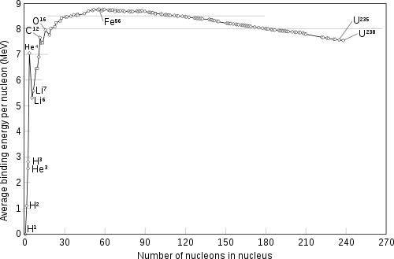
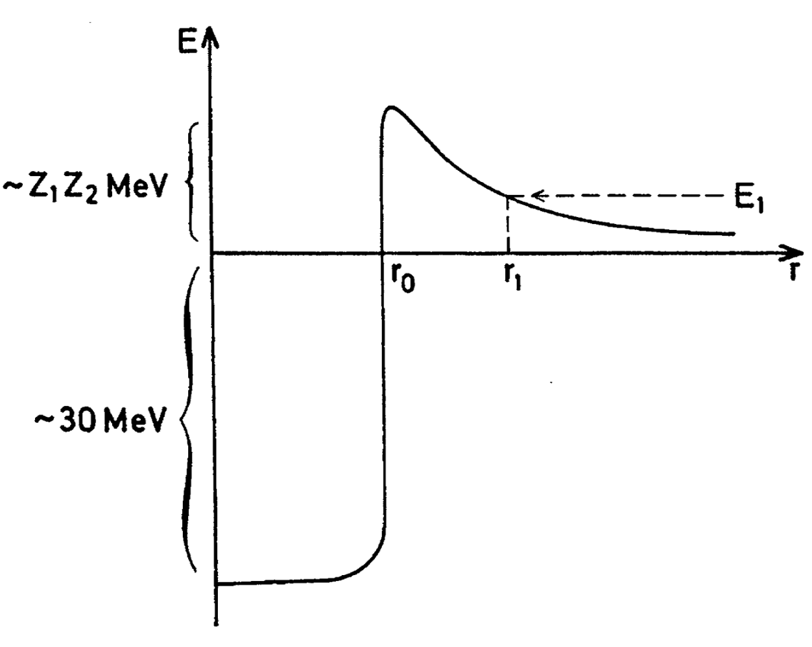
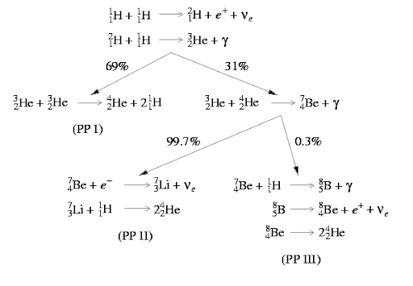
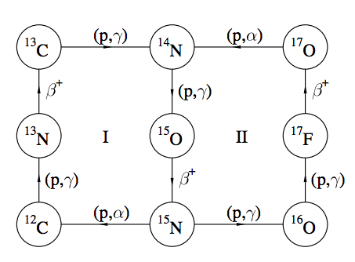

# Chapter 9. Nuclear Reactions

## Basic Considerations

Normally in a sun-like star, $\ce{4^1H -> ^4He}$. Here in nuclear physics, people use atomic mass unit (amu).
$$
1\text{ amu}=\frac1{12}m\left(\ce{^{12}C}\right)
$$
$m\left(\ce{^{1}H}\right)\simeq1.0081$ amu, $m\left(\ce{^{4}He}\right)\simeq4.0039$ amu, so the mass deficiency $\Delta m$ in this reaction is $0.0285$ amu. It will be transported into energy
$$
\Delta E=\Delta mc^2\simeq4.3\times10^{-5}\text{ erg}\simeq 27\text{ MeV}\sim10^{10}\text{ K}
$$

- The rest mass (energy) for important particles
  - Electron: $\sim 0.5$ MeV
  - Pion: $\sim10^2$ MeV
  - Proton: $\sim1$ GeV

Generally speaking, the nuclear binding energy $E_B$ of a nucleus is
$$
E_B=\left[(A-Z)m_\text{n}+Zm_\text{p}-M_\text{nuc}\right]c^2
$$
Where $Z$ is the proton number, $A$ is the atomic number, $m_\text{u}$, $m_\text{p}$, and $M_\text{nuc}$ are neutron mass, proton mass, and nuclear mass, respectively.

Let us define the **average binding energy per nucleon**
$$
\epsilon_B\equiv\frac{E_B}A
$$

The $\epsilon_B-A$ curve peaks at $\ce{^{56}Fe}$, where $\epsilon_B=8.5$ MeV. For $A<56$, nuclear reactions gain energy. Fusion for heavier elements requires energy.

**Note**

- It is interesting that $\ce{^4He}$ has a $\epsilon_B=6.6$ MeV, far above the smoothed fitting function. From $\ce{^1H}$ to $\ce{^{56}Fe}$, $\epsilon_B=8.5$ MeV, but $6.6$ MeV is already gained in the generation of $\ce{^4He}$.
- Nuclear fusion in stats produce heavy elements up to $\ce{^{56}Fe}$. Elements with $A>56$ are produced in violent explosions such as SNe, compact stars mergers, etc.

## Two-Body Nuclear Reaction Processes

### Reaction Rate

The number of reaction between species $i$ and $j$ per unit time in unit volume can be approximated as
$$
R_{ij}=n_in_j\sigma v\ [\text{1/s/cm}^3]
$$
where $n_i,n_j$ correspond to number desities, $\sigma$ denotes the cross section, and $v$ is the relative velocity. If we assume all nuclei are in thermal equilibrium so that the velocity magnitude $v$ obeys a Maxwell-Boltzmann distribution. The density function is
$$
f(v)\text dv=4\pi v^2\left(\frac{m}{2\pi k_BT}\right)^{3/2}\exp\left(-\frac{mv^2}{2k_BT}\right)\text dv
$$
If we define $E=\frac12mv^2$, we have
$$
f(E)\text dE=\frac2{\sqrt{\pi}}E^{1/2}\left(k_BT\right)^{-3/2}\exp\left[-\frac E{k_BT}\right]\text dE
$$
where $m=m_im_j/(m_i+m_j)$ is the reduced mass. So statistically we can calculate the average $\sigma v$
$$
\begin{align*}
\left\langle\sigma u\right\rangle&=\int_0^\infty\sigma vf(v)\text dv\\
&=\int_0^\infty\sigma(E)\cdot\left(\frac{2E}m\right)^{1/2}\cdot f(E)\text dE\\
&=\left(\frac{8}{\pi m}\right)^{1/2}\left(k_BT\right)^{-3/2}\int_0^\infty \sigma(E)\cdot E\exp\left[-\frac E{k_BT}\right]\text dE
\end{align*}
$$
Since nuclei have positive charge, we need to consider the long-distance, repulsive force - Columb force. The **Columb barrier** is
$$
V_C(r)=\frac{Z_1Z_2 e^2}{r}
$$
On the other hand, nuclear matters interact with short-distance, strong attractive force when
$$
r<r_0\simeq1.44\times10^{-13} A^{1/3}\text{ cm}\sim\text{fm}
$$

In a classical scenario, when the kinetic energy of partcles reaches $E_\text{max}=V_C(r_0)\sim Z_1Z_2$ MeV, they are able to overcome the Columb barrier. But in this way crtical temperature must be over $\sim10^{10}$ K, far above the central temeperature of sun-like stars ($\sim10^{10}$ K).

### Tunneling Effect

Thanks to the quantum physics, we know that as long as the size of the potential well is finite, there can be **tunneling effects** against the well. In the stellar core, $kT_\text{c}\ll E_\text{max}$. Even so, the quantum tunneling allows penetration under a small, yet finite, probability, which is given by
$$
P(E)\sim\exp\left[-\int_{r_0}^{r_c}\frac{\sqrt{2m[V(r)-E]}}{\hbar}\text dr\right]\equiv\exp(-2\pi\eta)
$$
Here $r_c$ is defined so that $V(r_c)=E$. Here $\eta$ is given by
$$
\eta=\left(\frac m2\right)^{1/2}\frac{Z_1Z_2 e^2}{\hbar E^{1/2}}
$$
We can understand this integration result in an alternative way. Considering $V_C(\lambda)$, where $\lambda$ is the de Broglie length,
$$
\lambda\equiv\frac hp
$$
Then
$$
\frac{V_C(\lambda)}{E}=\frac{Z_1Z_2 e^2}{h}\frac pE=\frac{Z_1Z_2 e^2}{h}\sqrt{\frac {2m}E}=\frac\eta\pi
$$
Thus $\eta$ corresponds to the ratio between the Columb potential and the particle specific energy,
$$
P(E)\sim\exp\left(-2\pi^2\frac{V_C(\lambda)}{E}\right)
$$
Increasing $E$ and decreasing $Z_1Z_2$ (lighter particles) help promote the tunneling probability.

### Cross Section

The cross section is given by
$$
\sigma(E)\simeq\pi\lambda^2P(E)\xi(E)
$$
where $\lambda$ is the de Broglie length, $P(E)$ is the tunneling probability, and $\xi(E)$ is the **resonance**. The form of $\xi(E)$ is rather complicated (sort of a Lorentz profile), but when $E$ is far away from any resonance, $\xi\to1$. Anyway, we define
$$
\sigma(E)\simeq S(E)\frac{\exp\left[{-b/\sqrt{E}}\right]}{E}
$$
$S(E)$ is known as the **astrophysical S-factor**. It is measured by nuclear physicists. Luckily, it depends only weakly on $E$. So we can treat it as a constant of $E$.

### Reaction Rate

Finally we go back to the integral
$$
\begin{align*}
\left\langle\sigma u\right\rangle
&=\left(\frac{8}{\pi m}\right)^{1/2}\left(k_BT\right)^{-3/2}\int_0^\infty \sigma(E)\cdot E\exp\left[-\frac E{k_BT}\right]\text dE\\
&\simeq\left(\frac{8}{\pi m}\right)^{1/2}\left(k_BT\right)^{-3/2}S_0\int_0^\infty \exp\left[-\frac E{k_BT}-\frac{b}{\sqrt{E}}\right]\text dE\\
\end{align*}
$$
The integrand $f(E)$ vanishes either at large or small $E$, and only significantly contributes to the integration around its maximum.

Define $E_0$, so that
$$
f'(E)=\frac{\text d}{\text dE} \left[-\frac E{k_BT}-\frac{b}{\sqrt{E}}\right]=0
$$
We can solve $E_0$
$$
\begin{align*}
E_0=\left(\frac b2k_BT\right)^{2/3}=\left[\left(\frac{m}{2}\right)^{1 / 2} \pi \frac{Z_{i} Z_{k} e^{2} k_B T}{\hbar}\right]^{2/3}
\end{align*}
$$
Around $E_0$, we can expand $f(E)$ into Tyler's series
$$
\begin{align*}
f(E)&=f(E_0)+\frac12f''(E_0)(E-E_0)^2+\mathcal O(E^3)\\
&=-\frac{3E_0}{k_BT}-\frac{3E_0}8E_0^{-3/2}b\left(\frac E{E_0}-1\right)^2+\mathcal O(E^3)\\
&=-\frac{3E_0}{k_BT}-\frac{3E_0}{4k_BT}\left(\frac E{E_0}-1\right)^2+\mathcal O(E^3)\\
&\equiv-\tau-\frac\tau4\left(\frac E{E_0}-1\right)^2+\mathcal O(E^3)
\end{align*}
$$
Thus the integration is approximately
$$
\begin{align*}
\left\langle\sigma u\right\rangle
&\simeq\left(\frac{8}{\pi m}\right)^{1/2}\left(k_BT\right)^{-3/2}S_0\int_0^\infty\exp\left[-\tau-\frac\tau4\left(\frac E{E_0}-1\right)^2\right]\text dE\\
&\simeq\left(\frac{8}{\pi m}\right)^{1/2}\left(k_BT\right)^{-3/2}S_0\text e^{-\tau}\int_0^\infty\exp\left[-\frac\tau4\left(\frac E{E_0}-1\right)^2\right]\text dE\\
&\equiv \left(\frac{8}{\pi m}\right)^{1/2}\left(k_BT\right)^{-3/2}S_0\cdot\frac{2}{3} k_B T\cdot \tau^{1 / 2} \mathrm{e}^{-\tau} \int_{-\sqrt{\tau }/2}^{\infty} \mathrm{e}^{-\xi^{2}} d \xi
\end{align*}
$$
where
$$
\xi\equiv\frac{\sqrt\tau}2\left(\frac E{E_0}-1\right)
$$
The main contribution to $\langle\sigma u\rangle$ comes from a range close to $\xi=0$, so that no large errors are introduces when extending the range of integration to 􏰠$-\infty$, the integral over the Gaussian becoming 􏰕$\sqrt\pi$.

Therefore, one can obtain
$$
\left\langle\sigma u\right\rangle=\frac{4}{3} \left(\frac{2}{ mk_BT}\right)^{1/2}S_0 \tau^{1 / 2} \mathrm{e}^{-\tau}
$$
Recall that
$$
\tau=\frac{3E_0}{k_BT}\simeq20\left(Z_1^2Z_2^2A\right)^{1/3}T_7^{-1/3}\propto T^{-1/3}
$$

$$
\Rightarrow\left\langle\sigma u\right\rangle\propto T^{-2/3}\exp\left(-cT^{-1/3}\right)
$$

Thus for the solar case, $\tau\sim20$, and
$$
\frac{\partial\ln\langle\sigma u\rangle}{\partial\ln T}=\frac\tau3-\frac23\sim6-7
$$

### Energy Generation Rate

The energy generation rate (per unit mass) between species $i$ and $j$ is simply
$$
\varepsilon_\text{nuc}=\frac{Q_{ij}R_{ij}}{\rho}\propto\rho\langle\sigma u\rangle
$$
where $Q_{ij}$ is the binding energy to release.

Define
$$
\nu\equiv\frac{\partial\ln\varepsilon_\text{nuc}}{\partial\ln T}=\frac\tau3-\frac23\sim6-7
$$
The temperature dependence is really strong!

For heavier elements, since $\tau\propto\left(Z_1^2Z_2^2A\right)^{1/3}$, $\nu$ can be extremely high.

## Nuclear Burning Mechanisms

### pp-chain (in the Sun)

**pp-chain I**

- $\ce{^1H + ^1H -> ^2H + e+ +\nu_e}$

  This reaction is slow. Once there is neutrino generation, weak interaction is involved, and the efficiency is much lower than other reactions.

  **Notes**

  In Big Bang nucleosynthesis (BBN), it causes the **deutron ($\ce{^2H}$) bottleneck**. All other reactions wait for the generation of $\ce{^2H}$.

- $\ce{^2H + ^1H -> ^3He + \gamma}$

- $\ce{^3He + ^3He -> ^4He + 2^1H}$

As a result, a positron and a gamma-photon are ejected to heat the gas up. The neutrino just escapes without any interaction.

**pp-chain II** and **pp-chain III** are rather complicated, and to form $\ce{^4He}$. $\ce{Li,\ Be,\ B}$ are also involved. The overall energy generation rate is
$$
\varepsilon_\text{pp}=4.4\times10^5\rho X^2T^{-2/3}_7\exp\left(-\frac{15.7}{T^{1/3}_7}\right)\text{ erg/s/g}
$$
where $X$ is the abundance of hydrogen.

### CNO Cycle ($M>2M_\odot$)

The CNO cycle is composed of **CNO-I (CN cycle)** and  **CNO-II (CNO cycle)**. The overall energy generation rate is
$$
\varepsilon_\text{CNO}=1.7\times10^{27}\rho XX_\text{CNO}T^{-2/3}_7\exp\left(-\frac{70.5}{T^{1/3}_7}\right)\text{ erg/s/g}
$$
where $X_\text{CNO}$ is the sum of carbon, nitrogen, and oxygen abundance.

